[TOC]

# DB - 1주차

## 1. 엔터티

### 1.1 엔터티의 개념

> 업무에 필요하고 유용한 **정보를 저장하고 관리**하기 위한 **집합적인 것(Thing)**
>
> 업무 활동상 지속적인 **관심**을 가지고 있어야 하는 **대상**

- DB 권위자가 정의한 사항
  - 변별할 수 있는 사물 - Peter Chen (1976)
  - 데이터베이스 내에서 변별 가능한 객체 - C.J Date (1986)
  - 정보를 저장할 수 있는 어떤 것 - James Martin (1989)
  - 정보가 저장될 수 있는 사람, 장소, 물건, 사건 그리고 개념 등 - Thomas Bruce (1992)

- 위 정의들의 공통점
  - 사람, 장소, 물건, 사건, 개념 등의 **명사**에 해당.
  - 업무상 관리가 필요한 **관심사**에 해당.
  - 저장이 되기 위한 **어떤 것(Thing)**

### 1.2 엔터티의 특징

> 엔터티의 특징. 
>
> 만약 도출된 엔터티가 다음의 성질을 만족하지 못하면 적절하지 못한 엔터티일 확률이 높다.

- 업무에서 **필요**한 **정보**

- **유일한 식별자**에 의해 **식별** 가능

- **영속적**으로 존재하는 **인스턴스의 집합**이어야 함. (2개 이상, 1개 X)

- 업무 프로세스에 의해 이용되어야 함

- 1개 이상의 **속성** 필수

- 다른 엔터티와 **최소 한 개 이상의 관계** 존재

  - 단, 아래 세 가지 경우는 관계가 존재하지 않아도 됨.

  - 통계성 엔터티 도출

    업무진행 엔터티로부터 **통계업무만(Read Only)**을 위해 별도 정의하므로 관계 생략 가능.

  - 코드성 엔터티 도출

    너무 많은 관계 설정으로 인한 **읽기효율성(Readability) 저하**로 관계 생략 가능.

  - 시스팀 처리시 내부 필요에 의한 엔터티 도출

    트랜잭션 로그 테이블과 같이 트랜잭션이 업무적으로 연관된 테이블과 관계 설정이 필요하지만

    업무적인 필요가 아닌 시스템 내부적인 필요에 의해 생성된 엔터티이므로 관계 생략 가능.

### 1.3 엔터티의 분류

> 유형, 발생시점에 의해 엔터티를 분류할 수 있다.

1. 유형에 따른 분류

   - 유형 엔터티(Tangible Entity)

     **물리적인 형태가 있고** 안정적이며 지속적으로 활용되는 엔터티 (ex. 사원, 상품, 강사 등)

   - 개념 엔터티(Conceptual Entity)

     물리적인 형태가 없고 관리해야 할 **개념적 정보**로 구분이 되는 엔터티 (ex. 조직, 보험상품 등)

   - 사건 엔터티(Event Entity)

     **업무를 수행함**에 따라 발생되는 엔터티. **발생량이 많고 통계자료**에 종종 이용됨 (ex. 주문, 청구, 미납 등)

2. 발생시점에 따른 분류

   - 기본 엔터티(Fundamental Entity, Key Entity)

     - 그 업무에 원래 존재하는 정보
     - **독립적으로 생성**이 가능, 타 엔터티의 **부모** 역할
     - **자신의 고유한 주식별자**를 가지게 됨.
     - ex. 사원, 부서, 고객, 상품, 자재 등
   
   - 중심 엔터티(Main Entity)
   
     - **기본엔터티로부터 발생**
     - **업무**에 있어서 **중심**적인 역할
     - **데이터의 양이 많이 발생, 다른 엔터티와의 관계를 통해 많은 행위엔터티 생성**
     - ex. 계약, 사고, 예금원장, 청구, 주문 매출 등
   - 행위 엔터티(Active Entity)
   
      - **두 개 이상의 부모엔터티**로부터 발생
   
      - <u>**내용이 자주 변경되거나 데어터량이 증가**</u>
      - ex. 주문목록, 사원변경이력 등
   

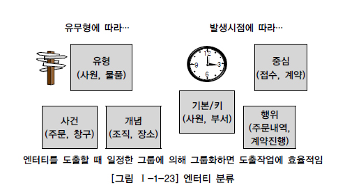

### 1.4 엔터티의 명명

> 엔터티 명명 규칙

- **현업에서 사용**하는 용어 사용
- **약어 사용 X**
- **단수명사** 사용
- **유일한 이름** 부여
- **생성의미대로 이름** 부여

## 2. 속성

### 2.1 속성의 개념

> 업무에서 필요로 하는 인스턴스
>
> 관리하고자 하는 의미상 **더이상 분리되지 않는 최소의 데이터 단위**

- 속성의 정의
  - 업무에서 필요로 한다.
  - 의미상 더이상 분리되지 않는다.
  - **<u>엔터티를 설명</u>**하고 **<u>인스턴스의 구성요소</u>**가 된다.
- 도메인
  - **<u>각 속성이 가질 수 있는 값의 범위</u>**
  - 엔터티 내에서 속성에 대한 데이터 타입, 크기, 제약사항을 지정하는 것

### 2.2 엔터티, 인스턴스, 속성, 속성값의 관계

> 엔터티, 인스턴스, 속성, 속성값에 대한 관계

- **한 개의 엔터티**는 **두 개 이상의 인스턴스**의 집합
- **한 개의 엔터티**는 **두 개 이상의 속성**으로 구성
- **한 개의 속성**은 **한 개의 속성값**을 가짐

### 2.3 속성의 특징

> 속성의 특징
>
> 다음의 속성을 만족하지 못하면 적절하지 않은 속성일 확률이 높음

- 업무에서 **필요**한 **정보**

- 주식별자에 **함수적 종속성**

  함수적 종속성이란?

  > X -> Y : X의 값을 알면 Y의 값을 바로 알아낼 수 있는 것.
  >
  > ex 1. 어떤 사람의 **주민등록번호**를 알게 되면 그 사람의 **성별**을 알 수 있다.
  >
  > ex 2. 어떤 학생의 **학번**을 알게 되면 그 학생의 **학과**를 알 수 있다.

  **<u>즉, 주식별자를 알면 나머지 속성들의 값을 알아낼 수 있어야 한다.</u>**

- **한 개**의 속성값

### 2.4 속성의 분류

>  속성의 특성, 엔터티 구성방식에 따라 속성을 분류할 수 있다

1. 속성의 특성에 따른 분류

   - 기본 속성

     **업무로부터 추출**한 모든 속성

   - 설계 속성

     데이터 모델링을 위해, 업무를 규칙화하기 위해 **새로 정의**한 속성

   - 파생 속성

     **다른 속성에 영향을 받아** 발생한 속성

2. 엔터티 구성방식에 따른 분류

   - PK 속성

     엔터티를 **식별**할 수 있는 속성

   - FK 속성

     다른 엔터티와의 **관계**에서 포함된 속성

   - 일반 속성

     엔터티에 포함되지만 PK, FK에 포함되지 않는 속성

3. 세부 의미 유무에 따른 분류

   - 복합 속성

     주소와 같이 **세부 속성들로 구성**될 수 있는 속성

   - 단순 속성

     나이, 성별와 같이 **더 이상 다른 속성들로 구성될 수 없는** 속성

4. 값의 개수에 따른 분류

   - 단일값 속성

     주민등록번호와 같이 **하나의 값만 존재**하는 속성

   - 다중값 속성

     전화번호(집, 회사, 휴대폰)와 같이 **여러 개의 값이 존재**하는 속성

### 2.5 속성의 명명규칙

> 속성의 명명규칙

- **현업**에서 사용하는 이름
- **서술식 X**
- **약어 사용 X**
- 전체 데이터 모델에서의 **유일성** 확보

## 3. 관계

### 3.1 관계의 개념

> 엔터티의 인스턴스 사이의 논리적인 연관성
>
> <u>**존재의 형태 / 행위로 서로에게 연관성이 부여된 상태**</u>

### 3.2 관계의 분류

> 존재, 행위에 의한 관계

1. 존재에 의한 관계

   `학생` 엔터티와 `학과` 엔터티가 존재할 때, `학생` 엔터티의 인스턴스는 `학과` 엔터티의 인스턴스에 속해있는 것과 같다. `소속됨` 이라는 관계는 특정 행위에 의해 발생한 것이 아니라, <u>**존재에 의해 관계가 형성된 것이다.**</u>

2. 행위에 의한 관계

   `고객` 엔터티와 `주문` 엔터티가 존재할 때, `고객` 엔터티의 인스턴스가 `주문하기` 라는 행위를 함으로 `주문` 엔터티의 인스턴스가 생성된다. 즉, `주문하기`라는 관계는 <u>**이러한 특정한 행위에 의해 관계가 형성된 것이다.**</u>

### 3.3 관계의 표기법

> 관계명, 관계차수, 관계선택사양

1. 관계명(Membership)

   > 관계의 이름
   >
   > 관계 시작점(관계가 시작되는 편)과 관계 끝점(관계를 받는 편) 모두 관계 이름을 가져야 하며,
   >
   > 참여자의 관점에 따라 능동 / 수동적으로 명명된다.

   - 애매한 동사 피하기

     `관련이 있다`와 같이 애매한 동사의 사용 X

     `포함한다`, `소속된다` 와 같이 <u>**구체적인 행위 / 상태를 나타내는 동사 사용**</u>

   - 현재형으로 표기

     `~했다`, `~할 것이다` 와 같은 과거 / 미래형 동사 사용 X

     `~한다` 와 같이 <u>**현재형 동사 사용**</u>

2. 관계차수(Cardinality)

   > 관계에 참여하는 두 엔터티의 참여자 수
   >
   > 1:1, 1:M, M:N

   - 1:1

     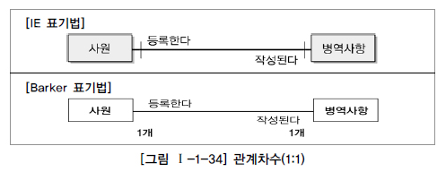

   - 1:M

     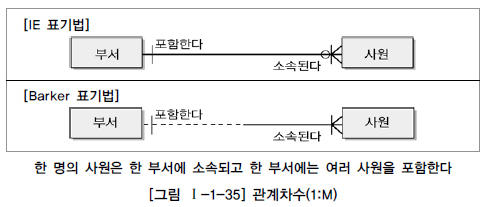

   - M:N

     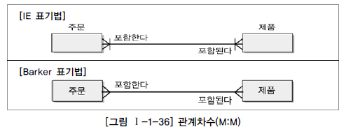

   - IE vs Barker

     |                              IE                              |  구분  |                            Barker                            |
     | :----------------------------------------------------------: | :----: | :----------------------------------------------------------: |
     | 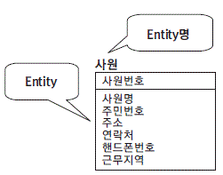 | 엔터티 | 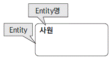 |
     | 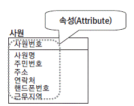 |  속성  | 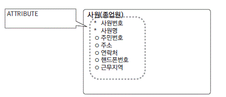 * : 반드시 저장해야 하는 속성 (Mandatory) Ο : 선택적 저장 가능 속성 (Optional) |
     | 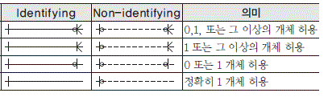 |  관계  | 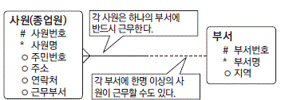 |
     | 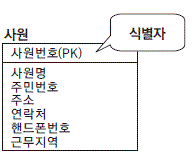 | 식별자 | 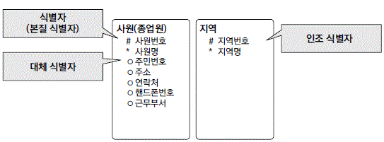 |

3. 관계선택사항(Optionality)

   > 엔터티가 항상 관계에 참여하는지 여부

   `Crow's Foot` 에서 Ο 표시가 있다면 관계가 있을 수도, 없을 수도 있다.

### 3.4 관계 체크 사항

> 두 개의 엔터티 사이에서 관계를 정의할 때 체크해야 할 항목

- 두 개의 엔터티 사이에 연관 규칙이 존재하는가?
- 두 개의 엔터티 사이에 정보의 조합이 발생되는가?
- 업무 기술서, 장표에 관계 연결에 대한 규칙이 서술되어 있는가?
- 업무 기술서, 장표에 관계 연결을 가능하게 하는 동사가 있는가?

