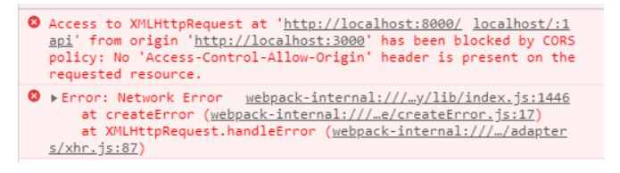
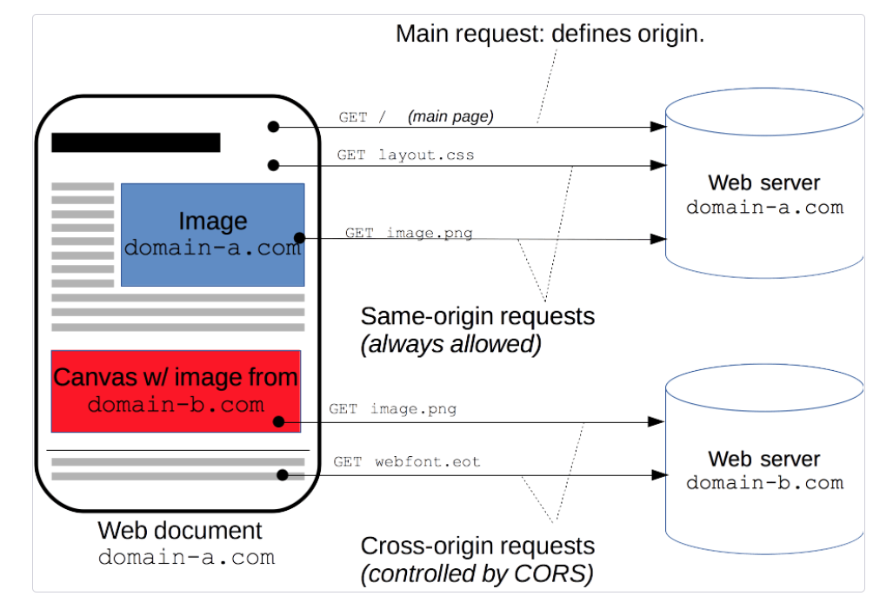
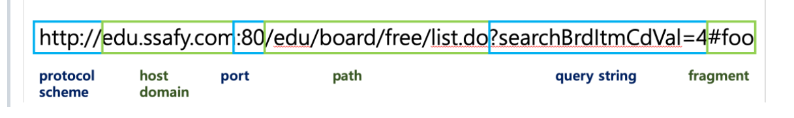
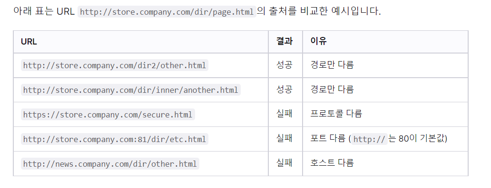
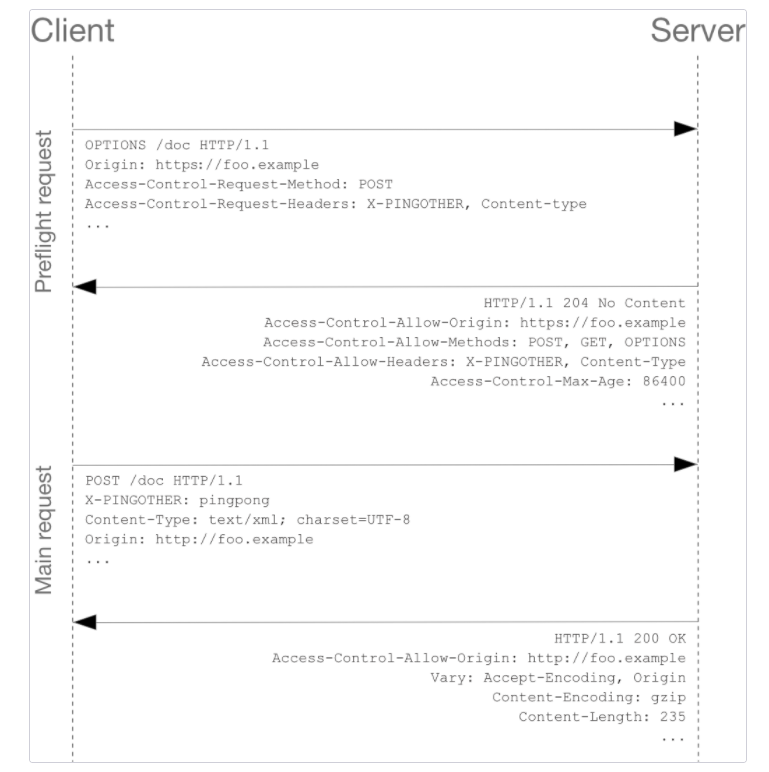
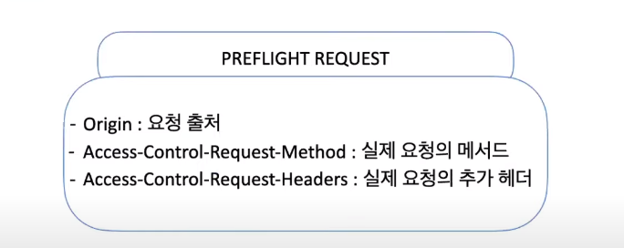
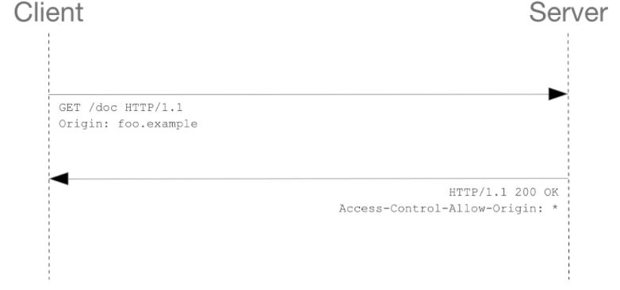
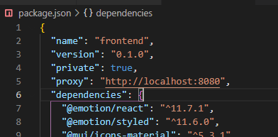
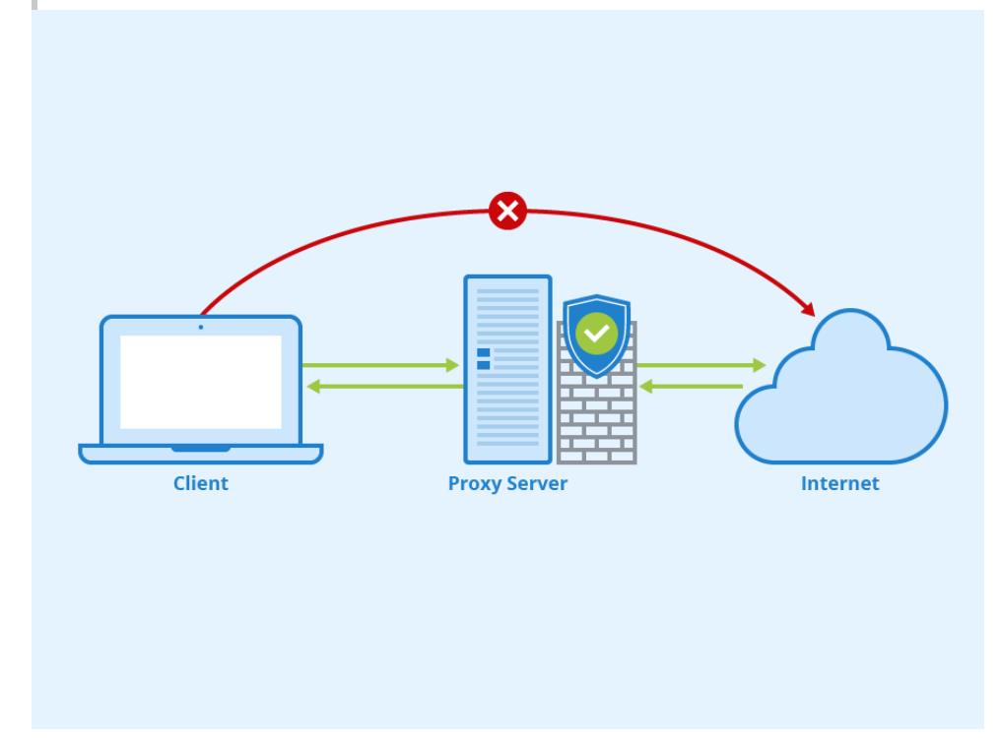

1. # CORS란 무엇인가

   

   지겹다,, 지겨워,,,

   

   ## SOP란?

   >  같은 출처에서만 리소스를 공유할 수 있다는 규칙이다. 브라우저에서 다른 서버에서 요청할 경우에 해당되고, 브라우저를 거치지 않고 서버 간 통신을 할 때는 이 정책이 적용되지 않는다.

   

   ## 그런데 이런 정책이 왜 존재할까? 

   만약 다른 출처의 어플리케이션이 서로 통신하는 것에 대해 아무런 제약도 존재하지 않는다면 악의를 가진 사용자가 소스 코드를 보고 [CSRF(Cross-Site Request Forgery)](https://ko.wikipedia.org/wiki/사이트_간_요청_위조) 나 [XSS(Cross-Site Scripting)](https://ko.wikipedia.org/wiki/사이트_간_스크립팅) 와 같은 방법을 사용하여 정보를 탈취할 수 있다.

   

   **CORS는 다른 출처의 리소스가 필요한 경우,  SOP를 우회하기 위한 여러가지 방법 중 가장 권장되는 방법이다.**

   **즉, 웹 생태계가 다양해짐에 따라 다른 웹페이지 간에도 데이터의 공유가 필요해지고, SOP를 풀어주기 위한 방식으로 CORS가 존재**

   

   

> **교차 출처 리소스 공유**(Cross-Origin Resource Sharing, [CORS](https://developer.mozilla.org/ko/docs/Glossary/CORS))는 추가 [HTTP](https://developer.mozilla.org/ko/docs/Glossary/HTTP) 헤더를 사용하여, 한 [출처](https://developer.mozilla.org/ko/docs/Glossary/Origin)에서 실행 중인 웹 애플리케이션이 다른 출처의 선택한 자원에 접근할 수 있는 권한을 부여하도록 브라우저에 알려주는 체제입니다. 웹 애플리케이션은 리소스가 자신의 출처(도메인, 프로토콜, 포트)와 다를 때 교차 출처 HTTP 요청을 실행합니다.

= **"다른 출처"에서 자원(resource)를 공유 할 수 있도록 하기 위해 내놓은 정책을 말한다.** 

= **즉, 브라우저에서 "다른 출처"요청을 안전하게 해 줄 수 있도록 하는 메커니즘**


**정리**

> Same-Origin Policy(동일 출처 정책) 때문에 CORS 같은 상황이 발생하면 외부 서버에 요청한 데이터를 브라우저에서 보안 목적으로 차단 한다. 그로 인해 정상적으로 데이터를 받을 수 없는 상황이 발생하여, CORS 정책을 적용하여 해결해줘야 한다.

## 그렇다면 출처란 무엇인가?! 



여기서 출처란 scheme(protocol : http 또는 https), host(domain), port로 구성됨.

동일출처(same Origin)이란 위의 3가지가 모두 같을떄를 말함

ex)




# 2.CORS동작 방식 3가지



<그림 설명>




1. ## 프리플라이트 요청 (Preflight Request)

- **`Preflight`** 방식은, 요청을 한번에 보내는 것이 아니라 예비 요청과 본 요청으로 나누어서 서버로 전송한다.
- 본 요청을 보내기 전 미리 예비로 보내는 요청을 **`Preflight`**라고 하며, HTTP 메서드 중 하나인 **`OPTIONS`** 메서드를 사용한다.
- 유저 데이터에 영향을 줄 수 있는 경우(예: delete, put)를 대비하여 미리 전송하는 것

> WhY?!
> 예비 요청을 함으로써 본 요청을 보내기 전 브라우저 스스로가 요청을 보내는 것에 대한 안전성을 확인함에 있다.
> 서버는 이 예비 요청에 대한 응답으로 현재 자신이 어떤 것들을 허용 하고, 어떤 것들을 금지하고 있는지에 대한 정보를 응답 헤더에 담아서 브라우저에게 다시 보내준다.

- `Access-Control-Request-Method` 와 `Access-Control-Request-Headers`를 보고 서버는 요청을 수락할지 결정
  - Preflight 요청을 보낼 때 origin 외에도 자신이 예비 요청 이후 본 요청에 해당하는 내용도 함께 전송
  - 서버의 응답을 통해 요청이 허용되는지 확인 가능
  - `Access-Control-Max-Age` 헤더값에 명시한 시간 동안 Preflight 요청 대신 본 요청
- Preflight Request가 성공해야 Main Request 가능
  - 실제 응답에서도 `Access-Control-Allow-Origin` 헤더 필수


2. ## 단순 요청 (Simple Request)

   

* **`Preflight Request`** 과는 달리, 예비 요청을 보내지 않고, **서버에게 바로 본 요청을 전송**한다.
* 이 후 서버가 응답 헤더에 **`Access-Control-Allow-Origin`**과 같은 값을 보내주면 그때 브라우저가 CORS 정책 위반 여부를 검사하는 방식이다.

- **Simple Request**는 **Preflight Request**와 다르게 요청을 보내면서 즉시 cross origin인지 확인하는데, 다음 조건을 모두 충족해야한다.
  - 메서드는 *GET POST HEAD* 중 하나
  - 헤더는 *Accept, Accept-Language, Content-Language, Content-Type* 만 허용
  - Content-Type 헤더는 다음의 값들만 허용
    - application/x-www-form-urlencoded
    - multipart/form-data
    - text/plain

3. ## 인증정보 포함 요청 (Credentialed Request)

인증된 요청을 사용하는 방법이다.

다른 출처 간 통신의 좀 더 보안을 강화하고자 할 때 사용한다. 브라우저가 제공하는 비동기 리소스 요청 API인 **`XMLHttpRequest`** 객체나 **`fetch API`**는 별도의 옵션 없이 브라우저의 쿠키 정보나 인증과 관련된 헤더를 함부로 요청에 담지 않는다. 이때 요청에 인증과 관련된 정보를 담을 수 있게 해주는 옵션이 바로 **`credentials`** 옵션이다.

### <credentials option 3가지>

- ***omit\*** : 절대로 cookie 들을 전송하거나 받지 않는다.
- ***same-origin\*** : 동일 출처(same origin)이라면, user credentials (cookies, basic http auth 등..)을 전송한다. (default 값)
- ***include\*** : cross-origin 호출이라 할지라도 언제나 user credentials (cookies, basic http auth 등..)을 전송한다.

ex) 

*예시)*

```js
fetch('주소', {
 credentials: 'include', // 모든 요청에 인증 정보 포함
});
```

**axios** 로 통신할 시, ***withCredentials\*** 설정을 ***true\*** 로 넣어주면 된다.

```js
axios.post(주소, 데이터, { withCredentials: true });

// 또는 공통으로 추가
axios.defaults.withCredentials = true;
```

### 정리)

* 브라우저의 토큰, 쿠키 정보 등 **사용자 식별 정보**를 담아 다른 출처로 보내는 요청인 경우
* 클라이언트 측은 `credentials: include` 필수 (무조건 인증 정보 포함)
* 서버 측의 응답헤더에 `Access-Control-Allow-Credentials: true` 값이 반드시 존재 해야 함
* Access-Control-Allow-Origin는 정확한 정보만 있어야 하므로 * 사용 불가, 명시적인 url을 설정해야 함

# 3. CORS를 해결 방법(실제 코드 예시)


## front

1. #### package.json에 proxy값을 설정

***create-react-app\*** 으로 생성한 프로젝트에서는, *package.json* 에 *proxy* 값을 설정하여 *proxy* 기능을 활성화 하는 방법도 있다.




2. #### cra를 하지 않고 Webpack 으로 리엑트 세팅을 한 경우


이렇게 설정을 해놓으면 로컬 환경에서 `/api`로 시작하는 URL로 보내는 요청에 대해 브라우저는 `localhost:3090/api`로 요청을 보낸 것으로 알고 있지만, 사실 뒤에서 웹팩이 `https://localhost:3095`으로 요청을 프록싱해주기 때문에 마치 CORS 정책을 지킨 것처럼 브라우저를 속이면서도 우리는 원하는 서버와 자유롭게 통신을 할 수 있다. 

**즉, 프록싱을 통해 CORS 정책을 우회할 수 있는 것이다.**

3. #### 라이브러리 사용

```
npm install http-proxy-middleware
```


````js
//setupProxy.js

const { createProxyMiddleware } = require('http-proxy-middleware');

module.exports = function(app) {
  app.use(
    '/api',
    createProxyMiddleware({
      target: 'http://localhost:5000',
      changeOrigin: true,
    })
  );
};
````


**참고 프록시(proxy)란?!**

> Proxy란 유저가 인터넷에 요청을 보낼때 직접 보내는 것이 아니라 Proxy 서버를 거쳐 최종 목적지까지 전달하게 한다.
>
> 이때 Proxy서버를 거치면서 유저의 IP를 바꿀 수 있다.
>
> 다시말해, 유저의 실제 IP와 포트를 알 수 없도록 하는 것이 프록시 서버의 역할이다.
>
>  



## back(node js + express)

#### 1 . Access-Control-Allow-Origin 응답 헤더 세팅

- 서버측 응답에서 접근 권한을 주는 헤더를 추가하여 해결

```js
app.use((req, res, next) => {
  res.header("Access-Control-Allow-Origin", "*"); // 모든 도메인
  res.header("Access-Control-Allow-Origin", "https://example.com"); // 특정 도메인
});
```


**2. CORS 라이브러리 설치**

````js
라이브러리 설치
npm i cors

특정 Origin에 적용하기
const express = require('express');
const cors = require('cors');
const app = express();

app.use(cors({ origin: "특정 url 주소" }));

모든 Origin에 적용하기
const express = require('express');
const cors = require('cors');
const app = express();

app.use(cors());
````


----

# 참고

1. https://developer.mozilla.org/ko/docs/Web/HTTP/CORS
2. https://ingg.dev/cors/
3. https://evan-moon.github.io/2020/05/21/about-cors/
4. https://www.youtube.com/watch?v=-2TgkKYmJt4  ***반드시 시청할 것***
5. https://www.youtube.com/watch?v=bW31xiNB8Nc 
6. https://developer.mozilla.org/ko/docs/Web/Security/Same-origin_policy
7. https://github.com/ssafy-tech-concert/ssafy-tech-concert/blob/master/web/CORS.md
8. https://velog.io/@pilyeooong/CORS%EB%9E%80-%EB%AC%B4%EC%97%87%EC%9D%B8%EA%B0%80
9. https://ivorycode.tistory.com/9
10. https://tried.tistory.com/76
11. https://hannut91.github.io/blogs/infra/cors

