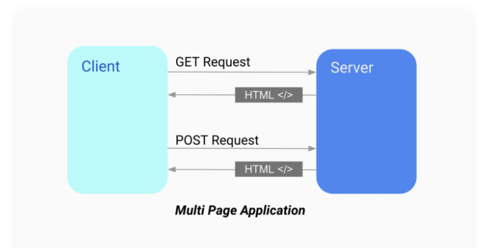
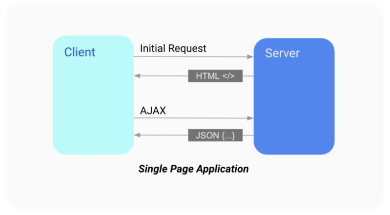
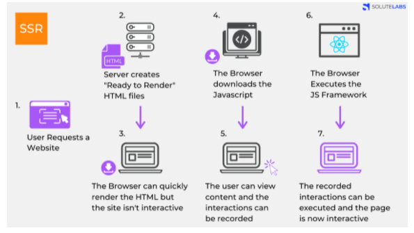
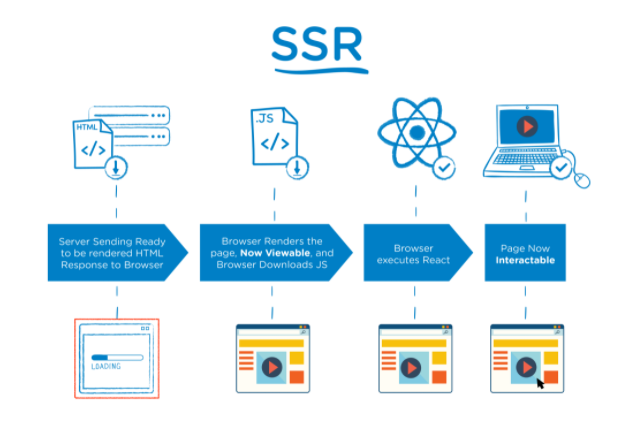
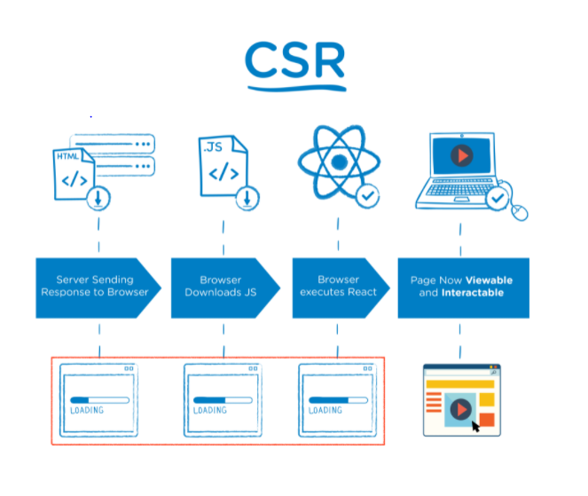

# CSR vs SSR (feat, SPA vs MPA)

**이 글을 읽기 전에 ""웹 브라우저의 동작원리""를 읽는 것을 추천**

> 비유해서 설명,,
>
>  SSR은 조리된 음식을 바로 먹는 것, (초벌 되서 나오는 고기)
>
> CSR은 삼겹살을 시켜놓고, 손님들이 직접 불판에 구워서 해 먹는 것,,! 

## SPA vs MPA

## SSR 

>  서버에서 완성된 형태의 html 파일을 받아와서 그대로 화면에 보여준다.
>
> 서버에서 렌더링을 마치고, Data가 결합된 HTML파일을 내려주는 방식이다. 

### (1) 정의

1. User가 Website 요청을 보냄.

2. Server는 'Ready to Render'. 즉, 즉시 렌더링 가능한 `html`파일을 만든다.
   (리소스 체크, 컴파일 후 완성된 HTML 컨텐츠로 만든다.)

3. 클라이언트에 전달되는 순간, 이미 렌더링 준비가 되어있기 때문에 HTML은 즉시 렌더링 된다. 그러나 사이트 자체는 조작 불가능하다. (Javascript가 읽히기 전이다.)

4. 클라이언트가 자바스크립트를 다운받는다.

5. 다운 받아지고 있는 사이에 유저는 컨텐츠는 볼 수 있지만 사이트를 조작 할 수는 없다. 이때의 사용자 조작을 기억하고 있는다.

6. 브라우저가 Javascript 프레임워크를 실행한다.

7. JS까지 성공적으로 컴파일 되었기 때문에 기억하고 있던 사용자 조작이 실행되고 이제 웹 페이지는 상호작용 가능해진다.

즉. 서버에서 이미 '렌더 가능한' 상태로 클라이언트에 전달되기 때문에, JS가 다운로드 되는 동안 사용자는 **무언가**를 보고 있을 수 있다.

### (2) 장 / 단점

**장점** 

1. seo 검색 엔진 최적화 (구글 제외) 갓 구글

CF) 

2. 빠른 초기 로딩 시간

**단점** 

1. TTV(Time To View)와 TTI(Time To Iteractive)차이 => 화면에 보이는데 클릭이 안된다?! (사용자 경험)

2. 요청시 마다 깜빡거림 => 페이지 이동하면 깜박거림! (사용자 경험)
3. 서버에 큰 부하

## CSR 

> 클라이언트에서 렌더링을 해줌
>
> 최초 요청시에 HTML을 비롯해 CSS, Javascript 등 각종 리소스를 받아온다. 이후에는 서버에 데이터만 요청하고, 자바스크립트로 뷰를 컨트롤 한다.
>
> 즉, 사용자의 요청에 따라 필요한 부분만 응답 받아 렌더링 하는 방식

1. User가 Website 요청을 보냄.

2. CDN이 HTML 파일과 JS로 접근할 수 있는 링크를 클라이언트로 보낸다.

> [CDN](https://ko.wikipedia.org/wiki/콘텐츠_전송_네트워크) : aws의 cloudflare를 생각하면 됨. 엔드 유저의 요청에 '물리적'으로 가까운 서버에서 요청에 응답하는 방식

3. 클라이언트는 HTML과 JS를 다운로드 받는다.
   (이때 SSR과 달리 유저는 아무것도 볼 수 없다.)

4. 클라이언트가 자바스크립트를 다운받는다. (3번과 같은데 왜 또,,,?)

5. 다운이 완료된 JS가 실행된다. 데이터를 위한 `API`가 호출된다.
   (이때 유저들은 `placeholder`를 보게된다. )

6. 서버가 API로부터의 요청에 응답한다.

7. API로부터 받아온 data를 placeholder 자리에 넣어준다. 이제 페이지는 상호작용이 가능해진다.

   

   자바스크립트가 모두 다운로드 된 다음에서야 화면이 보이고, 인터렉션이 가능

## (2) 장 / 단점

장점

1. 빠른 속도(초기화면 렌더링할때는 느리지만, 이후에 다른 페이지로의 이동시에는 ssr 보다 더 빠르다.)
2. 서버 부하 감소
3. 사용자 친화적(깜빡임 x)

단점

1. seo 불리
2. 초기 로딩속도 느림

## 언제 어떤 것을 사용해야 하나?!

### SSR

- 네트워크가 느릴 때 

- SEO(serach engine optimization : 검색 엔진 최적화)가 필요할 때.

- 최초 로딩이 빨라야하는 사이트를 개발 할 때

- 메인 스크립트가 크고 로딩이 매우 느릴 때

  > CSR은 메인스크립트가 로딩이 끝나면 API로 데이터 요청을 보낸다. 하지만 SSR은 한번의 요청에 아예 렌더가 가능한 페이지가 돌아온다.

- 웹 사이트가 상호작용이 별로 없을 때.

### CSR

- 네트워크가 빠를 때
- 개인정보의 보호가 중요할때
- 서버의 성능이 좋지 않을 때
- 사용자에게 보여줘야 하는 데이터의 양이 많을 때.
  (로딩창을 띄울 수 있는 장점이 있다.)
- 메인 스크립트가 가벼울 때
- SEO 따윈 관심 없을 때 (갓 구글)
- 웹 어플리케이션에 사용자와 상호작용할 것들이 많을 때

# 결론

양쪽의 모든 장점을 사용할 수 있는 NEXT.js를 쓰자!

> 첫판은 이미 조리되서 나오고,, 그 다음 부터는 손님이 굽는 

# 영상으로 복습하기

1. 드림코딩 앨리 : https://www.youtube.com/watch?v=iZ9csAfU5Os

2. 얄코 : https://youtube.com/watch?v=5ILR9Vd_Vos&feature=share

#  다음시간 예고

1. 그래서 seo가 정확히 뭔데?! 어떻게 최적화 할 수 있는건데?!
2. Next?! Nuxt?! 이것들로 CSR + SSR을?! (feat.  Hydration)  

----

참고

1. https://velog.io/@vagabondms/%EA%B8%B0%EC%88%A0-%EC%8A%A4%ED%84%B0%EB%94%94-SSR%EA%B3%BC-CSR%EC%9D%98-%EC%B0%A8%EC%9D%B4

2. https://miracleground.tistory.com/165

3. https://developers.google.com/web/updates/2019/02/rendering-on-the-web?hl=ko

4. https://hanamon.kr/spa-mpa-ssr-csr-%EC%9E%A5%EB%8B%A8%EC%A0%90-%EB%9C%BB%EC%A0%95%EB%A6%AC/

   