# EventLoop

부제 : js는 어떻게 동시성을 구현 하는가?!

# **오늘의 결론**

> 자바스크립트는 **싱글스레드 언어**(머리가 하나 / 호출스택이 하나 / 한번에 하나의 작업) 그렇지만 하지만 Web api, TaskQueue(CallbackQueue), EventLoop 덕분에 멀티 스레드처럼 실행하는듯 보여진다.


> 자바스크립트 엔진 자체는 싱글 스레드 이지만, 실제로 자바스크립트가 구동되는 환경인 Web Broswer에선 여러개의 쓰레드가 사용됨.(정확히는 web Api가 멀티 스레드로 동작) 그리고 이러한 web Api와 상호 연동을 하기 위해서 필요한 장치가 바로 TaskQueue(CallbackQueue)와 EventLoop

# 서론

## 자바 스크립트는 **싱글스레드 언어**. => **한번에 한가지**의 일 밖에 하지 못함.


**현실세계에 비유?!**

> 주지환은 한번에 다른일을 하지 못함. 게임을 하면서 다른 사람과 대화를 하지 못하고, 대화를 하면서 게임을 하지 못함.


**컴퓨터세계에서는?!**

> 현재 실행하고 있는 함수가 있는 경우에 다른 일을 할 수가 없고, 다른 일들이 block
>
> => 이렇게 되면 브라우저에서 오래 걸리는 작이 실행될 경우, 웹페이지의 UI는 멈춰버리고, 사용자는 어떠한 행동도 할 수 없게 됨

EX) alert를 창을 띄우면, alert를 창을 닫기 전까지는 아무것도 할 수 없는 것


**여기서의 문제의식**

## 그렇다면 시간이 오래 걸리는 작업과 같은 경우는 어떻게 해야하나?!


자바스크립트가 싱글스레드 언어이기 때문에, 1분동안 아무것도 안하고 기다리면서 브라우저는 아무런 행동도 하지 못하게 됨. 근데 이게 맞나?!

이때 사용하는 것이 바로

##  **비동기 콜백**


이러한 비동기 콜백을 이해하기 위해선 **JS engine** / **web api** / **eventLoop**에 대한 이해가 필요함

# 비동기 코드 예시

````js
console.log("안녕하세여")

//아래에 setTimeout의 인자로 들어간것이 콜백 함수
setTimeout(function() {
    console.log("실은 안녕 못하지롱!")
}, 5000) //단위 ms

console.log("웅 안녕!")
````

# 콜백 함수

이름 그대로 **나중에 호출되는 함수**

```
1. 다른 함수의 인자로써 이용되는 함수.
2. 어떤 이벤트에 의해 호출되어지는 함수.
```

동기 콜백의 경우 호츨 즉시 실행

비동기 콜백의 경우 나중에 조건을 만족했을떄 실행

ex) setTimeout, http 통신 등

**동기 콜백 함수 예시**

````js
function greeting(name) {
	console.log("안녕!" + name)
}

function nameInput(callback) {
    const name = prompt("이름을 입력해주세여")
    callback(name)
}

nameInput(greeting)
````

# 자바스크립트 엔진


엔진의 주요 두 구성요소는

- **Memory Heap** : 메모리 할당이 일어나는 곳
- **Call Stack** : **실제로 코드를 실행했을 때, 다음에 실행되어야 할 코드를 순서대로 기록을 하며, 순차적으로 코드를 실행** 할 수 있게 도와 줌.

EX)

````js
function multiply(x, y) {
    return x * y;
}
function printSquare(x) {
    var s = multiply(x, x);
    console.log(s);
}
printSquare(5);

````

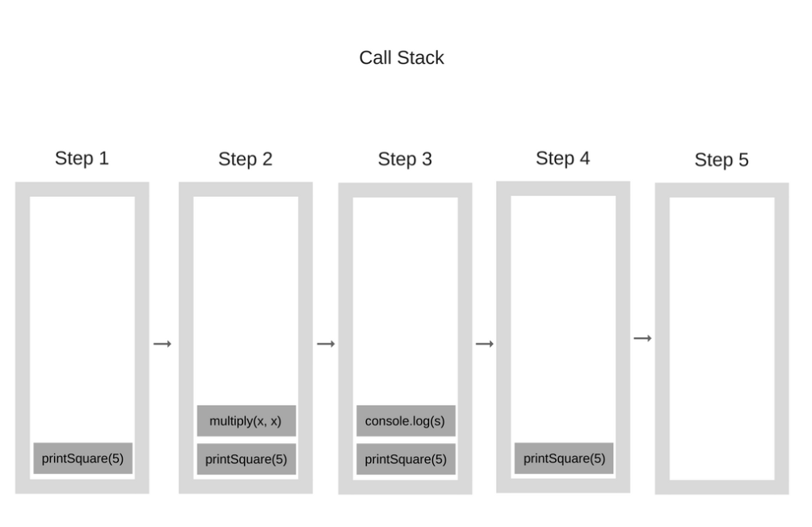

# 브라우저의 구조

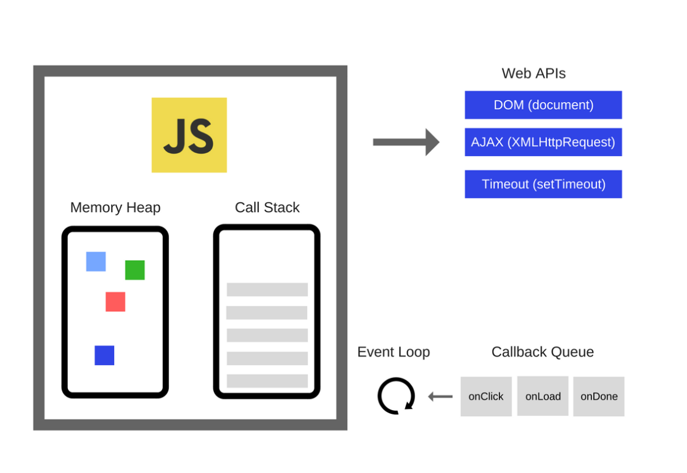


* 실제 브라우저에서는 자바스크립트 엔진 이외에도 자바스크립트에 관여하는 다른 요소들이 많다.

*  Web API: DOM, Ajax, setTimeout 과같이 브라우저에서 제공하는 API라고 함.

* `browser web API`가 브라우저에서 오래 걸리는 작업을 대신해 주는 역할을 한다. `browser web API` 는 브라우저 안에 C++ 구현된 쓰레드로 주로 `DOM event`, `AJAX request`, `setTimeout` 등 비동기 이벤트를 처리함. `javascript` 싱글 쓰레드의 영향을 받지 않고, 독립적으로 이벤트를 처리할 수 있게 됨.
* **이벤트 루프** 
  1. 호출 스택과 콜백 큐를 주시하고 있다.
  2. **호출스택이 비어있으면**, 먼저 들어온 순서대로 콜백 큐에 있는 콜백 함수들을 호출스택으로 집어 넣는다. 


````js
function foo() {
  console.log("1");
}

function foo2() {
  console.log("2");
}

foo();
setTimeout(function () {
  console.log("3");
}, 2000);
foo2();
````

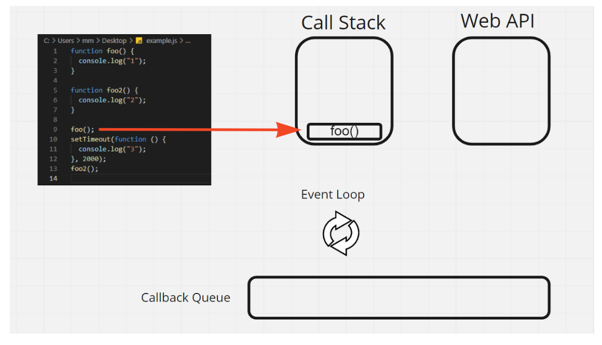


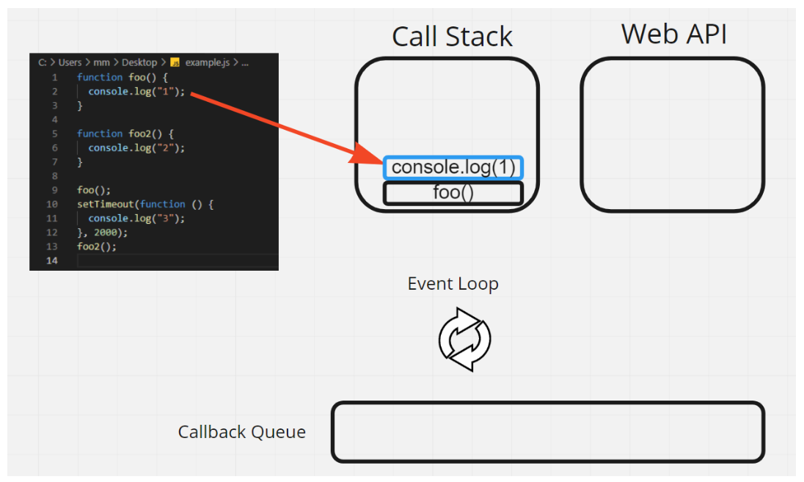

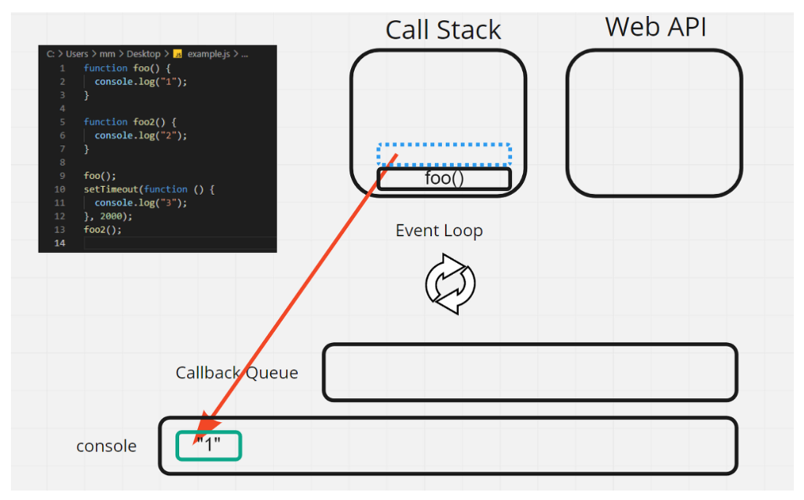

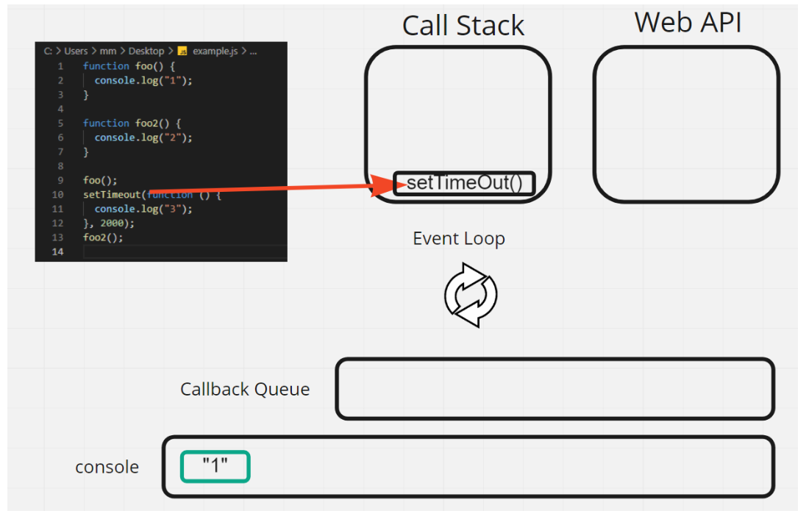

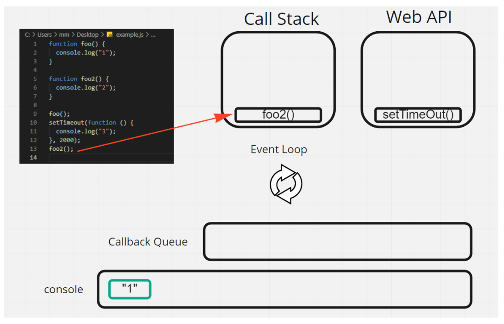

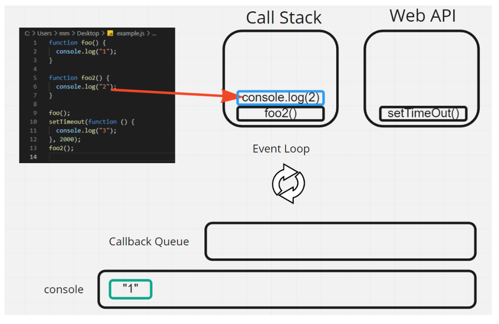


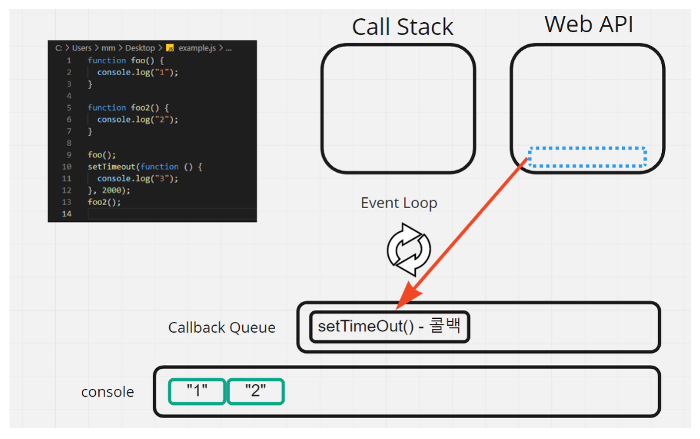

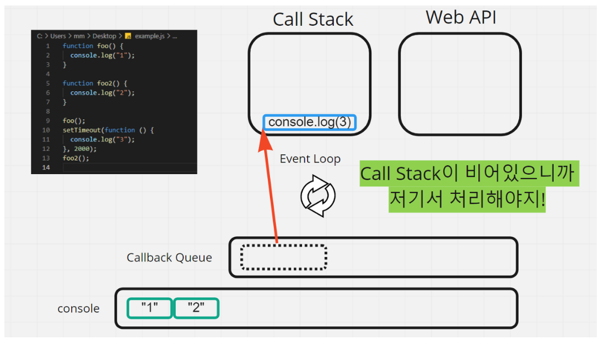

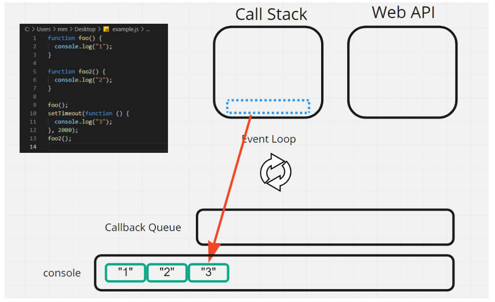


cf) **왜 call Stack이 비어있어야 하는 것인가?!**

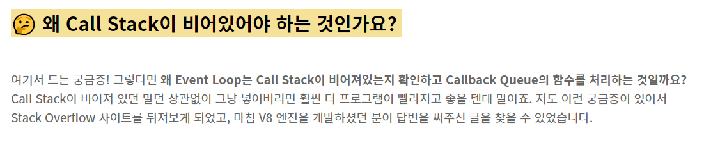

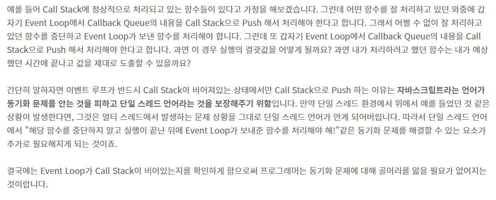

# 응용 예시

````js
$(".btn").click(function() { // (A)
	try {
	$.getJSON("/~~주소", function (res) { // (B)
		// 여기서 에러 발생
	});
	} catch (e) {
	  console.log("에러발생" + e.message)
	}
})
````

문제) (A)의 try cath는 (B)에서 발생한 에러를 잡을 수 있을까?! 

No. A와 B는 완전히 다른 문맥에서 실행중.

그렇다면 어떻게 적어야 할까?!

````js
$(".btn").click(function() { // (A)
	$.getJSON("/~~주소", function (res) { // (B)
		try {
             // 여기서 에러 발생
        } catch (e) {
              console.log("에러발생" + e.message)
        } 
	});
});
````


````js
console.log("피까츄")

setTimeout(function() {
    console.log("삐까삐까")
}, 0)

console.log("백만볼트")
````

문제) 피까츄 -> 삐까삐까 -> 백만볼트 일까 or 피까츄 -> 백만볼트 -> 삐까삐까 일까?!

정답은 피까츄 -> 백만볼트 -> 삐까삐까

**직접 call stack과 web api, callback queue를 그려가면서 해보시길,,**


# 참고

1. https://www.youtube.com/watch?v=wcxWlyps4Vg
2. https://blog.toycrane.xyz/%EC%A7%84%EC%A7%9C-%EC%89%BD%EA%B2%8C-%EC%95%8C%EC%95%84%EB%B3%B4%EB%8A%94-%EC%9E%90%EB%B0%94%EC%8A%A4%ED%81%AC%EB%A6%BD%ED%8A%B8-%EB%8F%99%EC%9E%91-%EC%9B%90%EB%A6%AC-c7fbdc44cc97

3. https://joshua1988.github.io/web-development/translation/javascript/how-js-works-inside-engine/

4. https://tristy.tistory.com/51