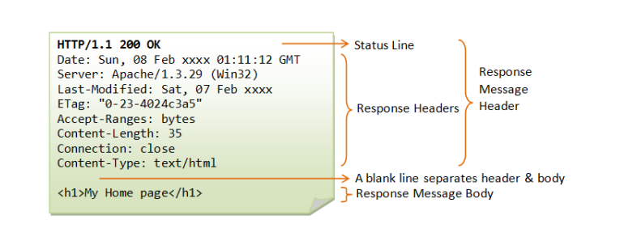
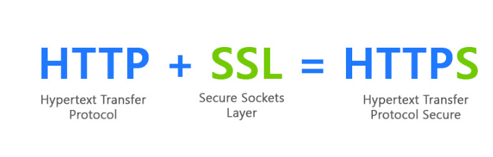
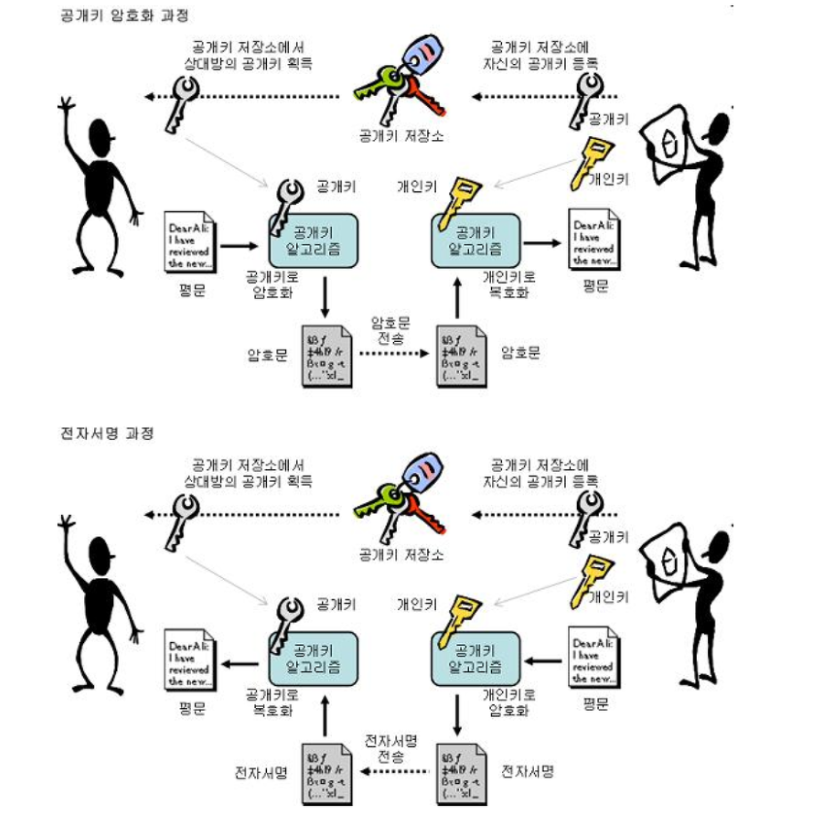
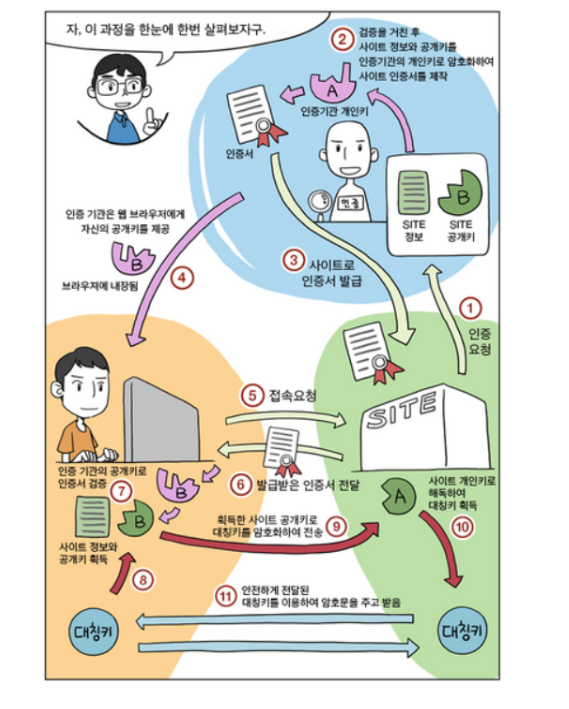
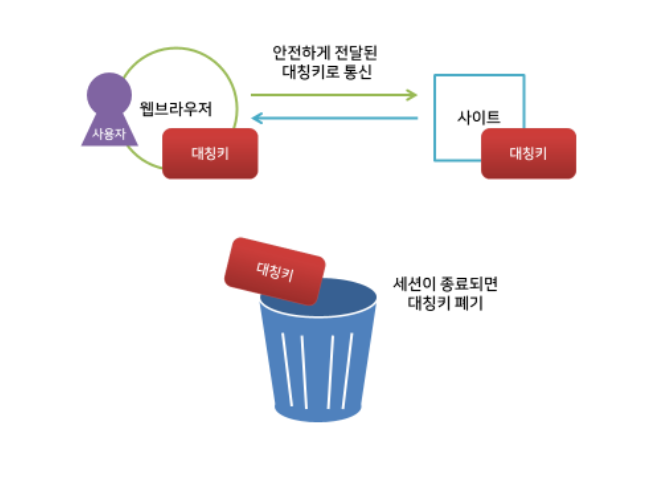
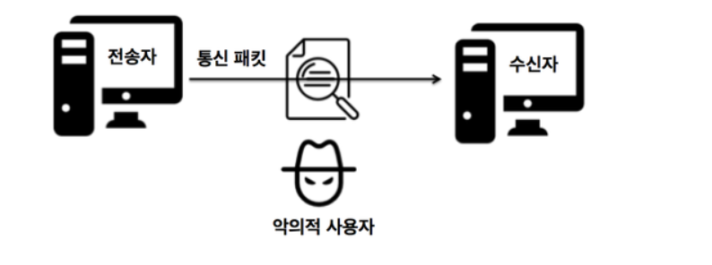

# Http vs Https

# Http(Hyper Text Transfer Protocol)

## Http란?!

**서버/클라이언트 모델을 따라 데이터를 주고 받기 위한 프로토콜**

>  HTTP는 인터넷에서 하이퍼텍스트를 교환하기 위한 통신 규약으로, 80번 포트를 사용하고 있다. 따라서 HTTP 서버가 80번 포트에서 요청을 기다리고 있으며, 클라이언트는 80번 포트로 요청을 보내게 된다.

## Http 구조

​	HTTP는 애플리케이션 레벨의 프로토콜로 TCP/IP 위에서 작동한다. HTTP는 상태를 가지고 있지 않는 Stateless 프로토콜이며 Method, Path, Version, Headers, Body 등으로 구성된다.

cf) Stateless 

> 여기서 상태가 없다는 말은 데이터를 주고 받기 위한 각각의 데이터 요청이 서로 독립적으로 관리가 된다는 뜻
>
> 이전에 보냈던 데이터 요청과 다음에 보낼 데이터 요청이 서로 관련이 없다는 것을 의미
>
> 이러한 특징 덕분에 서버는 세션과 같은 별도의 추가 정보를 관리하지 않아도 되고, 다수의 요청 처리 및 서버의 부하를 줄일 수 있는 성능 상의 이점이 발생한다. 

​												(Http Request Message)

​										(Http Response Message)

하지만 HTTP는 **암호화가 되지 않은 평문 데이터를 전송**하는 프로토콜이였기 때문에, HTTP로 비밀번호나 주민등록번호 등을 주고 받으면 제3자가 정보를 조회할 수 있었다. 그리고 이러한 문제를 해결하기 위해 **HTTPS**가 등장하게 되었다.

----

# Https(Hyper Text Transfer Protocol Secure)

> 즉, 쉽게 생각해서 **HTTP에 데이터 암호화가 추가된 프로토콜**

## 대칭키와 공개키(비대칭키)

Https는 SSL 암호화 통신은 **비대칭키 방식**(암호화에 사용할 키를 교환)를 사용하고, 그저 단순한 데이터 통신은 **대칭키 방식**을 사용

### 공개키(비대칭키) 방식

- A키로 암호화를 하면 B키로 복호화를 할 수 있다.
- B키로 암호화를 하면 A키로 복호화를 할 수 있다.
- 둘 중 하나를 비공개키(Private Key) 혹은 개인키라 부르며, 이는 자신만 가지고 있고 공개되지 않는다.
- 나머지 하나를 공개키(Public Key)라고 부르며 타인에게 제공한다. 공개키는 유출이 되어도 비공개키를 모르면 복호화 할 수 없기 때문에 안전하다.

### `공개키가 정확한지 아닌지를 증명하는 증명서`

공개키 암호에는 느리고 컴퓨터에 부하를 많이 준다는 단점 말고 하나 더 존재.

문제점은 `공개키가 진짜인지 아닌지를 증명할 수 없다는 것`

예를들어 네이버 서버의 공개키 암호를 사용해서 통신을 시작하려 할 때 해당 공개키가 네이버의 진짜 공개키인지를 어떻게 증명할 수 있을까요? 도중에 공격자가 공개키를 바꿔치기 했을지도 모르는데!?,,,

이 문제를 해결하는 데는 `인증 기관(CA:Certificate Authority)`에서 발행하는 `공개키 증명서`가 이용되고 있다. 인증 기관은 아무나 할 수 있는 것이 아니라 엄격한 심사의 과정을 거치게 된다. 즉, 서버, 클라이언트가 모두 신뢰할 수 있는 제3자 기관

### 대칭키 방식

- 동일한 키로 암호화, 복호화가 가능하다.
- 대칭키는 매번 랜덤으로 생성되어 누출되어도 다음에 사용할 때는 다른 키가 사용되기 때문에 안전하다.
- 공개키보다 빠르게 통신할 수 있다.

# 전체 동작과정 한번에

### 인증기관이 이용되는 순서

1. 먼저 서버에서 인증 기관에 서버 공개키를 제출
2. 인증 기관은 서버로부터 받은 공개키를 자신의 비밀키를 통해 암호화
3. 인증기관이 발급한 인증서에 2번에서 암호화한 서버의 공개키를 인증서에 담아서 서버에게 보냄
4. 서버는 이 인증 기관에 비밀키로 암호화된 자신의(서버의) 공개키를 담은 인증서를 클라이언트에게 보냄
5. 인증서를 받은 클라이언트는 인증 기관 CA의 공개키를 사용해서 서버의 공개키를 복호화. 이 때 복호화가 잘 된다면 인증 기관이 발급한 인증서라는 것과 실제 서버의 공개키라는 것을 알 수 있다.(즉, 신뢰할 수 있다.)

여기서 4번의 과정을 보면 클라이언트는 CA 기관의 비밀키로 암호화 되어 있는 서버의 공개키가 담긴 인증서를 받게 된다. 인증서에 들어있는 서버의 공개키를 복호화 하기 위해서는 CA의 공개키가 필요하다. 그러면 어떻게 CA 기관의 공개키를 클라이언트에게 전달할 수 있을까?!

통신 중에는 어떤 방법을 사용하더라도 안전하게 전달하는 것은 어렵기 때문에 많은 브라우저가 주요 인증 기관의 공개키를 사전에 내장한 상태로 제품을 내놓고 있다.

 다음으로는 `SSL HandShake`는 어떠한 과정으로 이루어지는지 알아보자!

## SSL HandShake(인증기관이 이용되고 난 후 )

1. 클라이언트가 `Client Hello 메세지(랜덤 메세지)`를 서버에게 보내면서 SSL 통신을 시작합니다. 메세지에는 클라이언트가 어떤 암호 알고리즘을 사용할 수 있는지 등등이 포함되어 있습니다. 
2. 서버가 SSL 통신이 가능한 경우에는 `Server Hello 메세지(랜덤 메세지)`로 응답합니다. 클라이언트가 보낸 암호 알고리즘 중에 가능한 알고리즘을 하나 선택해 클라이언트에게 응답해줍니다. 그리고 `서버가 Certificate(인증서)를 클라이언트에게 전송합니다` 즉, 신뢰성 있는 CA 기관으로 부터 발급 받은 증명서를 클라이언트에게 보내게 됩니다.
3. 클라이언트는 서버로부터 받은 증명서를 브라우저에 내장되어 있는 인증 기관의 공개키로 검증하고, `인증서가 진짜 CA 기관으로 부터 발급 받은 것`인지 확인합니다. 여기서 `인증서 안에 들어있는 CA 기관의 비밀키로 암호화 되어있는 서버의 공개키를 복호화하여 서버의 공개키를 클라이언트에서 얻을 수 있습니다.`
4. 서버가 Server Hello Done 메세지를 송신하고 최초의 SSL 통신이 끝났음을 통지합니다. 
5. 클라이언트는 클라이언트에서 서버로 보낸 `Client Hello(랜덤 메세지)`와 `서버에서 클라이언트로 응답한 Sever Hello(랜덤 메세지)`를 조합하여 `Pre-Master-Secret-Key`를 만듭니다.(`Pre-Mster-Secret-Key`는 클라이언트와 서버 사이에 `공통키`로 사용될 키이기 때문에 절대로 외부로 노출되어서는 안됩니다.)
6. **클라이언트는 `증명서에 들어있던 서버의 공개키를 이용해서 Pre-Master Secret Key를 암호화` 한 후에 서버로 보냅니다.(`Pre-Master-Secret-Key`는 외부에 노출되면 안되기 때문에 이 과정에서 `비대칭키(공개키)` 방식으로 통신하게 됩니다.)** 
7. **서버는 자신의 공개키로 암호화 되어 있는 `Pre-Master-Secret-Key`를 `자신의 비밀키`로 `복호화`한 후에 클라이언트와 서버에서 사용할 `공통키`를 가지게 됩니다.**
8. **클라이언트와 서버는 모두 `Pre-Master-Secret-Key`라는 `공통키`를 가졌기 때문에 이후 통신에는 `대칭키(공통키)` 방식으로 사용해서 통신하게 됩니다.**

## 다시 다른 그림으로 설명

\* 아래 그림 및 설명에서 서버 = 사이트, 클라이언트 = 사용자로 나타내었다.

1. 인터넷 사이트(서버)는 공개키와 개인키를 만들고, 신뢰할 수 있는 인증 기관(CA)에 자신의 정보와 공개키를 관리해달라고 계약하고 (경우에 따라) 돈을 지불한다.
2. 이 때, 계약을 완료한 인증 기관은 기관만의 공개키와 개인키가 있다. 인증 기관은 사이트가 제출된 데이터를 검증하고, 인증 기관의 개인키로 사이트에서 제출한 정보를 암호화해서 인증서를 만들어 제공한다. 사이트는 인증서를 가지게 되었다.
3. 인증 기관은 웹 브라우저에게 자신의 공개키를 제공한다.

1. 사용자가 사이트에 접속하면 서버는 자신의 인증서를 웹 브라우저(클라이언트)에게 보낸다. 예를 들어, 웹 브라우저가 index.html 파일을 달라고 요청했다면, 서버의 정보를 인증 기관의 개인키로 암호화한 인증서를 받게 되는 것이다.
2. 웹 브라우저는 3.0에서 미리 알고 있던 인증기관의 공개키로 인증서를 해독하여 검증한다. 그러면 사이트의 정보와 서버의 공개키를 알 수 있게 된다.
   \* *이 부분은 보안상의 의미는 없다. 단지 해당 서버로부터 온 응답임을 확신할 수 있게 된다.*
3. 이렇게 얻은 서버의 공개키로 대칭키를 암호화해서 다시 사이트에 보낸다.
4. 사이트는 개인키로 암호문을 해독하여 대칭키를 얻게 되고, 이제 대칭키로 데이터를 주고받을 수 있게 된다.

## HTTPS와 HTTP의 차이점은?

**첫 번째**, 사용자가 웹 사이트에 보내는 정보들을 제 3자가 못 보게 합니다.

> HTTP의 경우 사용자가 로그인 폼에 아이디와 비밀번호를 입력하고 로그인 버튼을 누르면 이 두 정보가 인터넷을 타고 서버로 전송될 때 이 암호가 입력한 텍스트 그대로, 누구든 알아볼 수 있는 형식으로 보내집니다. 이는 제 3자에게 사용자의 정보가 유출될 수 있습니다. 그러나 HTTPS의 경우는 이 비밀번호 정보를 허가된 서버에서만 알아볼 수 있는 암호화된 텍스트로 변경해서 전송됩니다.

**두 번째**, 사용자가 접속한 사이트가 신뢰할 수 있는 사이트인지 판별해줍니다.

> 기관으로부터 검증된 사이트만 주소에 HTTPS 사용이 허가되기 때문에 피싱 사이트를 걸러낼 수 있게 해줍니다.

# 다음주 주제

**Ouath 2.0** 혹은 **WebRTC vs webSOCKET**

# 추가 설명(꼭 보기)

1. 얄코 : https://www.youtube.com/watch?v=H6lpFRpyl14
2. http에 대해 더 자세히 알아보자 https://velog.io/@rosewwross/Http-and-Request-and-Response-hok6exbnfb

# 참고

1. https://github.com/joojeehwan/prepare_frontend_interview/blob/main/cs.md#HTTP

3. https://mangkyu.tistory.com/98

4. https://devlog-wjdrbs96.tistory.com/289
5. https://velog.io/@swhan9404/HTTP%EC%99%80-HTTPS-%EC%B0%A8%EC%9D%B4-%EA%B5%AC%EB%B6%84%ED%95%98%EA%B8%B0#ssl-%EC%A0%81%EC%9A%A9%EB%B0%A9%EC%8B%9D

6. https://rachel-kwak.github.io/2021/03/08/HTTPS.html
7. https://github.com/ssafy-tech-concert/ssafy-tech-concert/blob/master/web/HTTP_HTTPS.md

8. https://hyeran-story.tistory.com/159