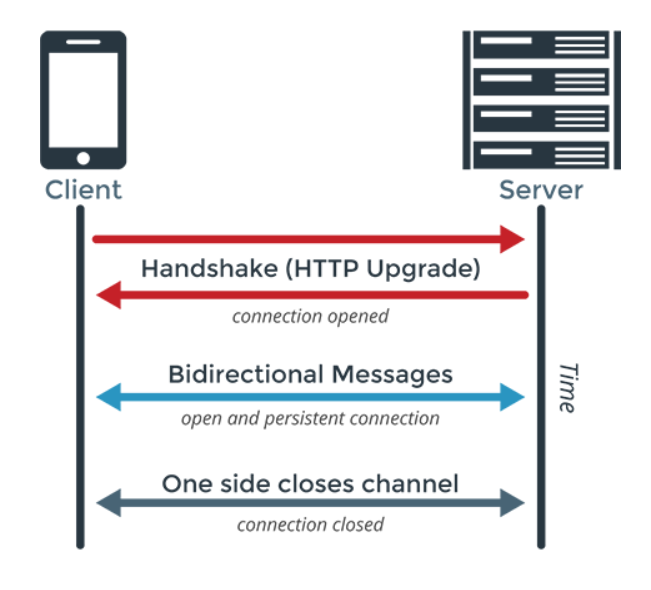
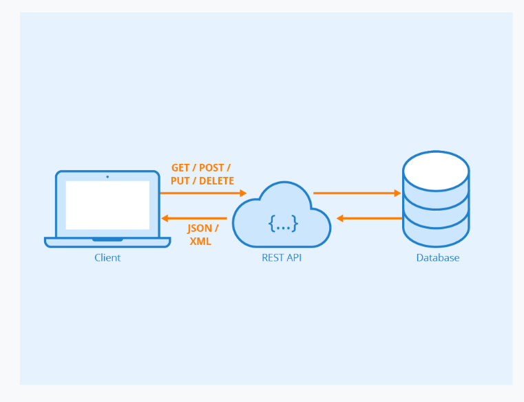
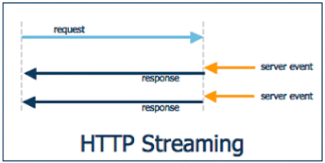

# 웹소켓이란?! 

>  **서버와 클라이언트 간에 Socket Connection을 유지해서 언제든 양방향 통신 또는 데이터 전송이 가능하도록 하는 기술**



# 웹소켓 탄생배경

### **기존의 HTTP 통신의 단점을 극복하기 위해서**

cf) Http?!

> HTTP는 HTML이라는 문서를 운반하기 위한 프로토콜로 **모든 HTTP를 사용한 통신은 클라이언트가 먼저 요청을 보내고, 그 요청에 따라 웹 서버가 응답하는 형태이며 웹 서버는 응답을 보낸 후 웹 브라우저와의 연결을 끊는다.**

HTTP는 Request/response기반의 **Stateless** protocol이다.

즉, 서버와 클라이언트 간의 Socket connection같은 영구적인 연결이 되어있지 않고 클라이언트 쪽에서 필요할때 Request를 할때만 서버가 Response를 하는 방식으로 통신이 진행되는 단방향 통신이다. 

**이럴경우 서버쪽 데이터가 업데이트 되더라도 클라이언트 쪽에는 화면은 Refresh하지 않는한 변경된 데이터가 업데이트 되지 않는 문제가 발생한다.** 




REST API로 데이터가 전송되는 것은 항상 누군가가 그 데이터를 요청한 것의 결과이다.

ex) 실시간으로 정보가 업데이트 되어야하는 분야(주식 등) -> 요청 행위 없이 실시간 데이터가 업데이트 되기 위해서는 무한 새로고침을 반복해야 할것이다.

###  REST API의 한계는

1. 정보가 변할 때, 그때마다 실시간으로 받아보기 힘들다는 점
2.  한 번의 요청이 한 번의 응답으로 끝난다.
   (즉, **한 번 요청하면 그 뒤로 계속해서 알아서 업데이트 해주는 방식의 API가 필요하**다)

### 그래서 등장한 API가 Websocket API(= 구독형 API)이다.

# 웹소켓의 특징


- ```
  양방향 통신(Full-Duplex)
  ```

  - 데이터 송수신을 동시에 처리할 수 있는 통신 방법
  - 클라이언트와 서버가 서로에게 원할 때 데이터를 주고 받는다.
  - 통상적인 HTTP 통신은 클라이언트가 요청을 보내는 경우에만 서버가 응답하는 단방향 통신

- ```
  실시간 네트워킹(Real Time-Networking)
  ```

  - 웹 환경에서 연속된 데이터를 빠르게 노출한다.
  - 여러 단말기에 데이터를 빠르게 교환한다.
  - ex) 채팅, 주식, 비디오 데이터

# 웹소켓 이전의 (유사)실시간 통신


webSocket 이전에는 실시간 통신을 위해서 **HTTP 통신에 약간의 트릭을 사용해서 실시간에 준하는** 것처럼 보이게 하는 기술들을 사용


1. ## Polling


> 가장 기본적인 데이터 처리방식으로, 특정 주기를 가지고 서버에 http request을 하는 방식이다

Polling방식은 언제 통신이 발생할 지 예측이 불가능하기 때문에 클라이언트가 평범한 http request를 **일정한 주기로 서버에 요청**하여 이벤트 내용을 전달받는 방식이다.

가장 간단한 방법이지만 언제 통신이 발생할지 예측이 불가능하다는 점에서 클라이언트가 계속적으로 요청을 하기때문에 클라이언트가 많아지면 서버의 부담이 급증하게된다. 실시간 통신이라고 부르기는 하지만 실시간 정도의 빠른 응답을 기대하기는 어렵다.

## cf) 카카오톡 FE 팀 useSwr vs React-qurey

##  https://fe-developers.kakaoent.com/2022/220224-data-fetching-libs/

2. ## Long Polling


> Polling과 비슷한 기법이나 실시간으로 데이터를 처리할 수 있는 방식이다

Long Polling은 클라이언트에서 서버로 일단 http request를 보내고 이 상태로 **계속 기다리다가** 서버에서 해당 클라이언트로 전달할 이벤트가 있다면 그 순간 response 메세지를 전달하며 연결이 종료된다. 해당 작업이 완료된 이후에는 클라이언트에서 곧바로 다시 http request를 보내 서버의 다음 이벤트를 기다리게 되는 작업 방식이다.

일반 Polling과 비교했을때 Polling보다는 서버의 부담이 줄어든다는 장점이 있지만 클라이언트에게 동시에 많은 양의 메세지가 올 경우 Polling과 별 차이가 없게되며, 다수의 클라이언트에게 동시에 이벤트가 발생될 경우에는 곧바로 다수의 클라이언트가 서버로 접속을 시도하게 되면서 서버의 부담이 급증하게 된다.


3. ## Streaming




> 일반적인 TCP Connection과 비슷하며, 클라이언트와 서버간 연결 된 연결 통로로 데이터를 보내는 방식이다

Streaming은 Long Polling과 마찬가지로 처음에는 클라이언트에서 서버로 http request를 보낸다.

서버에서 클라이언트로 이벤트를 전달할 때, 해당 요청을 끊지 않고 필요한 메세지만 보내기를 반복하는 방식이다. 서버에서 메세지를 보내고 나서 다시 http request연결을 하지 않아도 되어 Long Polling에 비해 부담이 덜 하다.

**Long Polling과 Streaming 방식의 경우 서버에서 클라이언트로 메세지를 보낼수는 있지만 클라이언트에서 서버로 메세지를 보내는것에는 조금 어렵다는 문제점이 있다.**


## 다음 시간에 이어서,  

## 웹소켓 동작 방법 / 웹 소켓 프로토콜의 특징 / 웹 소켓 특이점 / 웹소켓 한계극복(개발자용)

의 주제를 가지고 발표를 이어가겠습니다. 

----

# 참고 강의

1. 코딩애플 : https://www.youtube.com/watch?v=yXPCg5eupGM

2. 10분 테코톡 : https://www.youtube.com/watch?v=MPQHvwPxDUw

# 참고 자료

1. https://d2.naver.com/helloworld/1336
2. https://velog.io/@kirin/Websocket
3. https://www.notion.so/haney0y/WebSocket-d9c95636110144a0ae65780da63a5db0 
4. https://brunch.co.kr/@adrenalinee31/2
5. https://kyleyj.tistory.com/59