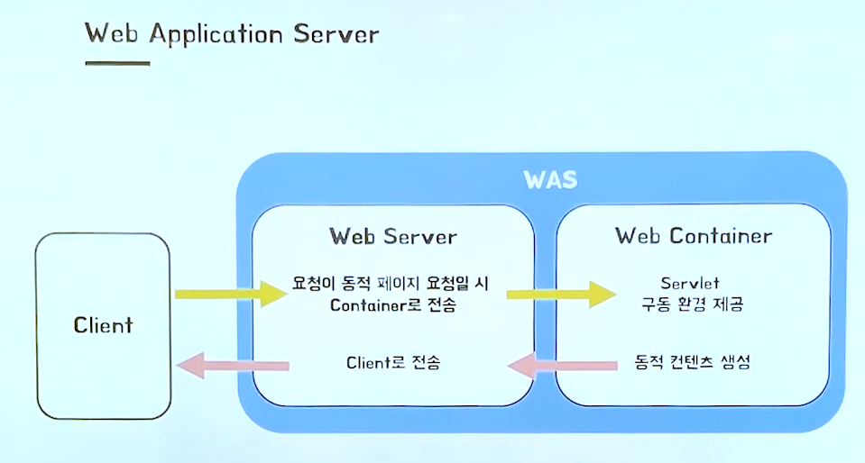
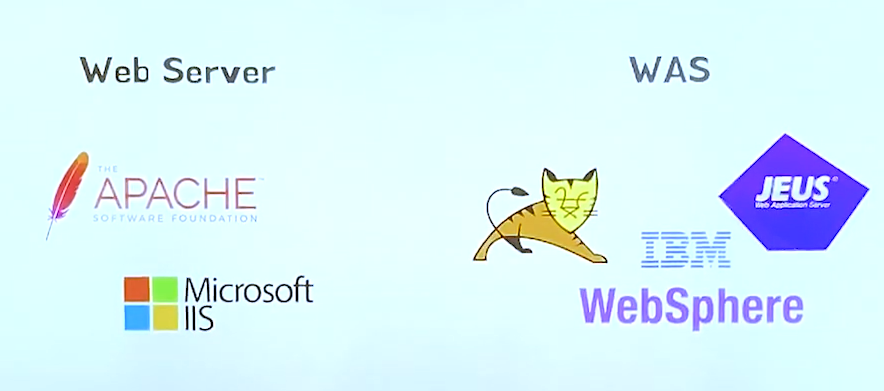

# 웹서버 vs WAS

# 1. 웹 서버의 이해

## 웹(Web)

- 일반적인 의미: **거미집 모양의 망**
- 기술적인 의미: **인터넷 망** 안에서 **정보를 공유, 검색**할 수 있게 하는 시스템이다. 인터넷에 연결된 사용자들은 서로 정보를 공유할 수 있다. **월드 와이드 웹(WWW)**이라고 부르는 게 바로 웹이다.
- 인터넷 서비스 종류로 웹만 있는 게 아니다. SMTP(전자우편), FTP(파일전송), Telnet(원격접속) 등 다양하게 있는데, **팀 버너스리**가 SMTP이나 FTP를 통해 정보를 주고 받는 것을 비효율적이라 생각하여 **WWW(월드 와이드 웹)**을 고안하였다.
- 웹을 지탱하고 구성하는 아래 세 가지 기술이 있다.
  - **HTTP(통신 규칙)**
  - **URI or URL(주소)**
  - **HTML(내용)**

## 서버(Server)

- 네트워크를 통해 **클라이언트에게** **정보나 서비스를 제공하는 컴퓨터** 시스템

## 웹 서버(Web Server)

- **인터넷을 기반**으로 **클라이언트에게 웹 서비스를 제공하는 컴퓨터**

> **클라이언트**의 입장: 웹 서버에게 **주소(url)**을 가지고 **통신 규칙(http)**에 맞게 요청하면, 알맞은 **내용(html)**을 응답 받음
>
> **서버** 입장: 클라이언트의 요청을 기다리고, **웹 요청(http)에 대한 데이터**를 만들어서 응답, 이때 데이터는 웹에서 처리할 수 있는 html, css, 이미지 등 **정적인 데이터로 한정**

- 우리도 로컬 컴퓨터로 쉽게 웹 서버를 만들 수 있다. 무료로 공개된 아파치 웹 서버를 깔고, 포트번호랑 HTML 파일 위치를 정해주면 전세계 사람들에게 웹 서비스를 제공할 수 있는 컴퓨터를 가질 수 있다.
- 그런데 한 가지 문제가 있다. 웹 서버에서는 html, css, 이미지 등 **정적인 자료**만 제공할 수 있다. 예를 들어 구구단 페이지를 전달할 때, 정적인 자료만 제공할 수 있으므로 `1 x 1 = 1, 1 x 2 = 2...` 등의 내용을 미리 다 작성해놔야 한다. 1, 2단이라 아니라 100단, 1000단이라고 생각하면 문제가 심각해진다. (프로그램을 웹에서 실행할 수 있다면 for문 몇 줄이면 끝나는 건데...)
- 다시 말해, 웹 서버에서 브라우저에게 html을 주기 전에 애플리케이션을 돌려서 데이터를 만들고 그 만든 데이터를 넣어 주면 간단하겠지만 html은 프로그래밍 언어가 아니라 위의 문제를 해결할 수 없었다. (html은 마크업 언어)
- 결국 요청에 따른 **비즈니스 로직 처리**나 **DB 연동** 문제를 해결하기 위해 등장한 게 WAS이다.

# 2. WAS의 이해

## Web Application

- 웹 애플리케이션은 드디어 우리가 원했던, 바로 그것. 웹에서 실행되는 응용 프로그램을 말한다. 우리는 애플리케이션을 통해서 이제 html의 한계를 극복할 수 있게 되었다.

## Web Application Server

- WAS는 **웹 애플리케이션을 실행시켜 필요한 기능을 수행하고 그 결과를 웹 서버에게 전달하는 일종의 미들웨어**를 말한다.

- php, jsp, asp와 같은 언어들을 사용해 **동적인 페이지를 만들어낼 수 있는 서버**이다.

- **프로그램 실행 환경과 데이터베이스 접속 기능**을 제공한다.

- **비즈니스 로직 수행**이 가능하다.

- **웹 서버 + 웹 컨테이너**를 합친 형태다.

  > 컨테이너: jsp, servlet을 실행시킬 수 있는 소프트웨어
  >
  > 자바 계열에선 웹 애플리케이션을 컨테이너라고 부른다.
  >
  > 웹 애플리케이션 컨테이너: 웹 애플리케이션이 배포되는 공간

## **동작 방식**

# 3. 웹 서버와 WAS 종류

## 웹 서버 종류

- 아파치
- Microsoft IIS
- Ngnix

## WAS 종류

- 톰캣
- JEUS
- IBM WebSphere

# 4. 웹 서버와 WAS 차이

- 웹 서버는 **정적인 컨텐츠**만 줄 수 있다.

- WAS는 어떤 **애플리케이션**을 돌리고, **DB**를 연결하고, 어떤 로직을 수행해서, 만든 데이터를 전달할 수 있다.

- **요약**: "요청에 따라 변하는 정보를 제공할 수 있는가?"

  > 우아한 테크톡 희봉님의 요약: "상황에 따라 변하는 정보를 제공할 수 있는가?"

> [이미지 출처](https://www.youtube.com/watch?v=NyhbNtOq0Bc)

## 요약 표

| 구성 요소                  | 설명                                                         |
| -------------------------- | ------------------------------------------------------------ |
| 웹 브라우저                | - 사용자(클라이언트)가 요청한 웹 서버의 결과를 화면에 출력하는 애플리케이션이다. |
| 웹 서버                    | - 웹 브라우저의 요청을 받아 들여서 이에 알맞은 결과를 웹 브라우저에 응답한다. - 요청에 필요한 페이지의 로직이나 데이터베이스와의 연동을 위해서 애플리케이션 서버에 이들의 처리를 요청한다. - 대표적인 웹 서버의 종류로는 아파치, IIS가 있다. |
| 웹 애플리케이션 서버 (WAS) | - 요청한 페이지의 로직이나 데이터베이스와의 연동을 위해 처리하는 부분이다. - 대표적인 WAS로 톰캣, IBM의 WebSphere, Jeus(국산) 가 있다. |
| 데이터 베이스              | - 데이터를 저장하는 곳이다. 예를 들어 회원 정보나 게시판에 올린 글에 대한 정보를 저장한다. |

# 5. 웹 서버와 WAS를 따로 사용하는 이유

1. 서로의 기능을 분리하여 서버 부하를 방지할 수 있다.

- WAS는 DB 조회 등 페이지를 만들기 위한 다양한 로직을 처리하는데,
  단순한 정적 컨텐츠까지도 WAS에서 제공하면 다른 작업에 사용하는 리소스로 인해 **지연**이 생겨날 수 있다.
- 다만, 톰캣 5.5 이상부터는 성능이 크게 떨어지지 않는다고 한다.

2. 물리적으로 분리하여 보안을 강화할 수 있다.

- SSL에 대한 암복호화 처리에 웹 서버를 사용한다.

- 웹 서버를 앞단에 두어, 공격이 있을 때 중요한 정보가 담긴 DB나 로직까지(WAS까지) 전파되지 못하게 한다.

  > `WAS`에는 실제 `Web Application`이 올라가 있기 때문에 외부와 직접 연결이 되어 있다면 중요한 설정 파일이나 리소스들이 외부로 노출될 수 있다.
  > 이를 막기 위해서 **`WEB서버`를 `WAS` 앞단에 배치해서 리소스를 안전하게 보호할 수 있다.**

3. 여러 대의 WAS 를 연결 가능할 수 있다.

- **Load Balancing**
- **fail over**(작동 중지된 WAS를 대신해 다른 WAS를 사용하여 장애를 극복함)
- **fail back**(작동 중지된 WAS를 재동작시킴)

- 대용량 웹 애플리케이션의 경우(여러 개의 서버 사용) Web Server와 WAS를 분리하여 무중단 운영을 위한 장애 극복에 쉽게 대응할 수 있다.

  

4. 다른 종류의 WAS로 서비스 가능

- 하나의 서버에서 PHP Application과 Java Application을 함께 사용할 수 있다.

----

***위처럼 다양한 이유가 있지만, 최근엔 WAS의 기능이 많이 강화되었기 때문에 WEB서버와 WAS를 분리하는 가장 큰 이유는 로드밸런싱이라고 볼 수 있다.***

# 참고

1. https://velog.io/@bky373/Web-%EC%9B%B9-%EC%84%9C%EB%B2%84%EC%99%80-WAS#ref

2. https://www.youtube.com/watch?v=F_vBAbjj4Pk
3. https://www.youtube.com/watch?v=NyhbNtOq0Bc
4. http://www.libqa.com/wiki/96
5. https://velog.io/@change/WEB%EC%84%9C%EB%B2%84-WAS-%EB%B6%84%EB%A6%AC-%EC%9D%B4%EC%9C%A0

