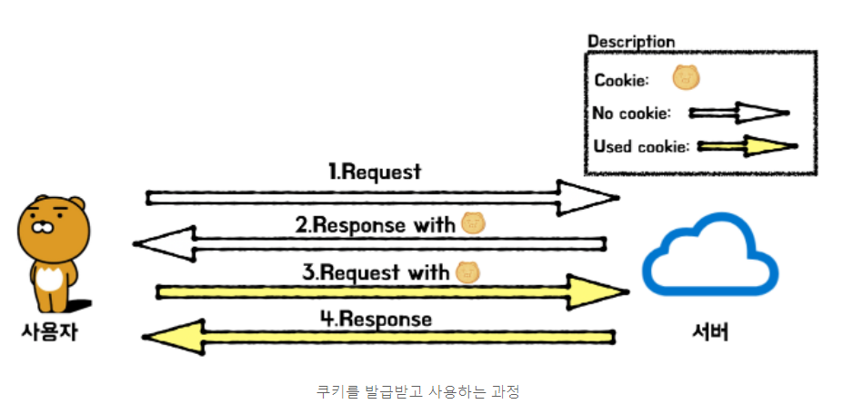

# 쿠키 vs 세션스토리지

- 공통점

데이터베이스를 사용하지 않고 데이터를 임시적인 용도로 저장 할 때 사용하는 것

* 차이점

**쿠키와 세션 차이**

|                           | **쿠키(Cookie)**                                             | **세션(Session)**                     |
| ------------------------- | ------------------------------------------------------------ | ------------------------------------- |
| **저장 위치**             | 클라이언트(=접속자 PC)                                       | 웹 서버                               |
| **저장 형식**             | text                                                         | Object                                |
| **만료 시점**             | 쿠키 저장시 설정 (브라우저가 종료되도, 만료시점이 지나지 않으면 자동삭제되지 않음) | 브라우저 종료시 삭제 (기간 지정 가능) |
| **사용하는 자원(리소스)** | 클라이언트 리소스                                            | 웹 서버 리소스                        |
| **용량 제한**             | 총 300개 하나의 도메인 당 20개 하나의 쿠키 당 4KB(=4096byte) | 서버가 허용하는 한 용량제한 없음.     |
| **속도**                  | 세션보다 빠름                                                | 쿠키보다 느림                         |
| **보안**                  | 세션보다 안좋음                                              | 쿠키보다 좋음                         |

## 쿠키와 세션스토리지을 사용하는 이유?!

### HTTP 프로토콜의 특징이자 약점을 보완하기 위해서 사용된다.

1. **Connectionless 프로토콜 (비연결지향)**

   > 클라이언트가 요청을 한 후 응답을 받으면 그 연결을 끊어 버리는 특징
   >
   > HTTP는 먼저 클라이언트가 request를 서버에 보내면, 서버는 클라이언트에게 요청에 맞는 response를 보내고 접속을 끊는 특성이 있다.
   >
   > 헤더에 keep-alive라는 값을 줘서 커넥션을 재활용하는데 HTTP1.1에서는 이것이 디폴트다.
   >
   > HTTP가 tcp위에서 구현되었기 때문에 (tcp는 연결지향,udp는 비연결지향) 네트워크 관점에서 keep-alive는 옵션으로 connectionless의 연결비용을 줄이는 것을 장점으로 비연결지향이라 한다.
   >
   > 

2. **Stateless 프로토콜 (상태정보 유지 안함)**

> 통신이 끝나면 상태를 유지하지 않는 특징
>
> 연결을 끊는 순간 클라이언트와 서버의 통신이 끝나며 상태 정보는 유지하지 않는 특성이 있다.

**But, 실제로는 데이터 유지가 필요한 경우가 많다.**

정보가 유지되지 않으면, 매번 페이지를 이동할 때마다 로그인을 다시 하거나, 상품을 선택했는데 구매 페이지에서 선택한 상품의 정보가 없거나 하는 등의 일이 발생할 수 있다.  

→ **따라서, Stateful 경우를 대처하기 위해서 쿠키와 세션을 사용한다.**   

쿠키와 세션의 차이점은 크게 상태 정보의 저장 위치이다.   

쿠키는 '클라이언트(=로컬PC)'에 저장하고, 세션은 '서버' 에 저장한다.

## 쿠키란?!

- HTTP의 일종으로 사용자가 어떠한 웹 사이트를 방문할 경우,
  그 사이트가 사용하고 있는 서버에서 **사용자의 컴퓨터에 저장하는 작은 기록 정보 파일**이다.

  HTTP에서 클라이언트의 상태 정보를 클라이언트의 PC에 저장하였다가
  **필요시 정보를 참조하거나 재사용할 수 있다.**

  

  - **쿠키 특징**

    1. 이름, 값, 만료일(저장 기간 설정), 경로 정보로 구성되어 있다.

    2. 클라이언트에 총 300개의 쿠키를 저장할 수 있다.

    3. 하나의 도메인 당 20개의 쿠키를 가질 수 있다

    4. 하나의 쿠키는 4KB(=4096byte)까지 저장 가능하다.

       

  - **쿠키의 동작 순서**

    1. 클라이언트가 페이지를 요청한다. (사용자가 웹사이트 접근)

    2. 웹 서버는 쿠키를 생성한다.

    3. 생성한 쿠키에 정보를 담아 HTTP 화면을 돌려줄 때,
       같이 클라이언트에게 돌려준다.

    4. 넘겨 받은 쿠키는 클라이언트가 가지고 있다가(로컬 PC에 저장)
       다시 서버에 요청할 때 요청과 함께 쿠키를 전송한다.

    5. 동일 사이트 재방문시 클라이언트의 PC에 해당 쿠키가 있는 경우,
       요청 페이지와 함께 쿠키를 전송한다.

       

  - **사용 예시**

    1. 방문했던 사이트에 다시 방문 하였을 때 아이디와 비밀번호 자동 입력
    2. 팝업창을 통해 "오늘 이 창을 다시 보지 않기" 체크

## 세션이란?!

일정 시간동안 같은 사용자(브라우저)로부터 들어오는
일련의 요구를 하나의 상태로 보고, 그 상태를 일정하게 유지시키는 기술이다.

여기서 일정 시간은 방문자가 웹 브라우저를 통해
웹 서버에 접속한 시점으로부터 웹 브라우저를 종료하여 연결을 끝내는 시점을 말한다.

즉, **방문자가 웹 서버에 접속해 있는 상태를 하나의 단위로 보고 그것을 세션**이라고 한다.

- 세션 특징

  1. 웹 서버에 웹 컨테이너의 상태를 유지하기 위한 정보를 저장한다.

  2. 웹 서버의 저장되는 쿠키(=세션 쿠키)

  3. 브라우저를 닫거나, 서버에서 세션을 삭제했을때만 삭제가 되므로,
     쿠키보다 비교적 보안이 좋다.

  4. 저장 데이터에 제한이 없다.(서버 용량이 허용하는 한...)

  5. 각 클라이언트 고유 Session ID를 부여한다.
     Session ID로 클라이언트를 구분하여 각 클라이언트 요구에 맞는 서비스 제공

     

- 세션의 동작 순서

  1. 클라이언트가 페이지를 요청한다. (사용자가 웹사이트 접근)

  2. 서버는 접근한 클라이언트의 Request-Header 필드인 Cookie를 확인하여,
     클라이언트가 해당 session-id를 보냈는지 확인한다.

  3. session-id가 존재하지 않는다면,
     서버는 session-id를 생성해 클라이언트에게 돌려준다.

  4. 서버에서 클라이언트로 돌려준 session-id를 쿠키를 사용해 서버에 저장한다.
     쿠키 이름 : JSESSIONID

  5. 클라이언트는 재접속 시,
     이 쿠키(JSESSIONID)를 이용하여 session-id 값을 서버에 전달

     

- 사용 예시

  - 화면이 이동해도 로그인이 풀리지 않고 로그아웃하기 전까지 유지

## **Q. 세션을 쓰면되는데 굳이 쿠키를 사용하는 이유?**

**A.** 세션이 쿠키에 비해 보안도 높은 편이나 쿠키를 사용하는 이유는
세션은 서버에 저장되고, 서버자원을 사용하기 때문에 사용자가 많을 경우 소모되는 자원이 상당하다.
이러한 자원관리 차원에서 쿠키와 세션을 적절한 요소 및 기능에 병행 사용하여,
서버 자원의 낭비를 방지하며 웹사이트의 속도를 높일 수 있다.

## 둘의 차이

## 4. 쿠키와 세션의 차이

- 쿠키와 세션은 비슷한 역할을 하며, 동작원리도 비슷. 그 이유는 세션도 결국 쿠키를 사용하기 때문
- 가장 큰 차이점은 사용자의 정보가 저장되는 위치. 때문에 쿠키는 서버의 자원을 전혀 사용하지 않으며, 세션은 서버의 자원을 사용
- 보안 면에서 세션이 더 우수하며, 요청 속도는 쿠키가 세션보다 더 빠릅니다. 그 이유는 세션은 서버의 처리가 필요하기 때문
- 보안, 쿠키는 클라이언트 로컬에 저장되기 때문에 변질되거나 request에서 스니핑 당할 우려가 있어서 보안에 취약하지만 세션은 쿠키를 이용해서 sessionid 만 저장하고 그것으로 구분해서 서버에서 처리하기 때문에 비교적 보안성이 좋다
- 라이프 사이클, 쿠키도 만료시간이 있지만 파일로 저장되기 때문에 브라우저를 종료해도 계속해서 정보가 남아 있을 수 있다. 또한 만료기간을 넉넉하게 잡아두면 쿠키삭제를 할 때 까지 유지됨
- 반면에 세션도 만료시간을 정할 수 있지만 브라우저가 종료되면 만료시간에 상관없이 삭제된다. 예를 들어, 크롬에서 다른 탭을 사용해도 세션을 공유됨. 다른 브라우저를 사용하게 되면 다른 세션을 사용할 수 있다.
- 속도, 쿠키에 정보가 있기 때문에 서버에 요청시 속도가 빠르고 세션은 정보가 서버에 있기 때문에 처리가 요구되어 비교적 느린 속도를 가짐.

# 추가 공부(읽어보기)

로컬스토리지 vs 세션스토리지

https://www.zerocho.com/category/HTML&DOM/post/5918515b1ed39f00182d3048

## 참고

2. https://hahahoho5915.tistory.com/32

3. https://interconnection.tistory.com/74?category=616434

4. https://www.zerocho.com/category/HTML&DOM/post/5918515b1ed39f00182d3048

## 영상 참고 (꼭 보세요!!)

1. 얄코 https://www.youtube.com/watch?v=OpoVuwxGRDI

2. 테코톡 https://www.youtube.com/watch?v=-4ZsGy1LOiE