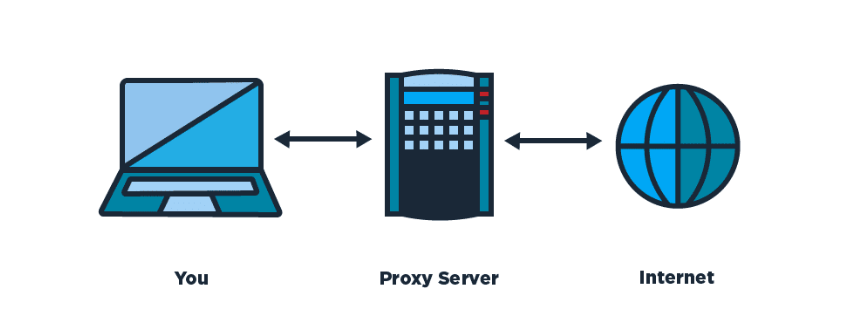
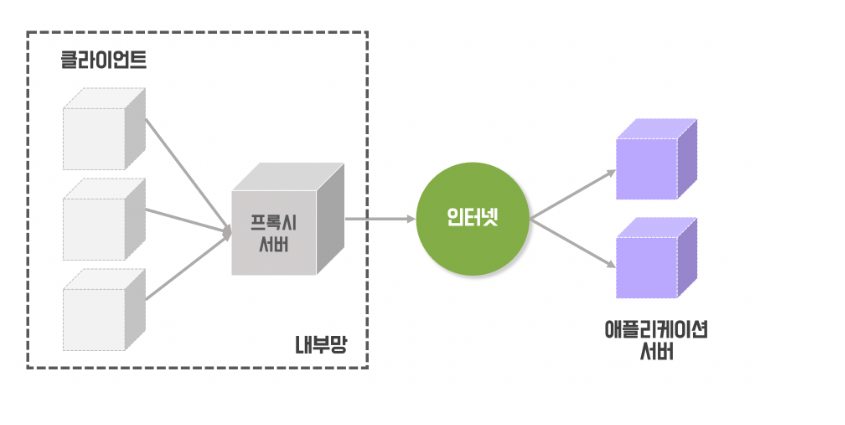
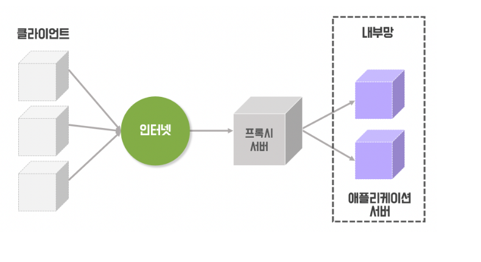
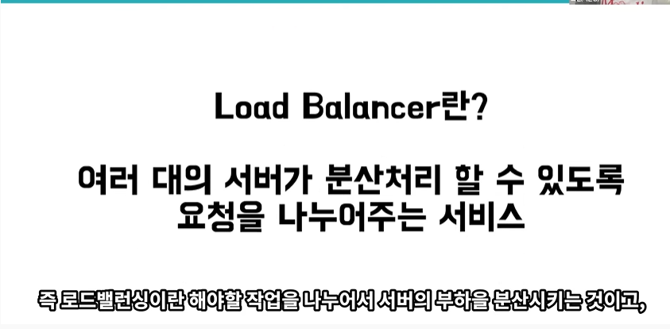
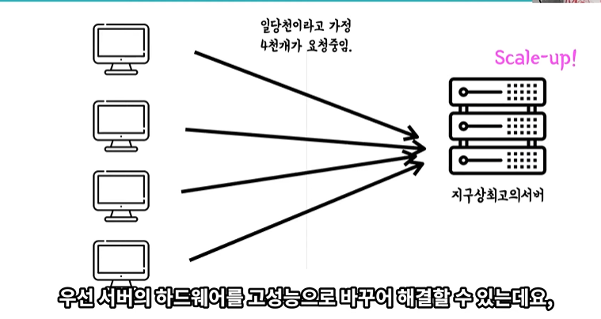
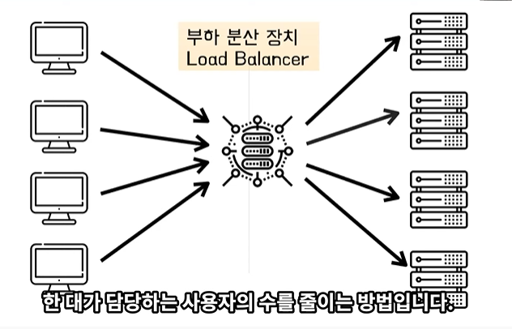
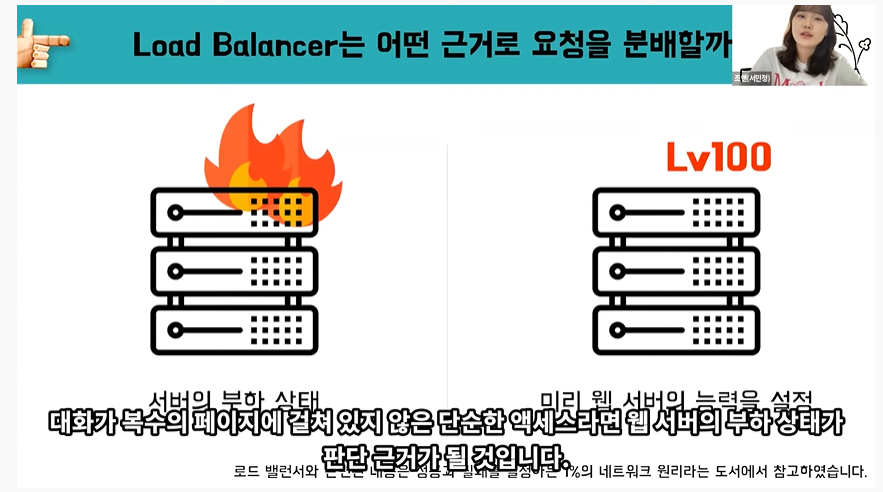
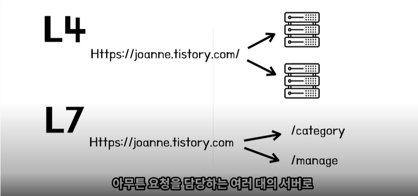
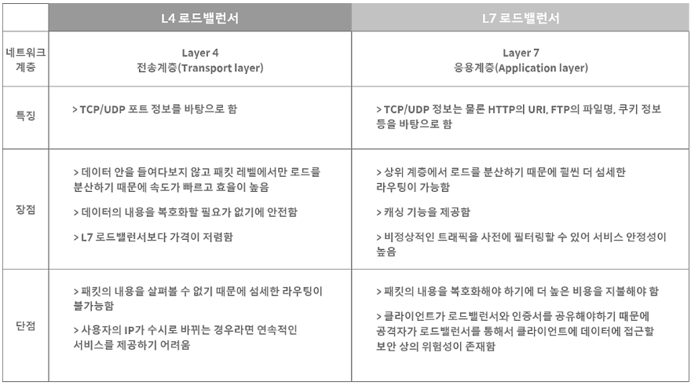

# 프록시(서버) 란?!

## 1.프록시 (서버) 정의

프록시의 사전적 의미는 ‘대신’, ‘대리’이다. 말 그대로 두 PC가 통신을 할 때 직접 하지 않고 중간에서 대리로 통신을 하는 것을 **‘프록시’**라고 하고, 중계 역할을 하는 것을 **‘프록시 서버’** 라고 부른다. 즉, 클라이언트와 서버 사이의 **‘중계 서버’**라고 생각하면 된다. 프록시 서버는 보안 목적이나 캐싱 등의 기능을 제공한다.

프록시 서버는 서버의 위치에 따라 포워드 프록시 / 리버스 프록시로 나뉜다.

## 2.포워드 프록시

일반적으로 프록시라고 말하면 **포워드 프록시**를 말한다.

클라이언트에서 서버로 리소스를 요청할 때 직접 요청하지 않고 프록시 서버를 거쳐서 요청한다. 

1. **캐싱**  => 네트워크 비용감소, 응답속도 상승

   * 첫 번째 요청 이후부터는 동일한 요청이 들어올 경우, 프록시 서버에 캐싱된 내용을 전달해줌으로써 성능을 향상시킬 수 있다.

     

   * 웹 서비스에서 요청이 발생할 때마다 `1) 요청 → 2) 요청 전송 → 3) 요청 접수 → 4) 응답 생성 → 5) 응답 전송 → 6) 응답 수신` 과 같은 과정을 반복해서 거친다. 요청이 한 번 뿐일 때는 괜찮지만, 중복되는 요청을 매번 처리하기에는 심한 자원낭비가 생기고, 웹 서버의 부하가 증가할 것이다.

   

   * 이를 위해 포워드 프록시는 정적 데이터를 저장해두고 동일한 요청의 경우 웹서버 까지 가지 않고 포워드 프록시에서 처리할 수 있는 **캐싱 역할**을 수행한다

     

2. **익명성(ip우회)**
   * 서버에서 받는 IP는 클라이언트의 IP가 아닌 프록시 서버의 IP이기 때문에 서버는 클라이언트가 누군지 알 수 없다. 즉, **서버에게 클라이언트가 누구인지 감춰주는 역할**을 한다. 이러한 특징 때문에 **기업 사내망**에서 주로 사용된다.

3. **필터(제한, 접근제어)**

   * 허가된 클라이언트만의 접근을 허용

     

## 3.리버스 프록시

리버스 프록시는 **포워드 프록시와 반대 개념**이다. 

**애플리케이션 서버의 앞에 위치**하여 클라이언트가 서버를 요청할 때 리버스 프록시를 호출하고, 리버스 프록시가 서버로부터 응답을 전달받아 다시 클라이언트에게 전송하는 역할을 한다.

이 경우, 클라이언트는 애플리케이션 서버를 직접 호출하는 것이 아니라 프록시 서버를 통해 호출하기 때문에 **리버스 프록시는 애플리케이션 서버를 감추는 역할**을 하게 된다.

*** 리버스 프록시의 예시** - NginX, Apache Web Server

1. **캐싱** => 포워드 프록시와 동일

2. **보안**

   * 서버 정보를 클라이언트로부터 숨김

   

   *  클라이언트가 바로 서버에 데이터를 요청하여 받아볼 수도 있지만, 
     그러면 중요한 데이터가 있는 DB 가 ‘최전방’에 노출될 수 있다는 위험이 존재한다. 따라서 중간에 프록시 서버를 두고 내부망을 보호하는 역할을 담당하게 하는 것이다. 

   

   * 즉, 클라이언트가 프록시 서버에 데이터를 요청하면 프록시 서버는 실제 내부 서버에서 데이터를 받아와 클라이언트에게 전달해주는 것

     

3. **로드밸런싱**

* 리버스 프록시 뒤에 여러 개의 WAS를 둠으로써, 사용자 요청을 분산할 수 있다. End-point 마다 호출 서버를 설정할 수 있어 역할에 따라 서버의 트래픽을 분산할 수도 있다.

cf) 로드 밸런싱 더 알아보기

https://velog.io/@jisoo1170/Load-Balancing%EC%9D%B4%EB%9E%80

https://nesoy.github.io/articles/2018-06/Load-Balancer

https://post.naver.com/viewer/postView.nhn?volumeNo=27046347&memberNo=2521903

# 참고

1. https://www.youtube.com/watch?v=lg-wHikZg0Q&t

2. https://www.youtube.com/watch?v=u4O4zHdiFhk&t

3. https://www.youtube.com/watch?v=YxwYhenZ3BE&t

4. https://sujinhope.github.io/2021/06/13/Network-%ED%94%84%EB%A1%9D%EC%8B%9C(Proxy)%EB%9E%80,-Forward-Proxy%EC%99%80-Reverse-Proxy.html

5. https://iforint.tistory.com/145