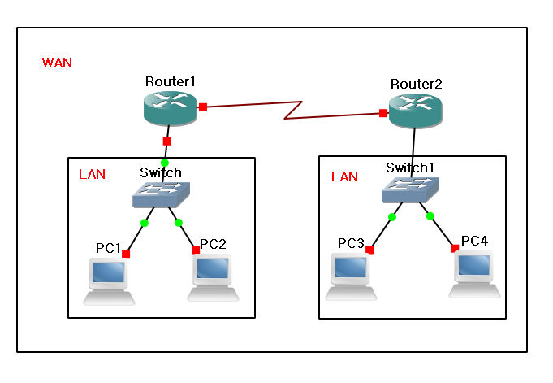
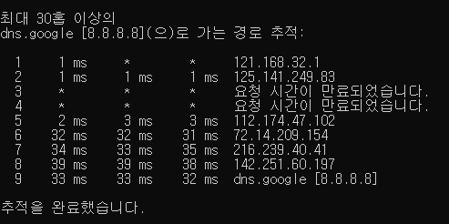

# 01 네트워크란 무엇인가?

# 네트워크

🌐 분산된 여러개의 **노드**(컴퓨터, 장비 등)들이 **데이터를 공유**할 수 있게 하는 디지털 전기 **통신망**

## 인터넷

- 여러가지 데이터를 **공유**하도록 구성된 전세계를 연결하는 네트워크
- 네트워크 망의 하나의 종류 (네트워크 ⊃ 인터넷)
- 인터넷 ≠ `www`
  - `www`는 인터넷을 통해 웹과 관련된 데이터를 공유하는 것
  - 인터넷을 통해 웹서비스를 사용하는 것이다. 대신 인터넷을 가장 많이 사용하는 것

## 네트워크 분류 - 크기

|                   LAN(Local Area Network)                    |                    WAN(Wide Area Network)                    |
| :----------------------------------------------------------: | :----------------------------------------------------------: |
|              가까운 지역을 하나로 묶은 네트워크              | 멀리 있는 지역을 한데 묶은 네트워크, 여러개의 LAN을 서로 연결시켜둔 것이다. |
| ex) PC방에서 LAN을 사용해 친구와 스타크래프트를 할 수 있다.  |             ex) 집 LAN + 학원 LAN + 회사 LAN ...             |
| ex) iptime 공유기를 통해 1, 2, 3 강의장은 모두 하나의 LAN에 연결 |                                                              |

#### MAN(Metropolitan Area Network)

- 도시권 통신망 - 큰 도시 또는 캠퍼스에 퍼져있는 컴퓨터 네트워크
- LAN과 WAN 의 중간 크기

#### 기타

- VLAN(Virtual Local Area Network) : 가상 근거리 통신망 - 가상랜은 물리적으로 LAN 을 분리하는 것이 아니라 논리적으로 한 장비 내에서 브로드캐스트 도메인을 나누는 것이다.
  - 출처 : 데이터넷(http://www.datanet.co.kr)
- CAN(Campus Area Network) : 캠퍼스 통신망 - 네트워크에 필요한 장치는 해당 지역 캠퍼스 소유자(기업, 대학, 정부 등)의 것이다.
  - LAN보다는 크지만, MAN보다는 작다.
- PAN(Personal Area Network) : 개인 통신망 - 개인의 작업 공간을 중심으로 장치들을 서로 연결하기 위한 네트워크
  - ex) 블루투스, USB

## 네트워크 분류 - 역할

|                             Star                             |                             Mesh                             |                             혼합                             |
| :----------------------------------------------------------: | :----------------------------------------------------------: | :----------------------------------------------------------: |
|  |  |  |
|         **중앙 장비**에 **모든 노드**가 연결된 형태          |        **여러 노드**들이 서로 **그물**처럼 연결된형태        |          실제 인터넷은 여러 형태를 **혼합**한 형태           |
| 가정집에서는 공유기를 통해서 핸드폰, 컴퓨터, TV 등등이 연결  | 하나가 고장이 나더라도 다른 기기끼리의 연결은 유지된다. 다른 연결로 돌아서 접근할 수 있다. |               LAN이 여러개 연결된 WAN의 혼합형               |
|      보통 하나의 LAN 대역을 만들 때 star형을 사용한다.       |                                                              |                                                              |

### 기타

- 출처: https://itdexter.tistory.com/153 [IT_Dexter]

#### Tree형

- 트리에 연결된 호스트는 허브에 연결되어 있지만 모든 장치가 중앙 전송제어 장치에 연결되어 있지 않은 형태

#### 링형

- 닫힌 루프 형태로 각 호스트가 자신의 양쪽 호스트와 전용으로 점 대 점으로 연결된 형태
- 단 하나의 연결 오류만으로도 전체의 연결이 끊기게 된다

#### 버스형

- 하나의 긴 케이블이 네트워크상의 모든 장치를 연결하는 중추 네트워크의 역할을 하는 형태
- 각 호스트의 고장이 네트워크 내의 다른 부분에 영향을 주지 않음

## 네트워크의 통신방식

|         유니캐스트         |         멀티캐스트         |                브로드캐스트                |
| :------------------------: | :------------------------: | :----------------------------------------: |
| 특정 대상과 1:1으로만 통신 | 특정한 다수와 1:N으로 통신 | 같은 네트워크 대역에 있는 모든 대상과 통신 |

## 네트워크 프로토콜

**프로토콜** = 약속, 양식

- 네트워크에서 노드와 노드가 통신할 때, `어떤 노드` 가 `어느 노드`에게 `어떤 데이터`를 `어떻게` 보내는지 작성하기 위한 양식
- 택배는 택배만의 양식, 편지는 편지만의 양식, 전화는 전화만의 양식이 있다.
- 각 프로토콜들도 해당 프로토콜만의 양식이 있다.

### 여러가지 프로토콜

| Ethernet 프로토콜 | ICMP, IPv4, IPv6, ARP |   TCP, UDP    |
| :---------------: | :-------------------: | :-----------: |
|      MAC주소      |        IP주소         |   포트번호    |
|     가까운 곳     |     멀리 있는 곳      | 특정 프로그램 |

- 이더넷 : LAN을 위해 개발된 근거리 유선 네트워크 통신망 기술
  - 장점
    1. 빠른 속도
    2. 높은 보안 수준
    3. 최고의 안정성 
    4. 효율성 : 낮은 전력 소비량
  - 단점
    1. 이동성이 낮음
    2. 확장시 많은 비용 발생
    3. 전문가의 도움 없이 설치 어려움
    4. 하나의 특정 컴퓨터에만 연결 가능
  - 링크 : https://m.blog.naver.com/jchyuncorp/222033619668
- 특정 프로그램으로 연락할 때?
  - 메신저가 카톡, 페메가 둘 다 켜져있을 때, 내가 보낸 쪽지가 상대방의 컴퓨터에 왔을때
  - 카톡으로 받을건지 페메로 받을건지 구분하는 것

### 패킷

- 패킷 = Ethernet + IPv4 + TCP + 데이터
- 이런 여러 프로토콜들이 합쳐져서 캡슐화 된 것

------

## 실습1

`tracert 8.8.8.8`

- 구글 DNS 서버 접속

- 구글 DNS까지 가는데 9개의 네트워크 대역을 거쳐갔다. (보통 15개 이내)
- 이런 대역폭들을 연결해 놓은것이 WAN, 대역폭이다.

## 실습2

[wireshark]: https://www.wireshark.org/#download

- 네트워크 프로토콜을 캡쳐해서 어떤 프로토콜을 사용했는지, 보냈는지, 받았는지를 시각화해주는 프로그램

- 설치하면서 옵션 체크 해제하고 winpcap 설치하고 나서 진행

  [winpcap]: https://www.winpcap.org/install/default.htm

  

- wireshark 화면

- http를 검색하고, HTTP/1.1 200 OK 중에서 text/html인 것을 확인해봄

  

  

  - Internet Protocl Version 4 : 멀어서 IPv4를 사용한다.
  - Ethernet : 어느 컴퓨터에 접근할 것인가?
  - Transmission Control Protocol : 어느 프로그램을 사용하는가? (크롬)

=> 프로토콜은 여러개가 사용된다.(encapsulation)