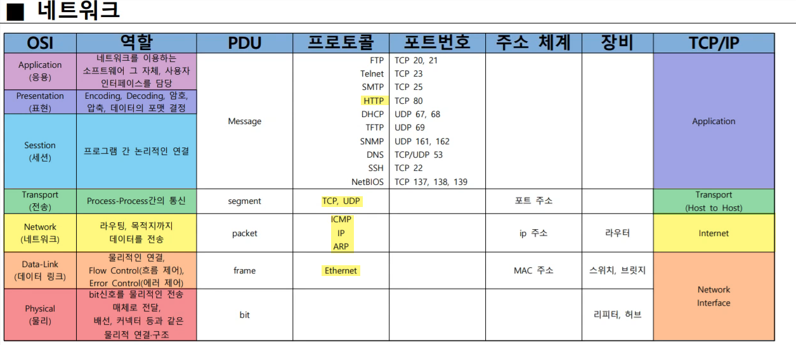
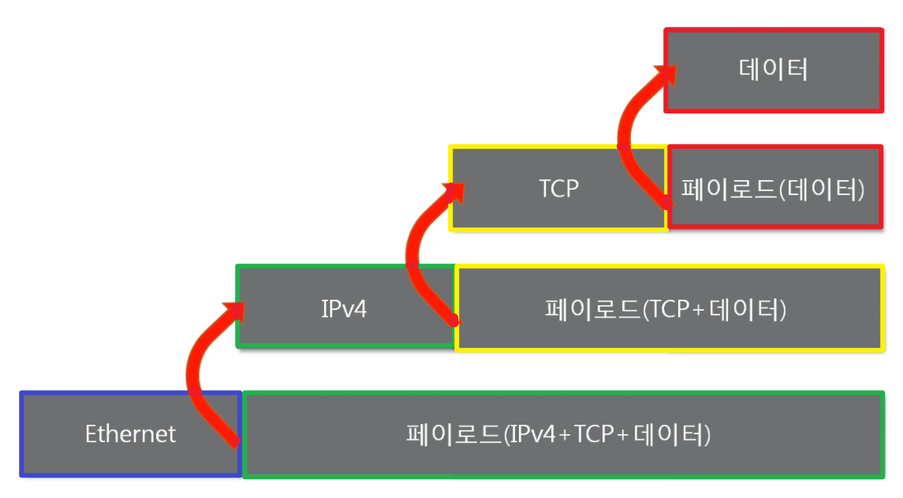
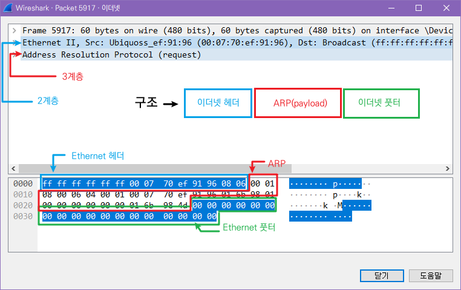

# 02 네트워크 모델

## :star:네트워크 모델 한눈에 비교

| 차이점          | OSI                                                          | TCP/IP                                                       |
| --------------- | ------------------------------------------------------------ | ------------------------------------------------------------ |
| 구조            |  |  |
| 시스템의 유연성 | 복잡한 통신망의 상황변화에 유연하게 적응이 어렵다.           | 하나의 계층에 네트워크 환경에 따라 여러개의 프로토콜을 어용하는 **유연성**을 가진다. |
| 서비스 특성     | 연결형(Connection Oriented) 서비스를 위주                    | 연결형(Connection Oriented)서비스, 비연결성(Connectionless) 서비스 둘 다 제공한다. |
| 계층 수         | 7 계층                                                       | 4 계층                                                       |
| 참조            | 참조하는 **개념적**인 모델                                   | 실제로 **구현된** 모델                                       |
| 시기            | 1977년                                                       | 1968년                                                       |

*연결형 서비스 : 송신자와 수신자 사이의 연결을 확립하고 데이터를 전송. 오류발생 시 재전송, 신뢰성 ex) TCP

*비연결형 서비스 : 송신자와 수신자 사이의 연결을 확립하지 않고 데이터를 전송. 오류 확인 X, 신뢰성 X, 속도 빠름 ex) UDP

### TCP/IP 모델

- 1960년대 말 미국방성의 연구에서 시작되어 1980년대 초 프로토콜 모델로 공개
- 현재 인터넷에서 컴퓨터들이 서로 정보를 주고받는데 쓰이는 **통신 규약(프로토콜)의 모음**

- 4개의 계층으로 이루어져있다.

### 7️⃣ OSI 7계층

| 계층 | 계층이름               | 설명                                                         | 전송단위 |
| ---- | ---------------------- | ------------------------------------------------------------ | -------- |
| 7    | 응용(Application)      | 최종 목적지, 응용 서비스 수행. 사용자 인터페이스, DB 관리등의 서비스 제공 | Data     |
| 6    | 표현(Presentation)     | 데이터 형식 설정. 파일 인코딩, 명령어플 포장, 압축, 암호화   | Data     |
| 5    | 세션(Session)          | 데이터가 통신하기 위한 논리적 연결 담당. 연결제어, 동기 제어 | Data     |
| 4    | 전송(Transport)        | TCP와 UDP 프로토콜을 통해 통신 연결. 포트를 열어 프로그램들이 전송할 수 있도록 함 | Segment  |
| 3    | 네트워크(Network)      | 데이터를 목적지까지 안전하고 빠르게 전달. 라우터를 통해 경로 선택하여 IP주소 지정. 라우팅, 흐름제어, 오류제어 | Packet   |
| 2    | 데이터 링크(Data Link) | 물리 계층으로 송수신되는 정보를 관리하여 안전하게 전달. MAC주소, 오류제어, 흐름 제어 | Frame    |
| 1    | 물리(Physical)         | 0과 1의 비트 정보를 회선에 보내기 위한 전기적 신호 변환 = 데이터 전송 | Bit      |

*논리적 연결 : 물리적 연결은 케이블을 통해 직접 연결(고유함, 변경 불가), 논리적 연결은 물리적 연결 외에 IP 또는 MAC주소를 통해 통신하는 형태(고유하지 않음, 변경 가능)

*라우터 : LAN과 LAN을 연결하거나 LAN과 WAN을 연결하기 위한 장비. 패킷의 위치를 추출하여, 위치에 대한 최적의 경로를 지정하고 경로를 따라 데이터 패킷을 전송

- 1984년 네트워크 통신을 체계적으로 다루는 ISO(국제표준화기구)에서 표준으로 지정한 **모델**
- 데이터를 주고받을 때 데이터 자체의 흐름을 각 구간별로 나눠 놓은 것 (특정 단계에서 문제가 발생하면 그 단계만 수정)
- **실질적으로 데이터 전송할 때는 TCP/IP에 더 가깝다.**
  - TCP/IP의 네트워크 인터페이스를 굳이 OSI에선 물리, 데이터링크 계층으로 나눈 셈
  - HTTP 프로토콜안에도 응용, 표현, 세션이 다 들어가있다. 그래서 HTTP를 7계층으로 표현하긴 하지만 5, 6, 7로 나누기 어렵다.

### :star:중요한 프로토콜

- 2계층 : `이더넷`
- 3계층 : 
  - `IP(Internet Protocl address)` : 송수신간의 패킷 단위로 데이터를 교환하는 네트워크에서 정보를 주고 받는데 사용하는 통신 프로토콜
  -  `ICMP(Internet Control Message Protocol)` : IP 패킷을 처리할 때 발생되는 문제를 알려주는 프로토콜 메시지
  -  `ARP(Address Resolution Protocol)` : IP 네트워크 상에서 IP주소를 MAC 주소로 변환하는 프로토콜 (반대 : RARP)
- 4계층 : 
  - `TCP(Transmission Control Protocol)` : 핵심 프로토콜, IP와 함께 TCP/IP라 불림
    - 신뢰성 보장 : 패킷 손실, 순서 바뀜 없도록 보장. IP 계층의 신뢰성 없는 서비스 보완
    - 연결 지향적 : 양쪽 애플리케이션은 TCP가 제공하는 연결성 회선을 통하여 통신
    - 흐름 제어 : 송신 및 수신 속도를 일치시킴
    - 혼잡 제어 : 네트워크가 혼잡하다고 판단할 경우 송신율을 감속
  - `UDP(User Datagram Protocol)` 
    - 비신뢰성 : 논리적 가상회선 연결 필요 X, 메세지가 도착했는지 확인 X, 오류 제어 X
    - 순서화되지 않은 데이터그램 서비스 제공 : 수신된 메세지의 순서를 맞추지 않음
    - 실시간 응용 및 멀티캐스트 기능 : 빠른 속도로 실시간 통신에 적합, 여러 다수 지점에 전송 가능
    - 단순 헤더 : 헤더의 크기가 고정되어있고 헤더 처리에 시간과 노력이 필요하지 않음
- 7계층 : `HTTP(HyperText Transfer Protocol)` : 하이퍼텍스트를 빠르게 교환하기 위한 프로토콜(텍스트 기반)
- 이 외에는 저런게 있구나 정도만 알면 된다.

## 두 모델 비교

### 공통점

- 네트워크를 **계층**으로 나눠 분류한다.
- 각각의 계층별로 **역할**을 지정해놓고 사용한다.

### 차이점

- OSI는 **논리적**으로 통신 전반에 걸쳐 **역할을 나눔** , TCP/IP는 **실무적**으로 네트워크를 통해서 데이터를 전달할 때, **프로토콜**을 분류
- OSI는 통신 전반에 대한 **표준**, TCP/IP는 데이터 전송**기술** 특화

### :star:정리 표

## 패킷

- 네트워크를 통해 전달되는 **데이터**

- 네트워크에서 전달하는 데이터의 형식화된 **블록**이다.

- 패킷은 제어 정보와 사용자 데이터로 이루어지며 사용자 데이터는 **페이로드**라고 한다.

- 패킷 프로토콜에는 **순서**가 있다.(포장 안에 포장 안에 포장 안에 상품처럼)

- 여러 프로토콜들로 **캡슐화**됨
   | 헤더 | 페이로드(=실질적 데이터) | 풋터 |
   | ---- | ------------------------ | ---- |
   
   - 일반적으로 풋터는 잘 사용하지 않음, 대부분 헤더만 사용 
   
   - 유일하게 풋터를 사용하는 프로토콜 = 이더넷
   
     

### :star:캡슐화 Encapsulatoin

여러 프로토콜을 이용해서 최종적으로 **보낼 때** 패킷을 만드는 과정

1. `[데이터]`
2. `TCP(헤더)` + `[데이터]`
3. `IPv4(헤더)` + `[TCP + [데이터]]`
4. `Ethernet(헤더)` + `[IPv4 + [TCP + [데이터]]]`

- 프로토콜을 하나씩 붙여나가는 과정을 **encapsulation**이라고 한다.
- **상위** 계층에서부터 **하위** 계층으로 <u>내려가면서</u> 프로토콜을 붙인다.
- 프로토콜을 붙일 때, 하위 프로토콜 앞에 상위 프로토콜이 올 수 없다.
  - TCP는 4계층, IPv4는 3계층, Ethernet은 2계층이다.
  - 위의 형태가 일반적이지만, `2계층 + 3계층 + 3계층 + 데이터` 는 가능하다.

### 디캡슐화 Decapsulation

패킷을 **받았을 때** 프로토콜들을 하나씩 확인하면서 데이터를 확인하는 과정

- **하위** 프로토콜부터 하나씩 열어보면서 양식대로 <u>누가</u> 나한테 <u>뭘</u> 보냈는지 확인한다.
- 확인할 때 3계층 확인했다가 2계층 확인하는 이런 방식은 없다. **순차적**으로 진행.

### PDU (Protocol Data Unit)

계층별 패킷의 이름 

- TCP + 데이터 = 세그먼트(4계층)
- IPv4 + TCP + 데이터 = 패킷(3계층)
  - 통상적으로 부르는 패킷과 이름은 같지만 뜻은 <u>다르다</u>.
- Ethernet + IPv4 + TCP + 데이터 = 프레임(2계층)
  - 이걸 통상적으로 패킷이라고 부르고, 프레임은 이 자체를 자세하게 의미하는 것
  - 패킷이라는 용어를 자주 사용하는데 자세히 말할 땐 프레임으로 사용

------

## 실습) 실제로 패킷 구조 보기

- `ping 8.8.8.8` : 구글 DNS(Domain Name System)에 신호보내고 wireshark에서 확인하기

### ARP

- 구조는 ARP를 이더넷이 감싸고 있다. 이더넷이 유일하게 footer가 있는 프로토콜이라 footer가 보인다.
- ARP자체가 payload다.
- ARP는 3계층, 이더넷은 2계층이므로 ARP앞에 헤더로 이더넷이 붙었다.

### ICMP

- ICMP를 검색해보고 아무 기록이나 눌러본다.
- 구조는 ICMP에 IPv4라는 헤더가 붙었고, 그 앞에 이더넷 헤더가 붙었다.
- IPv4와 ICMP도 순서가 정해져있다.
