> ## 이전시간 리뷰
>
> - 네트워크
>
>   - LAN = Local Area Network / 가까운 지역을 하나로 묶은 네트워크
>   - WAN = Wide Area Network / 멀리 있는 지역을 한데 묶은 네트워크
>   - 프로토콜 = 어느 기기에서 어떤 데이터를 어디로 어떻게 보낼지 작성한 양식
>     - 이더넷(2계층 - 데이터링크, 가까운 곳)
>     - IPv4, ICMP, ARP (3계층 - 멀리있는 곳)
>     - TCP,UDP (4계층 - 포트번호, 특정 프로그램)
>
> - OSI 계층 VS TCP/IP 계층
>
>   - OSI : 물리-데이터링크-네트워크-전송-세션-표현-응용
>   - TCP/IP : 네트워크인터페이스-인터넷-전송-응용
>     - 최근에는 '물리-데이터링크-네트워크-전송-응용'으로 업데이트 되어서 OSI와 매우 유사해짐
>   - 패킷 = 전달할 데이터 앞에 프로토콜을 붙여서 '캡슐화'를 통해 만들어진 데이터
>
> - OSI 2계층
>
>   - LAN 안에서 컴퓨터끼리 대화하는 방식
>   - MAC주소, 이더넷 프로토콜 사용
>
> - OSI 3계층
>
>   - 서로 다른 네트워크 대역과 통신하는 방식, '라우터'라는 장비 필요
>   - IP주소 필요
>   - ARP, IPv4, ICMP 프로토콜 사용
>   - 서브넷 마스크 = Class(A~E)를 사용하지 않기 위해 네트워크 대역을 구분하려고 정한 값
>   - 게이트웨이 = 공유기의 IP 주소
>   - NAT = Network Address Translation, ip주소를 변환해준다.
>   - 공인 IP = 실제로 인터넷 세상에서 필요한 주소
>   - 사설 IP = LAN 안에서 사용하는 주소
>
> - OSI 3계층 - ARP
>
>   - IP주소로 MAC 주소 알아오기
>
> - 그렇다면 오늘은?! OSI 3계층 - IP!!... 3계층을 ㅁㅐ우 매우 자세히 보고있긴 하네
>
>   - IPv4 프로토콜
>
>   - ICMP 프로토콜
>
>   - 라우팅 테이블
>
>   - 다른 네트워크(LAN)와 통신 과정
>
>   - IPv4의 조각화

[TOC]

# :star:IPv4

> 멀리있는 다른 네트워크 상에서 데이터를 교환하기 위한 프로토콜

- 정말 멀리 보내는 일만 한다.
- 데이터가 **정확하게 전달될 것을 보장하지 않는다.** = 데이터가 중간에 깨질수도 있다?!
  - 중복된 패킷을 전달하거나, 패킷의 순서를 잘못 전달할 가능성도 있다. (악의적으로 이용하면 Dos 공격)
  - 데이터의 정확하고 순차적인 전달은 그보다 상위 프로토콜인 TCP(4계층)에서 보장한다.

## IP 헤더

- Version = 그냥 무조건 4
- Total Length = 페이로드까지 합친 전체 길이
- Identification & Fragment Offset = 조각난 데이터의 id, 순서 확인
- Protocol = 상위 프로토콜 타입
- Source Address & Destination Address

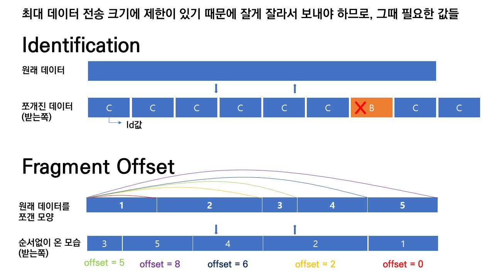

offset = 데이터의 처음 위치에서 얼마나 떨어져있는가를 나타낸다. n번째 조각은 1 ~ n-1 조각까지의 offset을 합친 값을 offset으로 갖는다.

## ➕추가

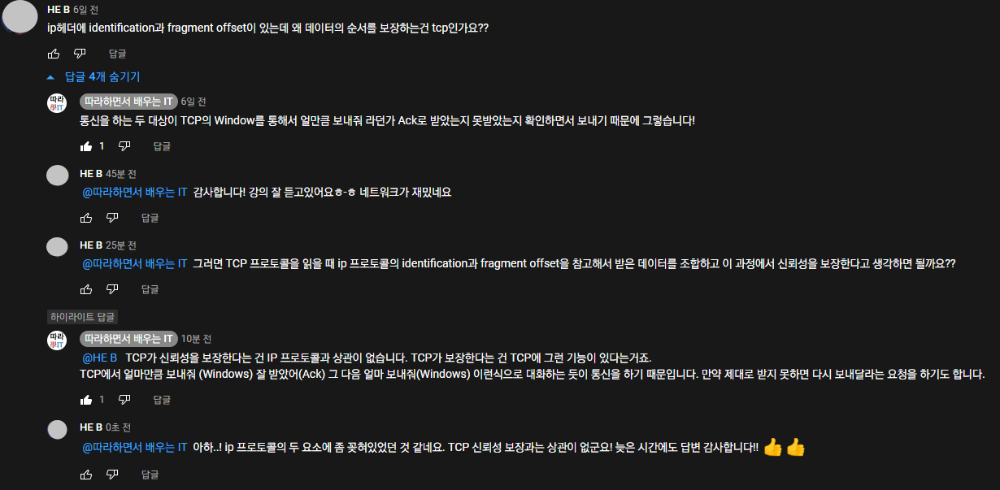

- TCP window = 수신쪽에서 얼만큼 더 데이터를 받을 수 있는지
- Ack(Acknowledgment) = 확인 응답 메시지

# ICMP (Internet Control Message Protocol, 인터넷 제어 메시지 프로토콜)

> 특정 대상과 내가 통신이 잘 되는지 확인한다.

- 네트워크 컴퓨터 위에서 돌아가는 운영체제에서 **오류 메시지**를 전송받는데 주로 쓰인다.
- 프로토콜 구조의 **Type**과 Code를 통해 오류 메시지를 전송 받는다.

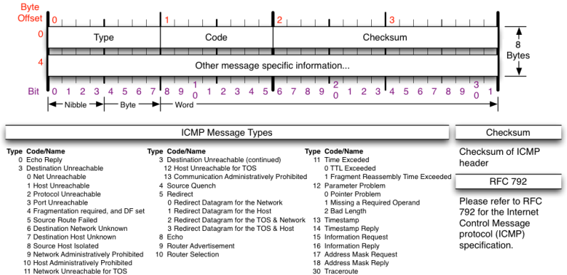

- Type = 대분류, Code = 소분류
- Type의 종류는 다양하다. 위의 이미지 기준 30번까지 있다고 볼 수 있다.
  - 0번(응답할 때), 8번(요청할 때)
  - 3번(목적지에 도달할 수 없다), 11번(요청 시간이 만료되었다.)
    - 3번은 가지를 못한 것 -> 경로상의 문제
    - 11번은 목적지까진 갔는데 응답을 못 받은 경우 -> 상대방의 문제, 방화벽을 켜놓은 경우
  - 5번 (옛날에 쓰던거. 남의 라우팅 테이블을 수정하는거라서 보안상의 문제가 발생할 수 있다. 요새는 잘 안씀)

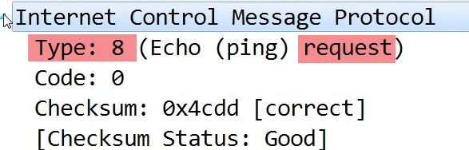

# 라우팅 테이블

> 어디로 보내야할지 설정되어있는 테이블

- 3계층에서 통신할 땐 멀리 가야하므로 최적의 경로를 찾아서 목적지로 가야하는데, 그때 사용한다.

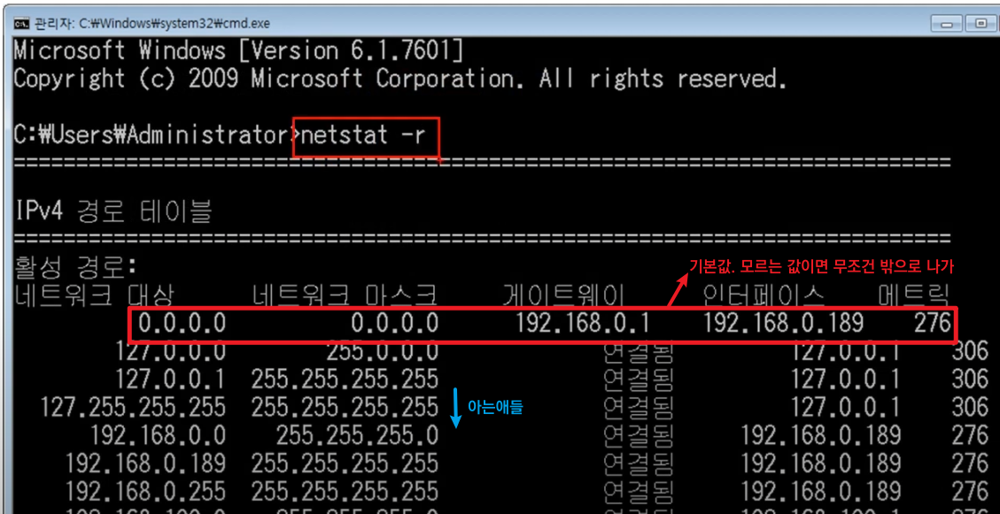

- 라우팅 테이블에 적혀있는 네트워크 대역만 찾아갈 수 있고, 적혀있지 않다면 찾아갈 수 없다.
- 보통 지도상에 작성할 때 기본값을 넣어준다.
- 모르는 값이면 무조건 밖으로 나가서 찾게 한다.(인터넷 세상 고고)

## 다른 네트워크와 통신 과정(복잡해요)

> 내 컴퓨터에서 보낸 패킷이 다른 네트워크의 컴퓨터까지 어떻게 이동하는가

 

 
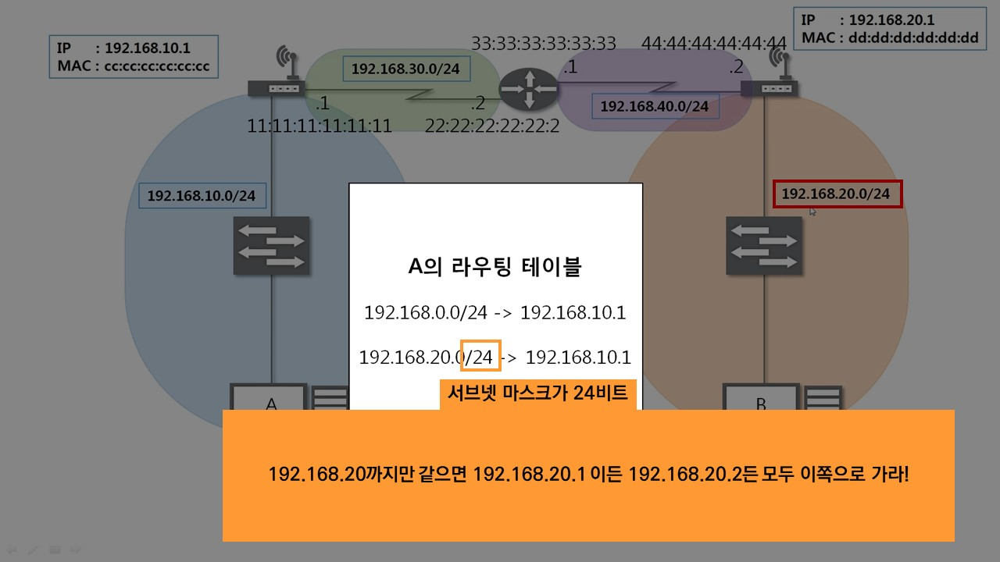
 
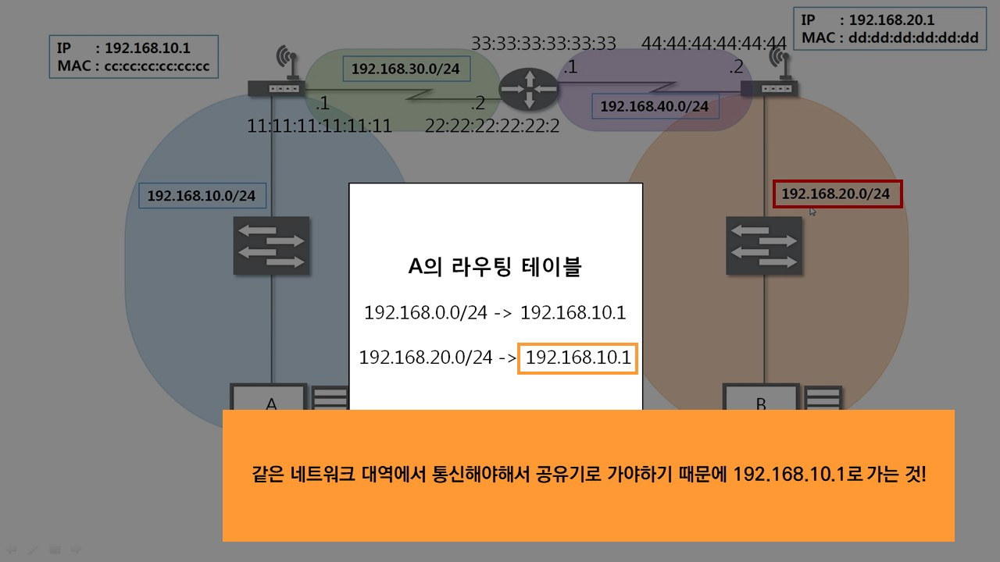
 
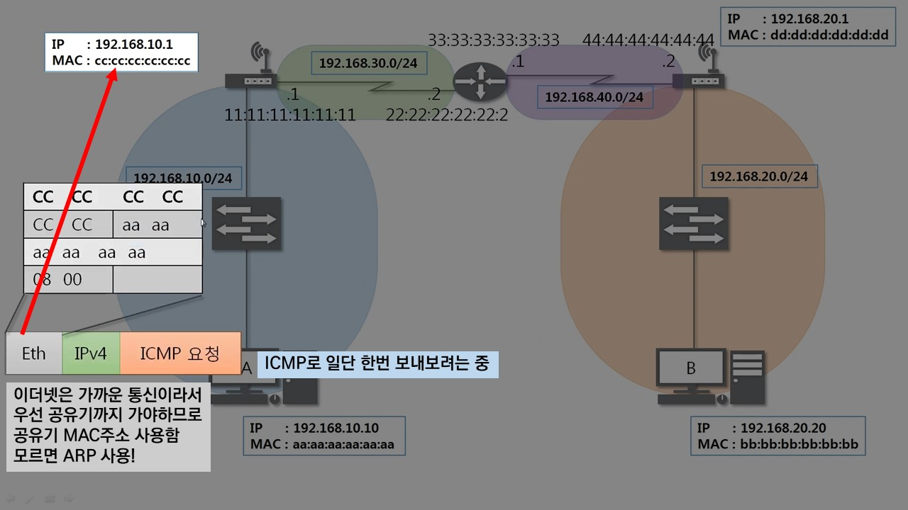
 

 
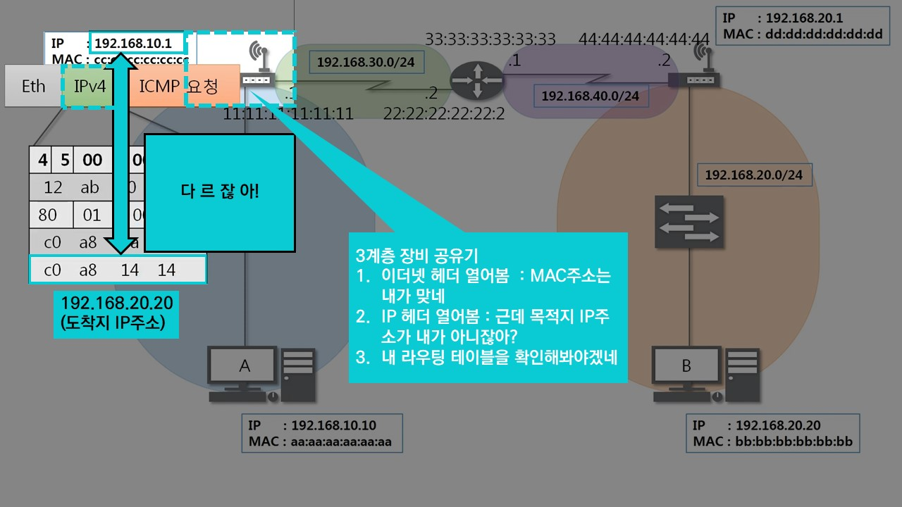
 
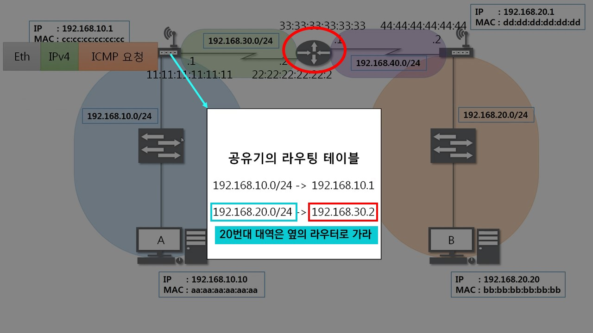
 

 

## ➕추가) 네트워크 대역 2개에 물려있으면 내 MAC주소도 2개?!

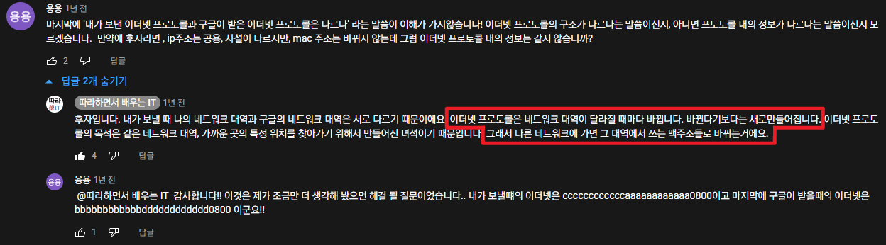

 

 
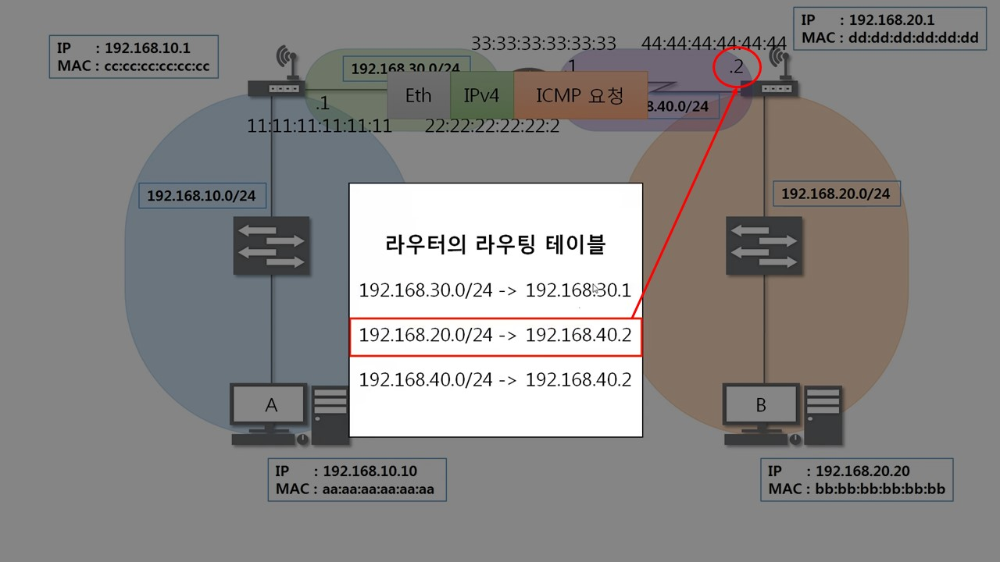
 
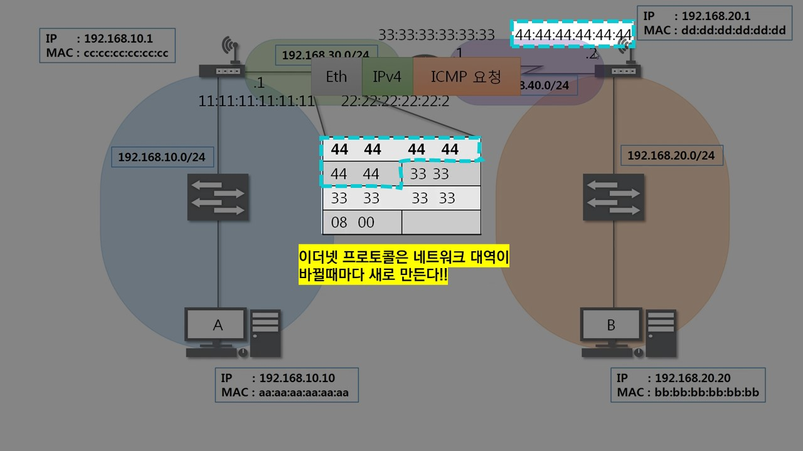
 

 

 

 

 
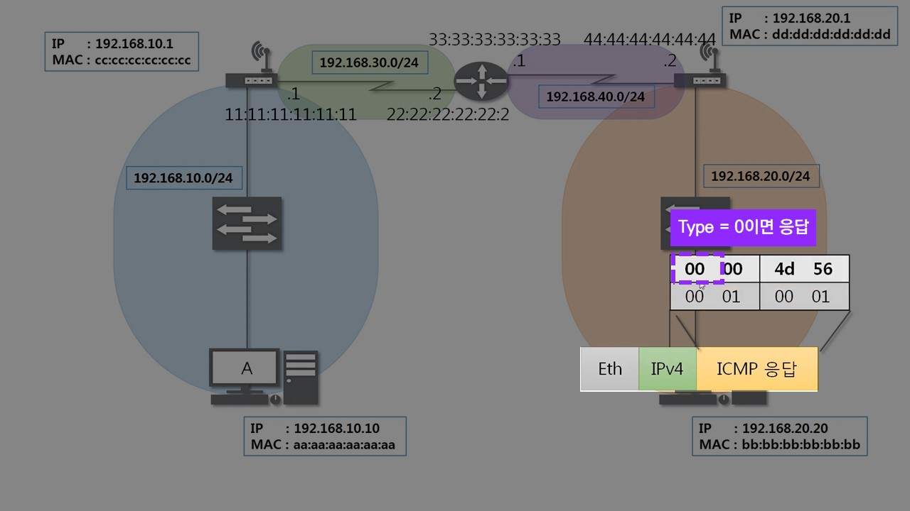
 

## 실제 라우팅 테이블 모습

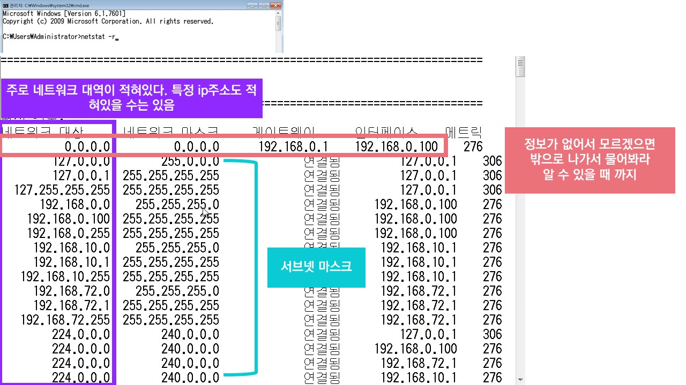

 

# IPv4의 조각화

> 큰 IP 패킷들이 적은 MTU(Maximum Transmission Unit, 최대 전송 단위, 보통 1500byte)를 갖는 링크를 통하여 전송되려면 **여러개의 작은 패킷으로 쪼개어/조각화 되어 전송해야 한다.**
>
> 여러개의 패킷으로 조각화된 패킷

- 즉, 목적지 까지 패킷을 전달하는 과정에 통과하는 각 라우터마다 전송에 적합한 프레임으로 변환이 필요하다.
- 일단 조각화되면, 최종 목적지에 도달할 때 까지 재조립되지 않는 것이 일반적이다.
- IPv4에서는 발신지 뿐만 아니라 중간 라우터에서도 IP조각화가 가능
- IPv6에서는 IP 단편화가 발신지에서만 가능, 재조립은 항상 최종 수신지에서만 가능함

 

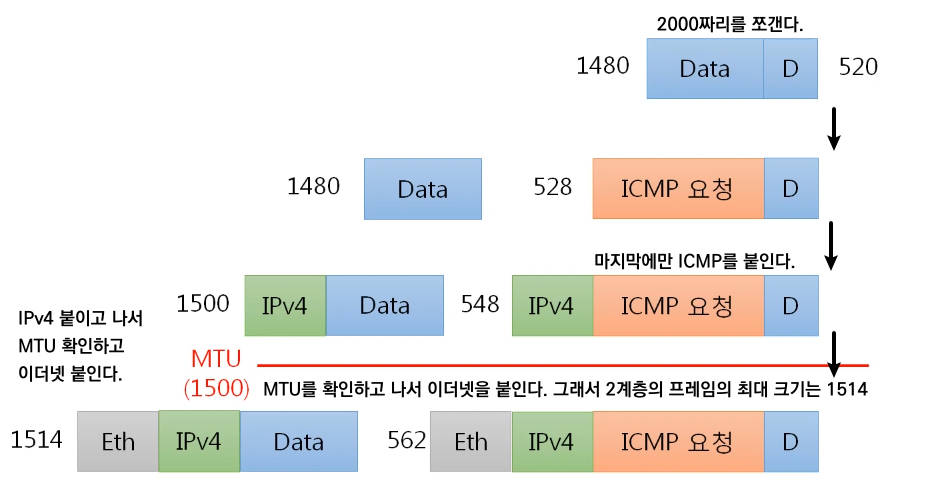

1. 원래 데이터의 크기는 2000이다.

2. MTU가 보통 1500이므로 1480과 520으로 나뉜다. IP 프로토콜의 크기가 20byte이므로

3. 마지막 데이터에만 icmp를 붙인다. 전체 payload를 대상으로 성공 또는 실패를 알기 위해서이므로.

   (마지막 데이터에 icmp를 붙여서 MTU를 넘는다면 또 쪼갠다.)

4. IP프로토콜을 데이터 앞에 붙인다.

5. MTU를 넘는지 확인한다.

6. 통과했다면 이더넷 프로토콜을 붙인다.