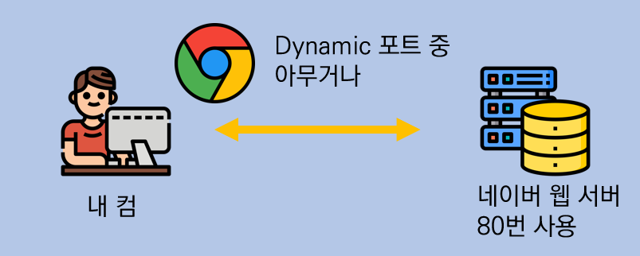
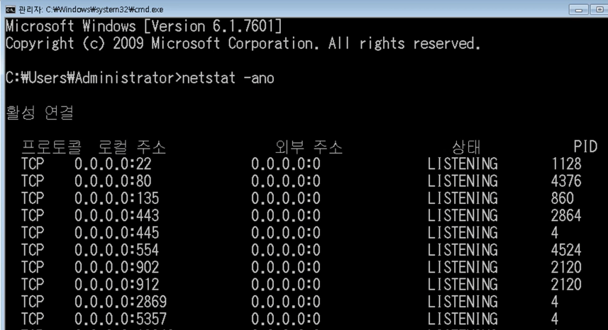
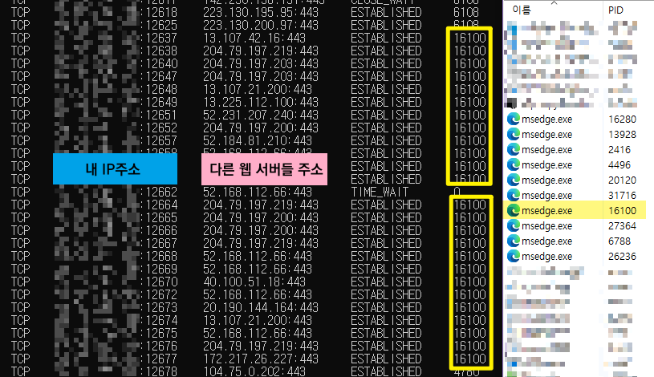
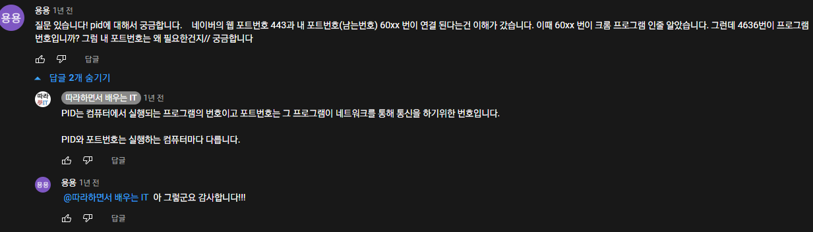

[TOC]

> "내가 보낸 데이터가 상대방의 네트워크의 컴퓨터까지 도달했을 때, 어느 프로그램으로 받을 수 있는 것인가? 게임의 클라이언트-서버 통신과 같다. 프로그램과 프로그램의 연결"

 

# :four:4계층 프로토콜

## 4계층에서 하는 일

> 전송 계층(Transport layer)은 송신자의 **프로세스**와 수신자의 **프로세스를 연결하는 통신 서비스**를 제공한다.
>
> 프로세스 = 메모리에서 동작중인 프로그램

"내 컴퓨터에서 동작하는 카톡과, 상대방의 컴퓨터에서 동작하는 카톡이 서로 메세지를 주고 받아야 한다. 상대방 컴퓨터까지 IP와 MAC주소로 찾아갔는데 그 컴퓨터에서 동작 중인 딱 하나의 프로그램을 찾을 수 있도록 해주는 계층"

- 제공하는 서비스
  - 연결 지향 데이터 스트림 지원
  - 신뢰성
  - 흐름제어
  - 다중화

### `TCP`(Transmission Control Protocol) 

> 연결 지향 전송 방식을 사용하는 전송 제어 프로토콜
>
> 안전한 연결을 지향한다. 상대방이 잘 받았는지 확인 함
>
> 친절 & 복잡

- 신뢰성 보장 : 패킷 손실, 순서 바뀜 없도록 보장. IP 계층의 신뢰성 없는 서비스 보완
- 연결 지향적 : 양쪽 애플리케이션은 TCP가 제공하는 연결성 회선을 통하여 통신
- 흐름 제어 : 송신 및 수신 속도를 일치시킴
- 혼잡 제어 : 네트워크가 혼잡하다고 판단할 경우 송신율을 감속

### `UDP`(User Datagram Protocol)

> 보다 단순한 전송에 사용되는 사용자 데이터그램 프로토콜
>
> 연결을 지향하지 않는다. 상대방이 잘 받았는지 확인 안함
>
> 불친절 & 간단 & 마이웨이

- 비신뢰성 : 논리적 가상회선 연결 필요 X, 메세지가 도착했는지 확인 X, 오류 제어 X
- 순서화되지 않은 데이터그램 서비스 제공 : 수신된 메세지의 순서를 맞추지 않음
- 실시간 응용 및 멀티캐스트 기능 : 빠른 속도로 실시간 통신에 적합, 여러 다수 지점에 전송 가능
- 단순 헤더 : 헤더의 크기가 고정되어있고 헤더 처리에 시간과 노력이 필요하지 않음

 

 

# 포트 번호

> 특정 프로세스와 특정 프로세스가 통신을 하기 위해 사용한다.

- **하나의 포트**는 **하나의 프로세스**만 사용 가능하다.
  - MySQL이 3306로 돌아가고 있으면 MariaDB는 3306 못 쓰니까 바꿔야됨
  - 만약 하나의 포트를 여러 프로그램이 쓰면, 해당 포트로 받은 데이터가 어느 프로그램으로 가야할지 알 순 없다.
- 하나의 프로세스가 여러 개의 포트를 사용하는 것은 가능하다.
  - 진짜로.. Jenkins깔다가 내가 기본으로 8080으로 설정된거 8081로 바꿨는데 제대로 적용이 안되어서 8080이나 8081 둘다 접속되어서 빢쳤었음
- 포트 번호는 일반적으로 정해져 있지만 **무조건 지켜야 하는 것은 아니다.**
  - spring 서버는 보~통 8080으로 실행되지만 원하면 바꿀 수 있다.
  - 그래서 spring이랑 Jenkins랑 겹치니까 Jenkins를 8081로 바꿔서 쓰려고 했던 것
  - 예를 들어, 일반적으로 웹 서비스는 80번 포트를 사용하지만! 웹 서비스가 항상 80번 포트를 사용해야만 하는 것은 아니다.

 

포트번호는 0 ~ 65536번까지 쓸 수 있는데, 3가지로 구분한다. 남은 2개는 몰라도 Well-Known 포트는 알아야한다.

## 1) Well-Known 포트

> 전 세계적으로 유명한 포트. 잘 알려진 유명한 프로그램들이 어떤 port를 쓰는지 지정되어있다.
>
> 대표적으로 Web을 이용할 때 Chrome, 웨일, IE, Edge 등등 웹 브라우저라는 프로그램을 써서 이용한다. 0 ~ 1024번 사용

| 서비스 이름                                                  | 포트 번호    | 용도                                                         |
| ------------------------------------------------------------ | ------------ | ------------------------------------------------------------ |
| [FTP (File Transfer Protocol)](https://ko.wikipedia.org/wiki/%ED%8C%8C%EC%9D%BC_%EC%A0%84%EC%86%A1_%ED%94%84%EB%A1%9C%ED%86%A0%EC%BD%9C) | 20번, 21번   | **파일 전송 프로토콜**은 TCP/IP 프로토콜을 가지고 서버와 클라이언트 사이의 파일 전송을 하기 위한 프로토콜이다. |
| [SSH (Secure SHell)](https://ko.wikipedia.org/wiki/%EC%8B%9C%ED%81%90%EC%96%B4_%EC%85%B8) | 22번         | **시큐어 셸**은 네트워크 상의 다른 컴퓨터에 로그인하거나 원격 시스템에서 명령을 실행하고  다른 시스템으로 파일을 복사할 수 있도록 해 주는 응용 프로그램 또는 그 프로토콜을 가리킨다. |
| [TELNET](https://ko.wikipedia.org/wiki/%ED%85%94%EB%84%B7)   | 23번         | 암호화되지 않은 텍스트 통신 (평문 전송). 보안 문제로인해 대체한게 SSH |
| [SMTP (Simple Mail Transfer Protocol)](https://ko.wikipedia.org/wiki/%EA%B0%84%EC%9D%B4_%EC%9A%B0%ED%8E%B8_%EC%A0%84%EC%86%A1_%ED%94%84%EB%A1%9C%ED%86%A0%EC%BD%9C) | 25번         | 인터넷에서 이메일을 **보내기** 위해 이용하는 프로토콜        |
| [DNS (Domain Name System)](https://ko.wikipedia.org/wiki/%EB%8F%84%EB%A9%94%EC%9D%B8_%EB%84%A4%EC%9E%84_%EC%8B%9C%EC%8A%A4%ED%85%9C) | 53번         | www.example.com과 같은 주 **컴퓨터의 도메인 이름**을 192.168.1.0과 같은 **IP 주소로 변환**하고 라우팅 정보를 제공하는 분산형 [데이터베이스](https://ko.wikipedia.org/wiki/데이터베이스) 시스템이다. (도메인 ↔ IP주소) |
| [DHCP (Dynamic Host Configuration Protocol)](https://ko.wikipedia.org/wiki/%EB%8F%99%EC%A0%81_%ED%98%B8%EC%8A%A4%ED%8A%B8_%EA%B5%AC%EC%84%B1_%ED%94%84%EB%A1%9C%ED%86%A0%EC%BD%9C) | 67번, 68번   | 네트워크 관리자들이 조직 내의 네트워크 상에서 IP 주소를 중앙에서 관리하고 할당해줄 수 있도록 해주는 프로토콜이다. |
| [TFTP (Trivial File Transfer Protocol)](https://ko.wikipedia.org/wiki/TFTP) | 69번         | [FTP](https://ko.wikipedia.org/wiki/파일_전송_프로토콜)와 마찬가지로 파일을 전송하기 위한 프로토콜이지만, FTP보다 더 단순한 방식으로 파일을 전송한다. |
| [HTTP](https://ko.wikipedia.org/wiki/HTTP)                   | 80번         | [클라이언트](https://ko.wikipedia.org/wiki/클라이언트)와 [서버](https://ko.wikipedia.org/wiki/서버) 사이에 이루어지는 요청/응답(request/response) 프로토콜이다. |
| [POP3 (Post Office Protocol)](https://ko.wikipedia.org/wiki/%ED%8F%AC%EC%8A%A4%ED%8A%B8_%EC%98%A4%ED%94%BC%EC%8A%A4_%ED%94%84%EB%A1%9C%ED%86%A0%EC%BD%9C) | 110번        | 원격 서버로부터 이메일을 **가져오는데** 사용. 일반적으로 POP를 지칭하는 경우 보통 POP3을 가리킨다. |
| [SNMP (Simple Network Managemnet Protocol)](https://ko.wikipedia.org/wiki/%EA%B0%84%EC%9D%B4_%EB%A7%9D_%EA%B4%80%EB%A6%AC_%ED%94%84%EB%A1%9C%ED%86%A0%EC%BD%9C) | 161번, 162번 | [IP](https://ko.wikipedia.org/wiki/인터넷_프로토콜) 네트워크상의 장치로부터 정보를 수집 및 관리하며, 또한 정보를 수정하여 장치의 동작을 변경하는 데에 사용되는 [인터넷 표준 프로토콜](https://ko.wikipedia.org/wiki/인터넷_프로토콜_스위트)이다. |
| [HTTPS](https://ko.wikipedia.org/wiki/HTTPS)                 | 443번        | HTTPS는 소켓 통신에서 일반 텍스트를 이용하는 대신에, [SSL](https://ko.wikipedia.org/wiki/%EC%A0%84%EC%86%A1_%EA%B3%84%EC%B8%B5_%EB%B3%B4%EC%95%88)이나 [TLS](https://ko.wikipedia.org/wiki/%EC%A0%84%EC%86%A1_%EA%B3%84%EC%B8%B5_%EB%B3%B4%EC%95%88) 프로토콜을 통해 [세션](https://ko.wikipedia.org/wiki/%EC%84%B8%EC%85%98_(%EC%BB%B4%ED%93%A8%ED%84%B0_%EA%B3%BC%ED%95%99)) 데이터를 암호화한다. |

참고) https://ko.wikipedia.org/wiki/TCP/UDP%EC%9D%98_%ED%8F%AC%ED%8A%B8_%EB%AA%A9%EB%A1%9D

- "네이버 웹툰을 본다고 했을때, 네이버 웹 서버 프로그램과 연결이 된다. 이때 네이버 웹 서버가 사용하는 포트는 80번"

- "여러분들 컴퓨터에 웹 서버 프로그램을 실행시키면 여러분의 컴퓨터가 웹 서버 컴퓨터가 되는거에요. DNS서버를 설치해서 실행시키면 DNS서버가 되는거고, 리니지 프리 서버를 설치해서 실행시키면 리니지 서버 컴퓨터가 되는거에요. 서버는 장비를 얘기하기도 하지만 실질적으로 *컴퓨터에서 실행시키는 프로그램*을 서버라고 한다."

- 포트번호는 절대적인게 아니다. 하지만 서비스 포트를 갑자기 바꿔버리면 모르는 사람들은 들어갈 수 없기 때문에, 보통은 잘 알려진 포트번호를 사용하는 것이다. 

 

## Registered 포트

> 조금은 유명한 등록된 포트

| 서비스 이름      | 포트번호 |
| ---------------- | -------- |
| 오라클 DB 서버   | 1521번   |
| MySQL 서버       | 3306번   |
| MS 원격 데스크탑 | 3389번   |

 

## Dynamic 포트

> 일반 사용자들이 사용하는 포트. 아무거나 남는거 하나 쓴다.

| 시작 포트 번호 | 마지막 포트 번호 |
| -------------- | ---------------- |
| 49152번        | 65535번          |

보통 상대방 프로그램으로 연결할 때 쓰는 번호

내 웹 브라우저인 크롬이라는 프로그램과, 네이버의 웹 서버 프로그램이 데이터를 서로 주고받는다.

결국에는 웹 이라는, 인터넷이라는걸 쓰면 3가지 주소를 다 쓰는 것이다. `포트번호(4), IP(3), MAC주소(2)`

 

# 프로그램의 연결 정보

> 나와 현재 연결되어 있는 컴퓨터들

서로 어떤 프로그램끼리 연결이 되어있는지 확인하는 방법? 

-> 현재 포트 활성 여부를 나타내는 **활성 연결 테이블**

### 따라해보기

1. 네이버를 들어간다.

2. 재빠르게 cmd에 `netstat -ano` 명령어를 입력한다. 좌르르르륵 출력됨

   (이거 쓰려는 포트번호 차지하고있는 프로그램 끌 때 사용했었는데...)

 

현재 마이크로소프트 엣지를 하나를 켰어도 실제로는 여러 프로그램들이 실행되기 때문에(확장 프로그램, 다수의 탭 등등) 프로세스가 여러개 나오는 것이다. 

