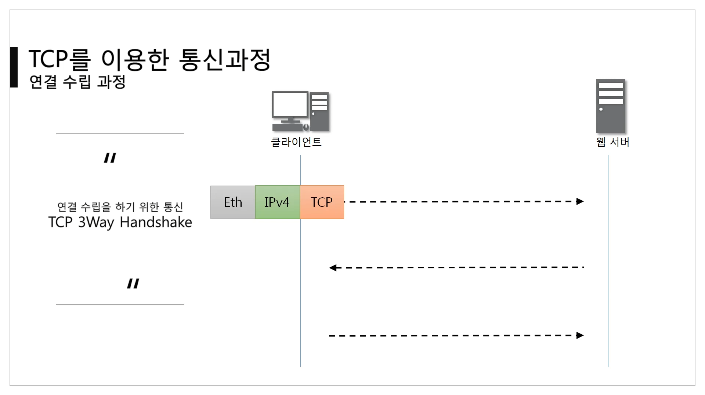
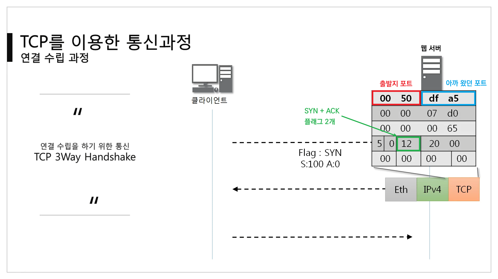
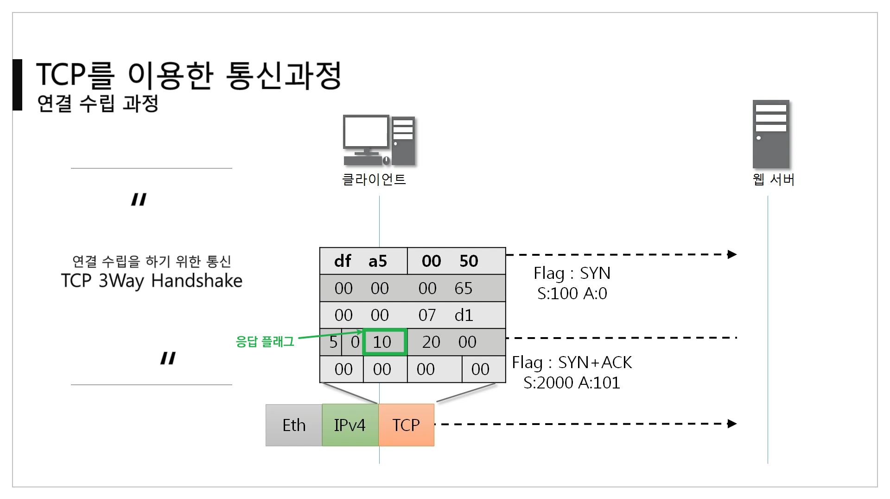
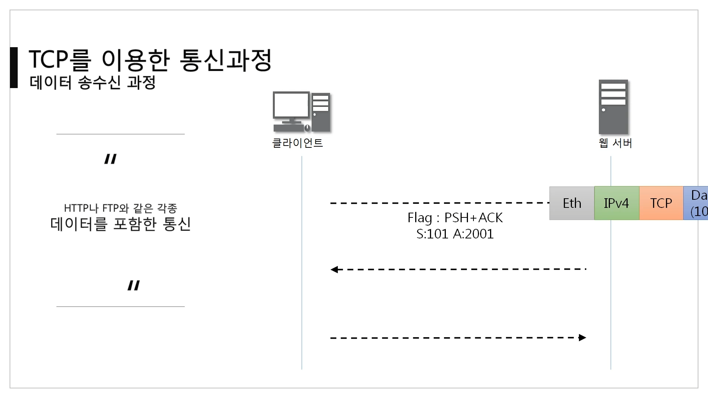

[TOC]

# TCP를 이용한 통신 과정

## :star: 연결 수립 과정

> TCP를 이용한 데이터 통신을 할 때 프로세스와 프로세스를 연결하기 위해 **가장 먼저 수행되는 과정**
>
> 이 과정을 거쳐야만 데이터를 주고 받을 수 있다.

1. 클라이언트가 서버에게 요청 패킷을 보내고 (연결해도 되나요? & 서버가 먼저 보낼 일은 없다. 네이버가 갑자기 내 컴퓨터에 데이터를 보낸다? 있을 수 없죠)
2. 서버가 클라이언트의 요청을 받아들이는 패킷을 보내고 (응 해도 된다 + 서버도 클라이언트에게 연결 요청을 보낸다.)
3. 클라이언트는 이를 최종적으로 수락하는 패킷을 보낸다. (당연하지)

**=> 위의 3개의 과정을 3Way Handshake라고 부른다.**

1. 페이로드 없이 패킷만 우선 클라이언트에서 서버로 보낸다.

​	TCP 프로토콜의 모습. 도착지 포트는 80이고, 플래그가 **동기화(sync) 플래그**이며 SEQ 번호와 ACK 번호가 랜덤으로 설정된다.

 

2. 서버에서 받은 요청을 해석한다. 이때 SEQ번호는 랜덤으로 정해진다.

​	참고로 ACK 번호는 비어있다는 뜻에서 0이다.

 

3. 서버에서 받은 요청을 해석한다. 이후 다시 패킷을 만들어 전달한다. 서버도 승인과 요청을 해야하므로 SYN와 ACK 플래그가 담긴 TCP 프로토콜을 만든다.

 

4. 클라이언트는 받은 패킷을 해석한다. 이후 ACK(응답) 플래그를 담아 마지막 3단계로 응답을 보낸다.

 

5. 이 응답을 서버가 받으면 연결을 수립하는 과정이 마무리 된다.

​	이제 다음으로 요청을 보내는 곳은 어디일까? 클라이언트? 서버?

정답은 클라이언트이다! 이 과정은 연결을 수립하는 과정이고, 연결이 되고 나서는 클라이언트가 서버에게 원하는 데이터를 보내달라고 요청해야한다. 

연결하고나서 가만히 있으면 서버는 뭐. 어쩔??

 

> 세션 하이재킹

그런데, 클라이언트가 아닌 누군가가 이 값(SEQ, ACK 번호)을 계산해서 요청을 보내면 서버는 클라이언트가 아닌 다른 누군가와 통신하게 된다. 

클라이언트는 낙동강 오리알이 된다. 연결 수립 다해놨더니 갑자기 서버가 다른 애랑 얘기한다.

네이버에 로그인 해놨는데 이 상태로 인터넷 하고 있다가 연결을 누가 빼앗으면? 그 해커는 내 아이디랑 비번을 몰라도 내가 로그인한 상태로 모든 서비스를 사용할 수 있는 것이다. 

 

## 💾 데이터 통신 과정

> 연결이 수립되고난 이후, 데이터를 주고 받는 과정.
>
> TCP를 이용해서 데이터 통신을 할 때 단순히 TCP 패킷만 캡슐화해서 통신하는 것이 아닌, 페이로드를 포함한 패킷을 주고 받을 때의 일정한 규칙

1. 클라이언트는 연결때 사용한 마지막 SEQ, ACK 번호를 그대로 이어간다. 보낸 쪽에서 또 보낼 때는 SEQ, ACK 번호가 그대로다.
2. 서버에서 받았을 때 ACK 번호 그대로 SEQ 번호가 된다.
3. 받는 쪽에서 ACK번호는 SEQ번호 + 데이터 크기
   - 이젠 데이터(payload)를 주고받고 있으니, 이 데이터의 크기로 인해 번호가 바뀌게 된다.

 

1. 클라이언트가 서버에게 요청에 관한 Data가 담긴 패킷을 보낸다.

​	SEQ, ACK 번호를 보면 아까 사용한 번호를 계속 이용하고 있다.

2. 서버가 요청을 받고 원하는 데이터를 담아 패킷을 클라이언트에게 보낸다.

 

3. 클라이언트는 데이터를 잘 받았다고 서버에게 응답을 보낸다.

### TCP 연결 상태

> 패킷을 주고 받을때 SEQ, ACK 번호 말고도 **TCP의 연결 상태**도 변한다.

 

### 4 way handshake (연결 해제)

연결 성립 이후, 모든 통신이 끝났다면 연결을 해제해야 한다.

1. 클라이언트는 서버에게 연결을 종료한다는 `FIN` 플래그를 보낸다.
2. 서버는 `FIN` 을 받고, 확인했다는 `ACK`를 클라이언트에게 보낸다. (이때 모든 데이터를 보내기 위해 CLOSE_WAIT 상태가 된다.)
3. 데이터를 모두 보냈다면, 연결이 종료되었다는 `FIN` 플래그를 클라이언트에게 보낸다.
4. 클라이언트는 `FIN` 을 받고, 확인했다는 `ACK`를 서버에게 보낸다.
   - 클라이언트가 보낸 `ACK`가 네트워크 오류 등으로 도착하지 않았을 경우를 고려하여 TIME_WAIT으로 기다린다.

- 서버는 `ACK`를 받은 이후 소켓을 닫는다. TIME_WAIT 시간이 끝나면 클라이언트도 닫는다.