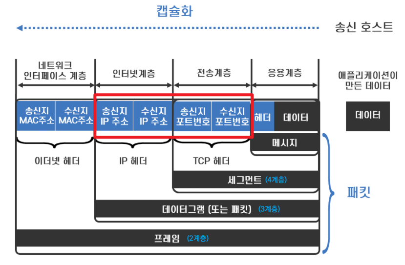
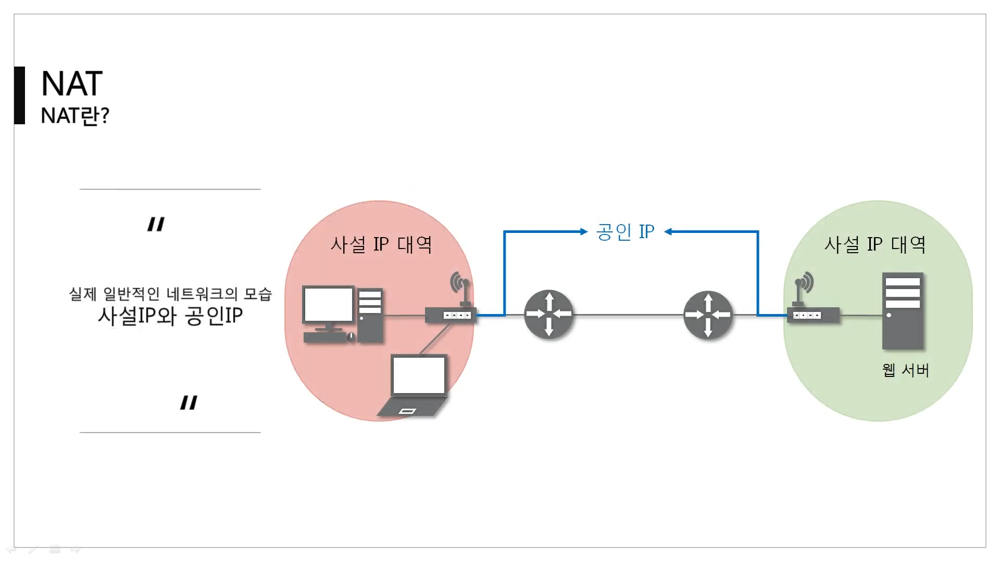
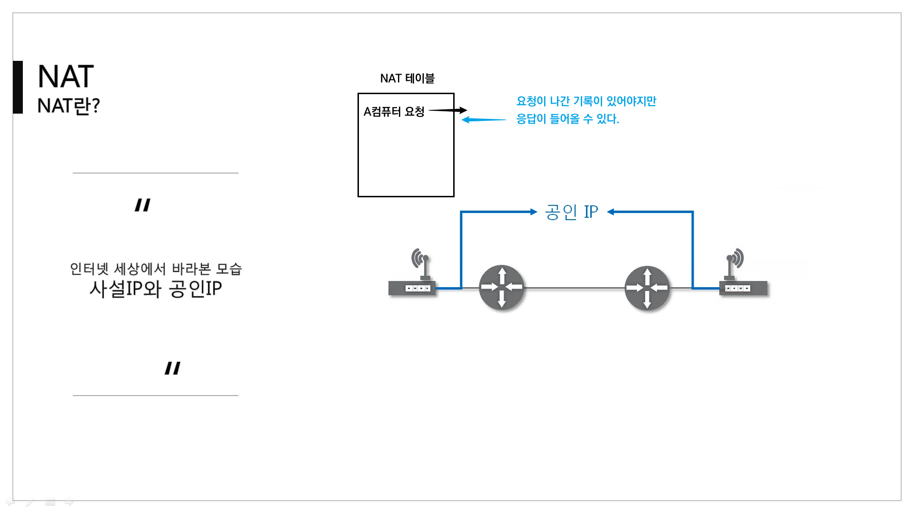
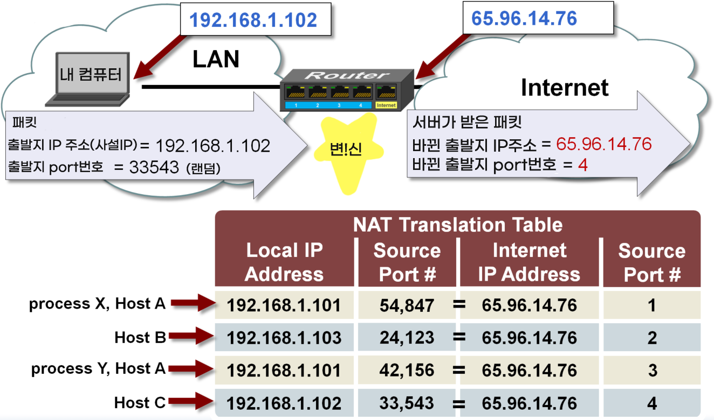
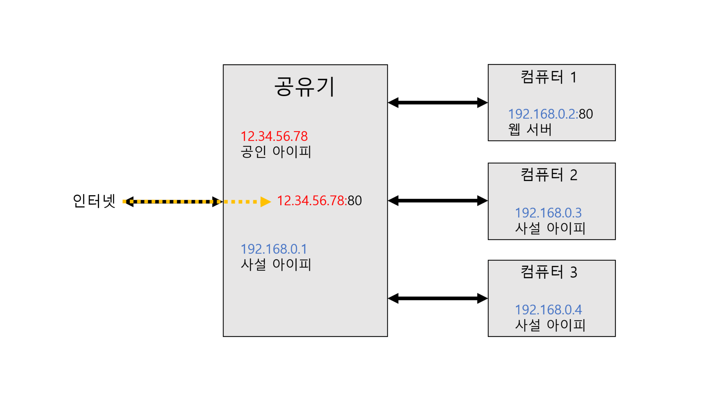
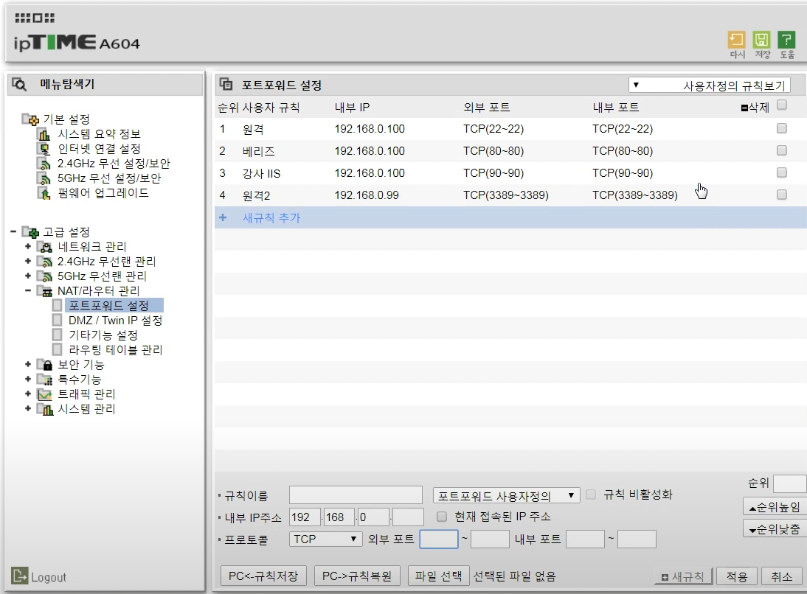

[TOC]

# NAT(=Network Address Translation)

IP 패킷의 `TCP/UDP 포트 숫자`와 `소스 및 목적지의 IP 주소` 등을 **재기록**하면서 라우터를 통해 네트워크 트래픽을 주고 받는 기술을 말한다.

- 멀리있는 컴퓨터와 통신하는 과정에서 네트워크 대역이 바뀔 때마다 이더넷 프로토콜(2계층)을 새로 작성했다. (06 IP 중간쯤)
- 그런 것 처럼 NAT는 3, 4계층의 프로토콜을 다시 만든다. 대신에 다시 만들었다고 NAT 테이블에 기록한다.

- 출발지 IP 주소 & 출발지 port번호를 담은 패킷을 다른 IP 주소의 다른 포트 번호로 바꿔준다.
- 이 기술을 통해 주로 사설 IP와 공인 IP를 바꾸는데 사용한다. 
  - 하지만 다른 곳에도 쓰기 때문에 NAT를 그 용도로만 쓴다고 생각하면 안된다. 

- 패킷에 변화가 생기기 때문에 IP나 TCP/UDP의 체크섬(checksum)도 다시 계산되어 재기록해야 한다.

- NAT를 이용하는 이유는 대개 사설 네트워크에 속한 여러 개의 호스트가 하나의 공인 IP 주소를 사용하여 인터넷에 접속하기 위함이다.

 

 

- 바깥 세상에서는 공유기끼리 통신하는 것 처럼 보인다.
- 요청에 대한 응답이 올 때만 들어올 수 있다.

 

- 내 컴퓨터는 사설 IP주소를 사용한다. 내 컴퓨터의 사설 IP주소와 랜덤 port번호가 담긴 패킷이 라우터를 통해 인터넷 세상으로 가야한다.
- 이때 사설 IP 주소 그대로 가면 다시 우리집에 돌아올 방법이 없다. 그래서 router는 출발지 IP 주소를 우리집 공인 IP주소로 바꿔준다.
- 그리고 어떤 사설 IP주소의 어떤 port번호를 바꿨는지 기록해야 나중에 응답이 왔을때 전해줄 수 있기 때문에 알아서 NAT 테이블에 기록한다.

 

# 포트포워딩(Port Forwarding)

> 05 ARP 초반

- Forwarding = 발송, 전달
- 포트 포워딩(포트 매핑)은 패킷이 라우터나 방화벽과 같은 네트워크 장비를 가로지르는 동안 **특정 IP 주소와 포트 번호의 통신 요청을 특정 다른 IP와 포트 번호로 넘겨주는** 네트워크 주소 변환(NAT)의 **응용**이다. NAT를 응용한 기술!!
- 일반적으로 서버가 사설 네트워크 대역에 있을 때, 그 네트워크 대역을 설정하는 **공유기나 라우터 같은 3계층 장비에서 제공해주는 기능**

- 이 기법은 게이트웨이(외부망)의 반대쪽에서 위치한 사설 네트워크에 상주하는 호스트에 대한 서비스를 생성하기 위해 흔히 사용된다.

- 공유기, 컴퓨터 1, 컴퓨터 2, 컴퓨터 3은 같은 네트워크 대역에 존재하며 각각 사설 IP를 갖는다.
- 이때 인터넷에서 요청이 들어온다. 하지만 현재 상태에서는 80 포트로 들어온 요청을 공유기가 받고 끝난다.

 

- 컴퓨터 1이 내가 설정한 서버이다. 그러면 공유기에 공인 IP주소의 80번 포트로 들어온 요청은 컴퓨터 1에 전달이 되도록 한다.

 

### 참고

- 외부 포트와 내부 포트는 서로 다를 수 있습니다. (80을 8080으로 포워딩 가능)
  - 12.34.56.78:80 ↔ 192.168.0.2:8080

- 내부에서 연결하려는 포트는 아이피를 반드시 지정해야 합니다.
- 하나의 포트로 들어오는 연결을 두 아이피로 포워딩 할 수 없습니다.(하나의 포트는 하나의 포워딩만 가능)
- 공유기가 할당한 아이피에만 포워딩이 가능합니다.

 

공유기에서 포트포워딩 설정한 모습

------

참고

https://lamanus.kr/59

https://microchipdeveloper.com/tcpip:network-address-translation-nat
