[TOC]

# 7계층 프로토콜 HTTP

> 7계층 프로토콜은 매우 많다. 어느정도 프로그래밍 할 줄 알면 7계층 프로토콜을 만들 수 있으며 소켓 프로그래밍이 이에 속한다.
>
> 데이터를 보내는 형식 = 프로토콜. 즉 프로그램 만드는 사람 마음. 대신 잘 알려져있는 프로그램이 있는 것.

- 웹 = HTTP 프로토콜 사용

- 7계층 프로토콜은 매우 다양하기 때문에 프로토콜 구조를 자세히 알 필요는 없다.
- `HTTP`외에 `TELNET`, `FTP`, `SMTP` 등이 있다. (07 4계층 - Well known 포트 에 설명 있음)

# 01 HTTP

## 1-1 웹을 만드는 기술들

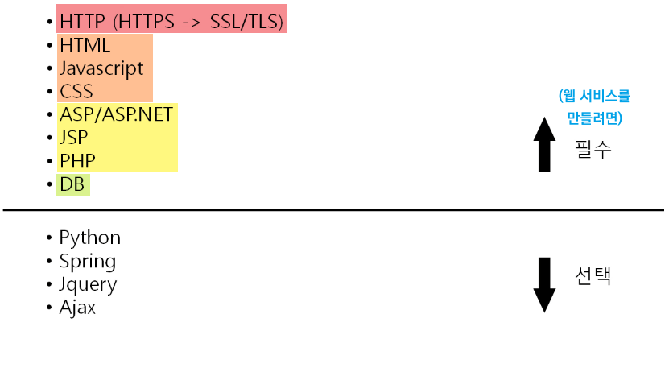

- HTML, Javascript, CSS는 서버에 저장이 되어있고 웹 브라우저로 다운 받아서 실행시킨다.

- 그때 웹 표준 데이터를 받아오는 것이 `HTTP` 이다. 

- 웹 표준이 클라이언트에서 작동된다면, `ASP/ASP.NET`, `JSP`, `PHP` 는 서버 사이드에서 실행한다.

  - JSP는 Java Server Pages이며 서버에서 웹 페이지를 생성하여 브라우저에 돌려주는 서버 사이드 스크립트 언어

    

 

## 1-2 HTTP의 특징

- HyperText Transfer Protocol
- `www`에서 쓰이는 핵심 프로토콜로 문서의 전송을 위해 쓰이며, 오늘날 거의 모든 웹 애플리케이션에서 사용된다.
  - 음성, 화상 등 여러 종류의 데이터를 MIME로 정의하여 전송 가능
  - MIME = 클라이언트에게 전송된 문서의 다양성을 알려주기 위한 메커니즘 : `type/subtype`
    - `application/octet-stream` : 이 타입은 이진 파일을 위한 기본값입니다. 이 타입은 실제로 *잘 알려지지 않은* 이진 파일을 의미하므로, 브라우저는 보통 자동으로 실행하지 않거나 실행해야 할지 묻기도 합니다.
    - `text/plain` ,`text/css`, `text/html`
    - `image/jpeg` , `audio/wave` ...
    - `multipart/form-data` : HTML Form을 전송하기 위해 사용하는 타입.
    - https://developer.mozilla.org/ko/docs/Web/HTTP/Basics_of_HTTP/MIME_types
- HTTP 특징
  - Request / Response 동작에 기반하여 서비스 제공

|          | HTTP 1.0                                                     | HTTP 1.1                                                     |
| -------- | ------------------------------------------------------------ | ------------------------------------------------------------ |
| 특징     | - "연결 수립 / 동작 / 연결 해제" 의 단순함이 특징. - HTML 문서를 전송받은 뒤 연결을 끊고, 다시 연결하여 데이터를 전송한다. | - HTTP 1.0과 호환 가능 - Multiple Request 처리가 가능하여 Client의 요청이 많을 경우 연속적인 응답 제공. - 응답을 다 받을 때 까지 연결을 끊지 않는다.(Pipeline 방식) - 빠른 속도와 인터넷 프로토콜 설계에 최적화 될 수 있도록 캐시 사용 - 데이터를 압축해 전달이 가능하도록 하여 전달하는 데이터 양이 감소 |
| 문제점   | 단순 동작(연결 수립 - 동작 - 연결 해제)이 반복되어 **통신 부하 문제**발생 |                                                              |
| 통신방식 |  |  |

 

# 02 HTTP 요청 프로토콜

## 2-1 HTTP 요청 프로토콜의 구조

- 지금까지의 프로토콜은 16진수였지만, HTTP는 영어를 쓴다.
- Headers에는 옵션 같은 것들이 들어있다.
- Body 데이터를 요청할 때 보내는 추가적인 데이터

### 요청 프로토콜 예시

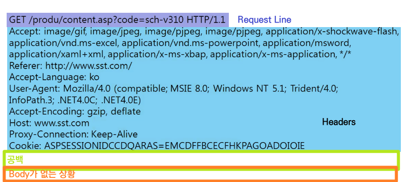

## 2-2 요청 타입

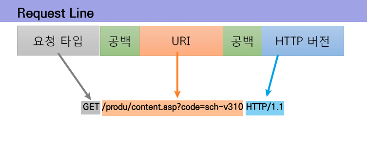

- 서버의 파일을 건드리는 종류들은 대부분 허용해주지 않는다.

 

## 2-3 URI (Uniform Resource Identifier)

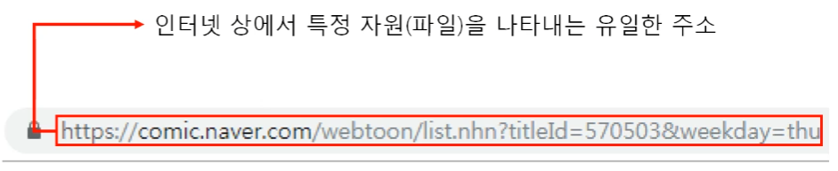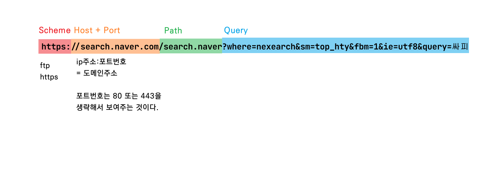

- 꼭 웹 통신 아니더라도 TCP 이후의 데이터 형식만 맞춰주면 HTTP 로 보낼 수 있다. 

 

# 03 HTTP 응답 프로토콜

## 3-1 HTTP 응답 프로토콜의 구조

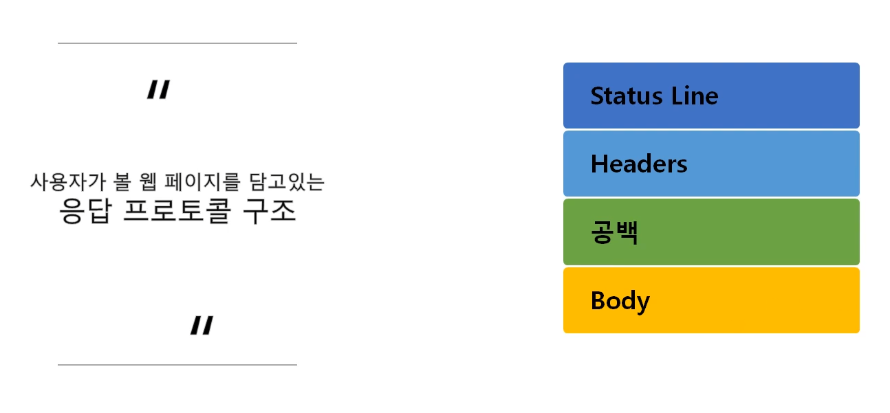

### 응답 프로토콜 예시

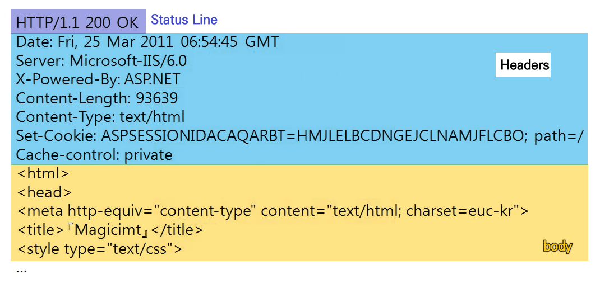

### Status Line

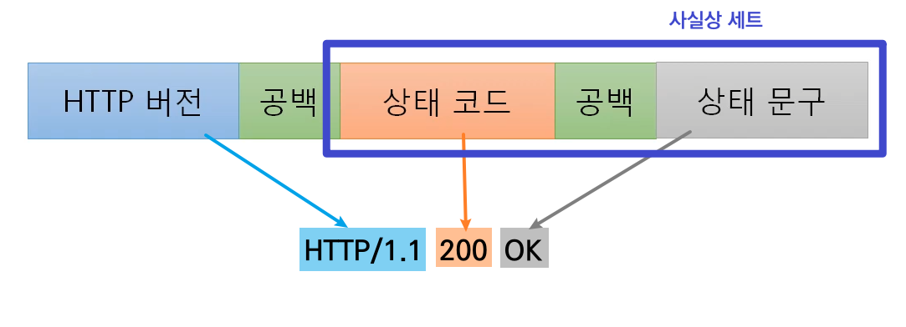

 

## 3-2 상태코드      https://developer.mozilla.org/ko/docs/Web/HTTP/Status

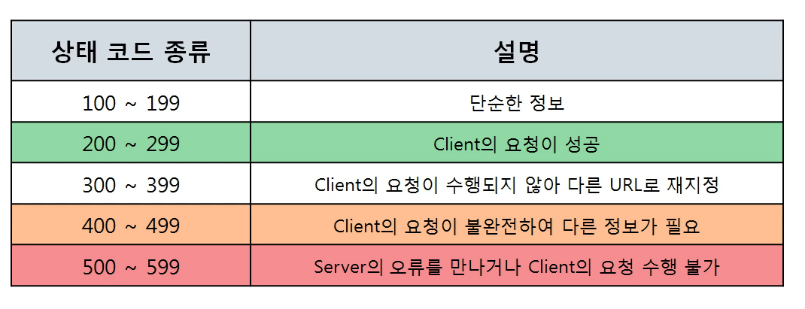

| 상태코드 | 상태 문구               | 상태                                                         |
| -------- | ----------------------- | ------------------------------------------------------------ |
| 401      | `Unauthorized`          | =unauthenticated. 클라이언트는 요청한 응답을 받기 위해 반드시 스스로를 인증해야한다. => "누구세요??" |
| 403      | `Forbidden`             | 클라이언트는 콘텐츠에 접근할 권리가 없습니다. => "너가 감히??" |
| 405      | `Method Not Allowed`    | 요청한 메소드는 서버에서 알고 있지만, 제거되었고 사용할 수 없습니다. |
| 409      | `Conflict`              | 요청이 현재 서버의 상태와 충돌될 때 보냅니다. (주로 중복인 경우 사용함) |
| 500      | `Internal Server Error` | 서버가 처리 방법을 모르는 상황이 발생했습니다. (주로 Null Pointer Exception.. 백엔드 나와) |
| 502      | `Bad Gateway`           | 서버가 게이트웨이나 프록시 서버 역할을 하면서 업스트림 서버로부터 유효하지 않은 응답을 받았다는 뜻이다. Nginx를 사용한다면 Nginx 로그를 뜯어봐라  |
| 503      | `Service Unavailable`   | 최대 Session 수를 초과했을때. 과부화 걸림                    |

 

# 04 HTTP 헤더 포맷

## 4-1 HTTP 헤더 구조

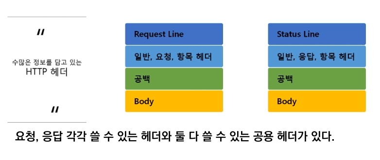

## 4-2 일반 헤더

| 헤더 종류        | 설명                                                         |
| ---------------- | ------------------------------------------------------------ |
| `Content-Length` | 메시지 바디 길이를 나타낼 때 쓰인다. 데이터의 크기를 알려준다. |
| `Content-Type`   | 메시지 바디에 들어있는 컨텐츠 종류 (예: HTML 문서는 `text/html`). 데이터의 종류 |

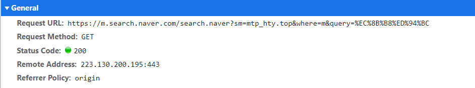

 

## 4-3 요청 헤더

- 요청 프로토콜에 필수로 들어가는 헤더이며, 클라이언트 정보를 담는다.

| 헤더 종류    | 설명                                                         |
| ------------ | ------------------------------------------------------------ |
| `Cookie`     | 서버로부터 받은 쿠키를 다시 서버에게 보내준다.               |
| `Host`       | 요청된 URL에 나타난 호스트명을 상세하게 표시 (HTTP 1.1은 필수) |
| `User-Agent` | 클라이언트 프로그램에 대한 식별 가능 정보를 제공 (핸드폰으로 접속했는지, PC로 접속했는지 다 뜬다.) |

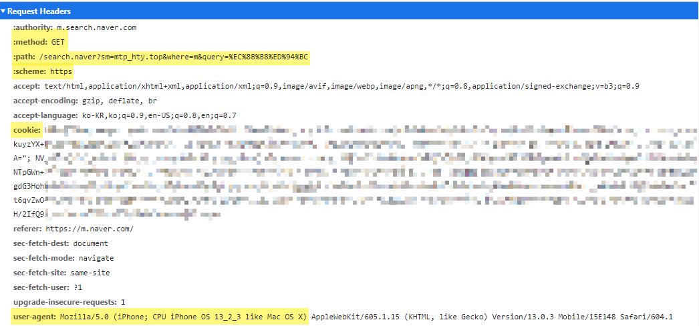

 

## 4-4 응답 헤더

| 헤더 종류    | 설명                                                         |
| ------------ | ------------------------------------------------------------ |
| `Server`     | 사용하는 웹 서버의 소프트웨어에 대한 정보. 공개하기 싫으면 막아두겠죠? |
| `Set-Cookie` | 쿠키를 생성하고 브라우저에 보낼 때 사용한다. 해당 쿠키값을 브라우저가 서버에게 다시 보낼 때 사용한다. |

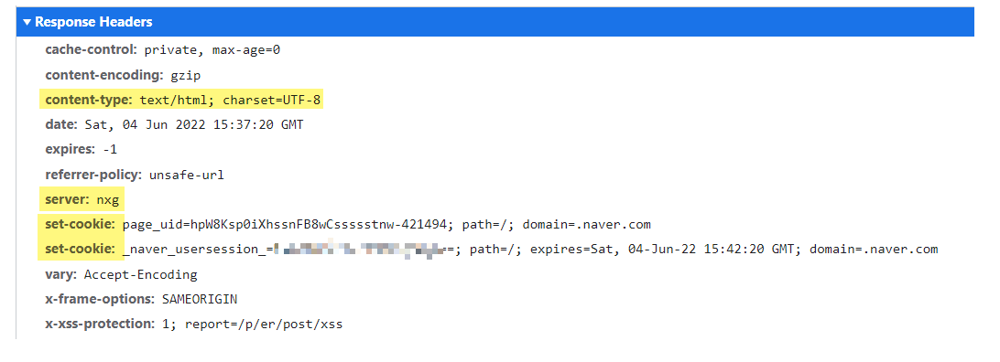