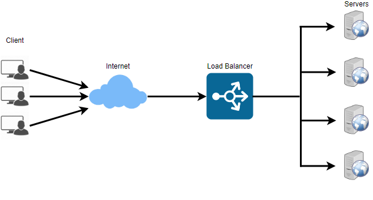
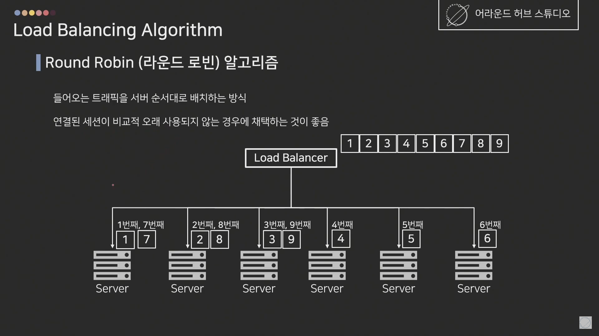
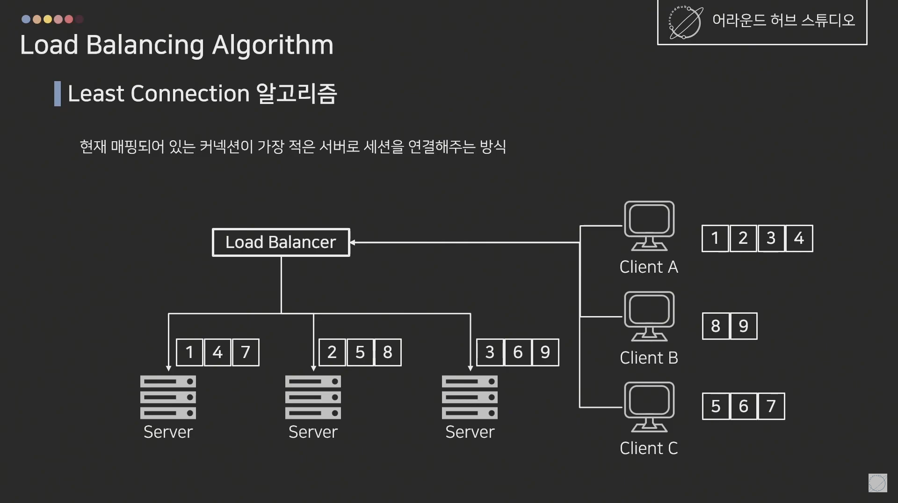
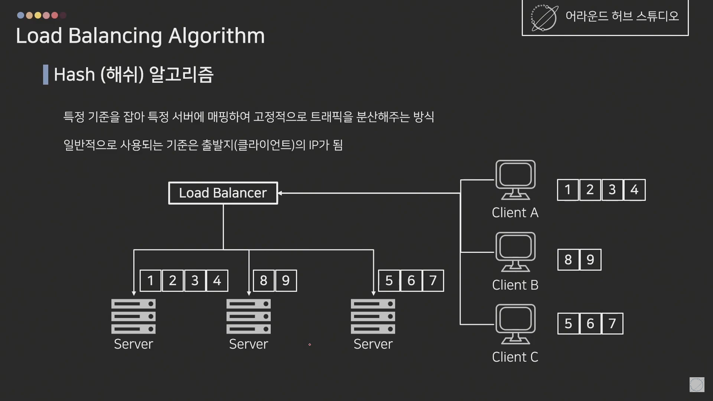
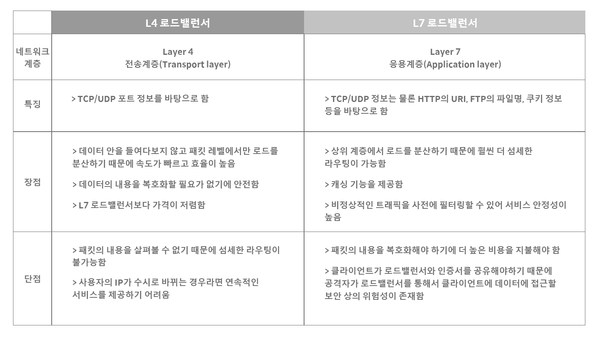
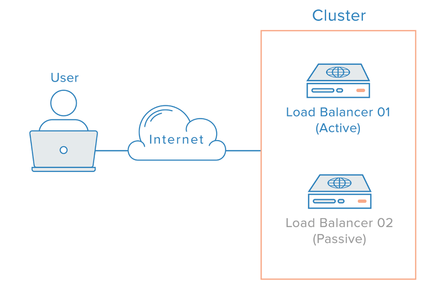

# 로드 밸런싱(Load Balancing)

> 둘 이상의 CPU or 저장장치와 같은 컴퓨터 자원들에게 작업을 나누는 것

## 로드 밸런싱이 필요한 이유

- 수천만명의 Client가 접속해서 많은 트래픽이 발생하고, server 충분히 감당하지 못한다면 결국 멈추게 된다.

- 해결 방법

  

  - `Scale-up` : 서버의 하드웨어 성능을 올린다. (CPU i3를 i7으로 업그레이드)
  - `Scale-out` : 여러대의 서버가 나눠서 일한다. (i3 여러대)

- `Scale-out` 방법의 장점

  - 서버의 하드웨어 향상 비용보다 서버를 한대 추가하는 **비용이 저렴하다.**
  - 여러대의 서버가 일한다면 **무중단 서비스**를 제공할 수 있다.
    - `Load Balancer` : 여러 대의 서버에게 균등하게 트래픽을 분산한다.

## 로드 밸런싱

- 로드 밸런싱은 여러 서버에 부하(Load)를 나누어주는 역할을 한다. 

- Load Balancer를 클라이언트와 서버풀 사이에 두고, 부하가 일어나지 않도록 여러 서버에 분산시켜주는 방식이다.
  - 서버풀 : Server pool, 분산 네트워크를 구성하는 서버 그룹
- 서비스를 운영하는 사이트의 규모에 따라 웹 서버를 추가로 증설하면서 로드 밸런서로 관리해주면 웹 서버의 부하를 해결할 수 있다.

### 로드 밸런서가 서버를 선택하는 방식

- 라운드 로빈(Round Robin) : CPU 스케줄링의 라운드 로빈 방식 활용. 서버 목록을 순회한다. 마지막 서버에 요청을 보낸 경우 다시 처음으로 돌아간다. 서버의 성능이 비슷하고 연결 개수가 그리 많지 않은 경우 가장 효과적이다.

  

- Least Connections : 연결 개수가 가장 적은 서버 선택 (트래픽으로 인해 세션이 길어지는 경우 권장). 세션이 언제 끊어질지 모른다는 점에서 단점이 있고, 큰 규모의 서비스에서는 잘 사용하지 않음

  

- IP Hash : 사용자 IP를 해싱하여 분배 (특정 사용자가 항상 같은 서버로 연결되는 것 보장)

  

### L4 L7 로드밸런서

- 부하 분산에는 L4(4계층, IP주소) 로드밸런서와 L7(7계층, 프로그램) 로드밸런서가 가장 많이 활용된다.
  - L4 부터 포트 정보를 바탕으로 분산이 가능하기 때문이다.
- L4 로드밸런서는 네트워크 계층이나 전송 계층의 정보를 바탕으로 분산한다. **IP주소, 포트번호, MAC주소, 전송 프로토콜**에 따라 트래픽을 나눌 수 있다.
- L7 로드밸런서는 응용 계층에서 분산하기 때문에 **HTTP 헤더, 쿠키 등과 같은 사용자의 요청**을 기준으로 특정 서버에 트래픽을 분산할 수 있다. 

### 로드 밸런서 장애 대비

서버를 분배하는 로드 밸런서에 문제가 생길 수 있기 때문에 로드 밸런서를 **이중화**하여 대비한다.

> Active 상태와 Passive 상태

- 이중화된 Load Balancer들은 서로 Health Check를 합니다.
- Main Load Balancer가 동작하지 않으면 가상IP(VIP, Virtual IP, 사설 IP)는 여분의 Load Balancer로 변경됩니다.
- 여분의 Load Balancer로 운영하게 됩니다.

 

#### [참고자료]

- [로드 밸런서란? - 거의 내용 동일 (한글)](https://www.educative.io/courses/grokking-the-system-design-interview/3jEwl04BL7Q)
- [로드 밸런서의 개념과 특징 - 추가적인 내용 + 설명 잘 되어있음 (한글)](https://m.post.naver.com/viewer/postView.naver?volumeNo=27046347&memberNo=2521903)
- [Load Balacning(영어)](https://nesoy.github.io/articles/2018-06/Load-Balancer)
- [해시넷(한글)](http://wiki.hash.kr/index.php/%EB%A1%9C%EB%93%9C%EB%B0%B8%EB%9F%B0%EC%8B%B1)
- [어라운드허브 스튜디오 - 로드밸런싱이란?(한글)](https://www.youtube.com/watch?v=kYipnodgi2I&ab_channel=%EC%96%B4%EB%9D%BC%EC%9A%B4%EB%93%9C%ED%97%88%EB%B8%8C%EC%8A%A4%ED%8A%9C%EB%94%94%EC%98%A4-AroundHubStudio)