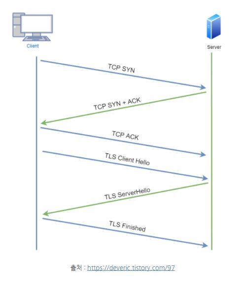

# 웹 브라우저에 URL을 입력하면 일어나는 일

------

> www.google.com 을 입력하면 어떻게 되는걸까?
>
> 9단계에 걸쳐 설명해보겠습니다.
>
> [딱 간단 명료. 내용을 이해했다면 면접 전에 이 글만 읽어도 될듯](https://1day1commit.tistory.com/149)

[TOC]

 

## 1. 웹 브라우저에 URL을 입력한다.

> 우선 URL을 입력하면 URL의 문법에 맞는지 확인합니다. 이때 URL이 맞으면 URL의 Host를 인코딩하고, 아니라면 기본 검색 엔진에 검색합니다.

`www.google.com`은 `http://www.google.com:80` 이란 뜻이다.

`http://` 는 프로토콜,  `www.google.com`은 도메인, `80` 은 포트번호이다.

Q. 입력한 내용이 URL이 맞는가?

​	Y => URL의 Host를 인코딩한다.

​	N => 기본 검색 엔진에 검색한다.

 

## 2. HSTS(HTTP Strict Transport Security) 로 https 요청을 보낼지 결정한다.

> URL의 Host를 인코딩할 때, HSTS로 우선 HTTPS 요청을 보내야하는지 웹 브라우저에서 확인합니다. HSTS 목록에 존재한다면 HTTPS요청을 보내고, 그렇지 않다면 우선 HTTP 요청을 보냅니다. 만약 서버가 HTTPS로 설계되어있다면 HTTP 응답 헤더에 Strict Transport Security가 포함되고 브라우저는 이후 HTTPS 요청만 보냅니다.

HSTS는 요청한 웹 서버가 HTTPS로 설계되어 있을 때, 웹 브라우저에게 HTTPS로 요청하라고 알려주는 보안 기능을 수행한다.

HTTP로 요청을 보냈는데 HTTPS로 설계되어있다면 301, 302 (Redirect) 응답으로 다시 HTTPS 요청을 보내야하는데 이때 쿠키 탈취 등의 보안상의 문제가 존재할 수 있다.

HTTPS가 적용된 사이트에 처음 방문하면, **웹 브라우저**의 HSTS 목록에 저장한다.

Q. URL이 HSTS 목록에 있는가?

​	Y => HTTPS로 요청을 보낸다.

​	N => HTTP로 요청을 보낸다. 이때 HTTPS가 적용된 서버라면 HTTP 응답 헤더에 Strict Transport Security가 포함되어있고, 이후 브라우저는 HTTPS로 요청을 보내게 된다. 

​			HSTS목록에 추가되는 것은 물론이다.

 

## 3. DNS로 IP 주소를 받아온다.

> 하지만 도메인 주소로는 컴퓨터끼리 통신할 수 없기 때문에 IP 주소가 필요합니다. 브라우저에 캐싱되어있다면 해당 데이터를 참조하고, 아니라면 DNS 목록을 조회하여 해당 도메인의 IP 주소를 받아옵니다.

DNS = Domain Name System

도메인 주소(`www.google.com`)은 사람이 알아보기 쉽게 만든 주소라, 컴퓨터는 IP주소(`8.8.8.8`)을 필요로 한다.

따라서 DNS를 통해 도메인에 해당하는 IP 주소를 알아와야한다. 우선 캐싱된게 있는지 찾아본다. 캐시를 찾아보는 순서는 아래와 같다.

1. 브라우저
2. OS
3. router
4. ISP(Internet Service Provider)

ISP에 도달하면 DNS Query를 전달하여 recursive search로 찾아낸다.

참고

​	1. [요청한 URL이 캐시에 없으면, ISP의 DNS 서버가 www.google.com을 호스팅하고 있는 서버의 IP 주소를 찾기 위해 DNS query를 날린다](https://devjin-blog.com/what-happen-browser-search/#3-%EC%9A%94%EC%B2%AD%ED%95%9C-url%EC%9D%B4-%EC%BA%90%EC%8B%9C%EC%97%90-%EC%97%86%EC%9C%BC%EB%A9%B4-isp%EC%9D%98-dns-%EC%84%9C%EB%B2%84%EA%B0%80-wwwgooglecom%EC%9D%84-%ED%98%B8%EC%8A%A4%ED%8C%85%ED%95%98%EA%B3%A0-%EC%9E%88%EB%8A%94-%EC%84%9C%EB%B2%84%EC%9D%98-ip-%EC%A3%BC%EC%86%8C%EB%A5%BC-%EC%B0%BE%EA%B8%B0-%EC%9C%84%ED%95%B4-dns-query%EB%A5%BC-%EB%82%A0%EB%A6%B0%EB%8B%A4)	

2. [인터넷 주소창에 URL을 입력 후 화면에 출력되는 과정](https://1-7171771.tistory.com/134)

 

## 4. 받아온 IP주소로 ARP를 통해 MAC주소를 받는다.

> 받아온 IP 주소로 라우터를 거쳐 서버에 접근하여 ARP를 통해 IP주소를 MAC 주소로 변환합니다.

IP(3계층) 주소를 MAC(2계층)주소로 변환하는 과정이 필요하다. 

IP주소는 접속하려는 서버의 **네트워크**를 찾기 위함이고, MAC 주소는 그 네트워크 내부에 있는 **컴퓨터**와 통신하기 위해 필요하다.

Q. IP주소가 router에 존재(같은 네트워크)? 

​	Y => routing table로 MAC 주소를 알아낼 수 있다. (근데 구글 서버는 우리집에 없으니까...)

​	N => 로컬 네트워크가 아니라면 게이트웨이를 통해 인터넷으로 가서 MAC주소를 찾아온다.

자세한 과정은 [06 IP](https://github.com/pear96/cs-zz/blob/main/%EB%84%A4%ED%8A%B8%EC%9B%8C%ED%81%AC/06%20IP.md) 에서 확인하세요.

 

## 5. TCP 3 Way Handshake

> MAC 주소까지 알아왔다면 이제 서버에 요청을 보내기 전에, 연결 수립을 위해 TCP 3way handshake로 연결을 설정합니다. 이때 HTTPS 요청인 경우 `TLS handshake`가 추가됩니다.

- 3-way handshake가 끝나면 TCP connection 완성
- HTTPS 요청인 경우 추가적인 `TLS(Transport Layer Security) handshake`를 통하여 세션 키를 생성
- 세션이 유지되는 동안 요청과 응답을 반복하는데, 필요하다면 응답을 캐싱
- 출처] [ssafy-tech-concert/web/Web_Process](https://github.com/ssafy-tech-concert/ssafy-tech-concert/blob/master/web/Web_Process.md)

자세한 과정은 [09 TCP 3way Handshake](https://github.com/pear96/cs-zz/blob/main/%EB%84%A4%ED%8A%B8%EC%9B%8C%ED%81%AC/09%20TCP%203way%20Handshake.md#star-%EC%97%B0%EA%B2%B0-%EC%88%98%EB%A6%BD-%EA%B3%BC%EC%A0%95) 에서 확인하세요.

TLS Hanshake는 주지환님의 [Http vs Https](https://github.com/pear96/cs-zz/blob/main/%EB%84%A4%ED%8A%B8%EC%9B%8C%ED%81%AC/09%20TCP%203way%20Handshake.md#star-%EC%97%B0%EA%B2%B0-%EC%88%98%EB%A6%BD-%EA%B3%BC%EC%A0%95) 에서 확인하세요.

 

## 6. HTTP Request + HTTP Response

> TCP 연결이 수립되었다면 이제 HTTP 요청을 보냅니다. 서버는 요청을 처리하고 HTTP 응답을 생성하여 보냅니다.

HTTP 요청과 응답에 포함되는 헤더는 [11 웹을 이용해 데이터 주고받기](https://github.com/ssafy-tech-concert/ssafy-tech-concert/blob/master/web/Web_Process.md) 에서 확인하세요.

 

## 7. Response로 받은 HTML, CSS, JS 등의 자원을 파싱하여 렌더링한다.

자세한 과정은 주지환님의 [웹 브라우저 동작 원리](https://github.com/pear96/cs-zz/blob/main/web/%EC%9B%B9%20%EB%B8%8C%EB%9D%BC%EC%9A%B0%EC%A0%80%20%EB%8F%99%EC%9E%91%20%EC%9B%90%EB%A6%AC.md) 에서 확인하세요.

## 8. 서버와 세션이 종료되면, 4 Way Handshake로 연결을 종료한다.

자세한 과정은 [09 TCP 3way Handshake](https://github.com/pear96/cs-zz/blob/main/%EB%84%A4%ED%8A%B8%EC%9B%8C%ED%81%AC/09%20TCP%203way%20Handshake.md#4-way-handshake-%EC%97%B0%EA%B2%B0-%ED%95%B4%EC%A0%9C) 에서 확인하세요.

### 참고 링크

- [웹 브라우저에 URL을 입력하면 일어나는 일 - 인프라 위주](https://www.youtube.com/watch?v=GAyZ_QgYYYo&t=473s&ab_channel=%EB%84%90%EB%84%90%ED%95%9C%EA%B0%9C%EB%B0%9C%EC%9E%90TV)
- [웹 브라우저에 URL을 입력하면 일어나는 일 - 프론트 개발자용](https://www.youtube.com/watch?v=mmsPSiB2o3M&ab_channel=%EB%84%90%EB%84%90%ED%95%9C%EA%B0%9C%EB%B0%9C%EC%9E%90TV)

- [진짜 길다. 이것보다 자세하게 설명할 수는 없을 듯. 키보드 입력 과정까지도 설명함](https://github.com/SantonyChoi/what-happens-when-KR)
- [DNS 설명이 매우 자세하다.](https://www.netmanias.com/ko/post/blog/5353/dns/dns-basic-operation)

- [위에 써놨긴 한데 DNS 설명이 자세하다](https://1-7171771.tistory.com/134)

- [위에 써놨긴 한데 DNS 설명이 깔끔하고 자세하다. [번역] Browser에 www.google.com을 검색하면 어떤 일이 일어날까?](https://devjin-blog.com/what-happen-browser-search/#3-%EC%9A%94%EC%B2%AD%ED%95%9C-url%EC%9D%B4-%EC%BA%90%EC%8B%9C%EC%97%90-%EC%97%86%EC%9C%BC%EB%A9%B4-isp%EC%9D%98-dns-%EC%84%9C%EB%B2%84%EA%B0%80-wwwgooglecom%EC%9D%84-%ED%98%B8%EC%8A%A4%ED%8C%85%ED%95%98%EA%B3%A0-%EC%9E%88%EB%8A%94-%EC%84%9C%EB%B2%84%EC%9D%98-ip-%EC%A3%BC%EC%86%8C%EB%A5%BC-%EC%B0%BE%EA%B8%B0-%EC%9C%84%ED%95%B4-dns-query%EB%A5%BC-%EB%82%A0%EB%A6%B0%EB%8B%A4)

- [주소 창에 google.com을 검색하면? (브라우저가 웹 페이지를 표시하는 일련의 과정)](https://sorjfkrh5078.tistory.com/65)

- [Ready For Tech Interview - 주소창에 naver.com을 치면 일어나는 일](https://github.com/WooVictory/Ready-For-Tech-Interview/blob/master/Network/%EC%A3%BC%EC%86%8C%EC%B0%BD%EC%97%90%20naver.com%EC%9D%84%20%EC%B9%98%EB%A9%B4%20%EC%9D%BC%EC%96%B4%EB%82%98%EB%8A%94%20%EC%9D%BC.md)

- [싸피 테크 콘서트 - 웹 브라우저 주소창에 www.naver.com을 입력하고 엔터를 누르면 어떤 일이 일어날까?](https://github.com/ssafy-tech-concert/ssafy-tech-concert/blob/master/web/Web_Process.md#7)

