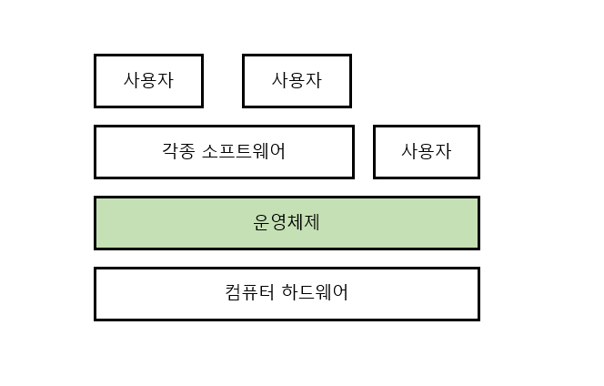

### 운영체제란

#### 운영체제(Operating System, OS)란?

컴퓨터 하드웨어 바로 위에 설치되어 사용자 및 다른 모든 소프트웨어와 하드웨어를 연결하는 소프트웨어 계층

*  좁은 의미 (커널)

   운영체제의 핵심 부분으로 부팅이 일어난 이후로 항상 메모리에 상주하는 부분

*  넓은 의미

   커널 뿐 아니라 각종 주변 시스템 유틸리티를 포함

   ex) windows를 설치하면 커널만 있는 것이 아니라 여러 부가적인 프로그램들이 설치됨(파일 복사 등)

#### 운영체제의 목적

*  컴퓨터 시스템의 자원을 효율적으로 관리
   *  사용자간의 형평성 있는 자원 분배
   
   *  주어진 자원으로 최대한의 성능
   
      (자원: CPU, 기억장치, 입출력 장치 / 프로세스, 파일, 메시지)
   
   *  실행중인 프로그램들에게 짧은 시간씩 CPU를 번갈아 할당
   
*  컴퓨터 시스템을 편리하게 사용할 수 있는 환경을 제공
   *  운영체제는 동시 사용자/ 프로그램들이 각각 독자적 컴퓨터에서 수행되는 것 같은 환상을 제공
   *  하드웨어를 직접 다루는 복잡한 부분을 운영체제가 대행

#### 운영체제의 분류

*  동시 작업 가능 여부

   *  단일 작업(single tasking)
      *  MS-DOS
   *  다중 작업(multi tasking)
      *  UNIX, MS Windows
      *  다중작업 OS도 CPU에서는 매 순간 하나의 프로그램만 수행. CPU에서 번갈아서 수행되지만 CPU의 처리 속도가 워낙 빨라 여러 프로그램들이 동시에 수행되는 것처럼 보임 (시분할 시스템)

*  사용자의 수

   컴퓨터 한 대를 여러 사용자가 동시에 접속해서 사용할 수 있는지

   *  단일 사용자(single user)

      *  MS-DOS, MS Windows

   *  다중 사용자(multi user)

      *  UNIX, NT server

         컴퓨터 한 대를 여러 사용자가 동시에 접근해서 사용 가능

         (요즘은 MS Windows도 계정 여러 개 만들어서 컴퓨터에 원격으로 접근 가능)

*  처리 방식

   *  일괄 처리(batch processing)
      *  작업 요청의 일정량을 모아서 한꺼번에 처리
   *  시분할(time sharing)
      *  여러 작업을 수행할 때 컴퓨터 처리 능력을 일정한 시간 단위로 분할하여 사용
      *  짧은 응답시간
      *  interactive
      *  요즘 OS
   *  실시간(Realtime OS)
      *  정해진 시간 안에 어떤한 일이 반드시 종료됨이 보장되어야 하는 실시간 시스템을 위한 OS
      *  ex) 원자로/공장 제어, 미사일 제어, 반도체 장비 등
      *  Hard realtime system / Soft realtime system

#### 용어 정리

*  ##### Multitasking

task가 여러 개 돌아가고 있지만 CPU에서는 하나의 작업만 실행중이고 시간을 짧게 분할했을 뿐

*  ##### Multiprogramming

여러 프로그램이 메모리에 올라가 있음을 강조

*  ##### Time sharing

CPU의 시간을 분할하여 나누어 쓴다는 의미를 강조

*  ##### Mutiprocess

위의 용어들은 컴퓨터에서 여러 작업을 동시에 수행하는 것을 뜻함

##### Multiprocessor

하나의 컴퓨터에 CPU가 여러 개 붙어 있음을 의미

하드웨어적으로 다른 시스템

#### 운영 체제의 예

*  ##### 유닉스(UNIX)

   *  대형 컴퓨터를 위해 만들어졌음

   *  multitasking

   *  높은 이식성(portable)

      (전혀 다른 기계어를 사용하는 컴퓨터에 이식가능)

   *  코드 대부분을 C언어로 작성

   *  최소한의 커널구조

   *  복잡한 시스템에 맞게 확장 용이

   *  소스 코드 공개

   *  프로그램 개발에 용이

   *  다양한 버전
      *  System V, FreeBSD, SunOS, Solaris
      *  Linux

*  ##### DOS(Disk Operating System)

   *  MS사에서 개인용 pc를 위해 만들어졌음

   *  단일 사용자용 운영체제, 메모리 관리 능력의 한계

*  ##### MS Windows

   *  MS사의 다중 작업용 GUI 기반 운영 체제

   *  Plug and Play 네트워크 환경 강화

   *  DOS용 응용 프로그램과 호환성 제공

   *  불안정성

   *  풍부한 지원 소프트웨어

#### 운영 체제의 구조

*  ##### CPU

   *  어떤 프로그램에게 CPU를 할당할지 CPU 스케줄링

*  ##### 메모리

   *  한정된 메모리로 어떤 프로그램에 얼만큼 할당해야 하는지 메모리 관리

*  ##### Disk

   *  디스크에 파일을 어떻게 보관할지 파일 관리 디스크 스케줄링

   *  헤드가 움직이면서 작업을 처리하기 때문에 헤드를 최소한으로 움직이도록

*  ##### I/O device

   *  각기 다른 입출력장치와 컴퓨터 간에 어떻게 정보를 주고 받을지 입출력 관리
   *  interrupt를 기반으로 관리됨

*  ##### 프로세스 관리

   *  프로세스의 생성과 삭제

   *  자원 할당 및 반환

   *  프로세스 간 협력

*  ##### 그 외

   *  보호 시스템

   *  네트워킹

   *  명령어 해석기