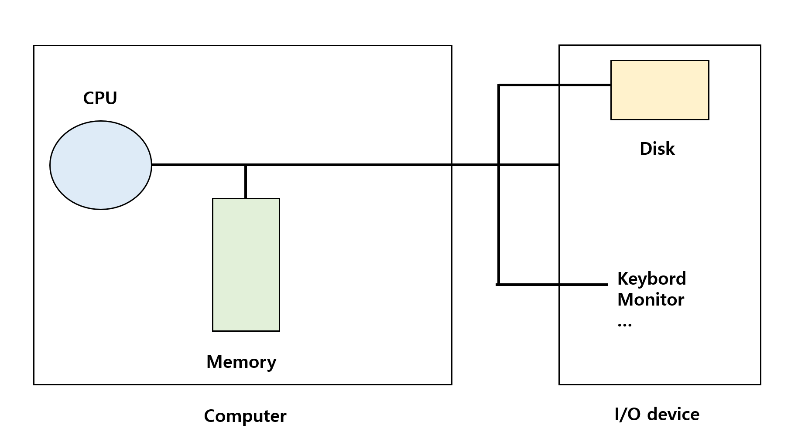
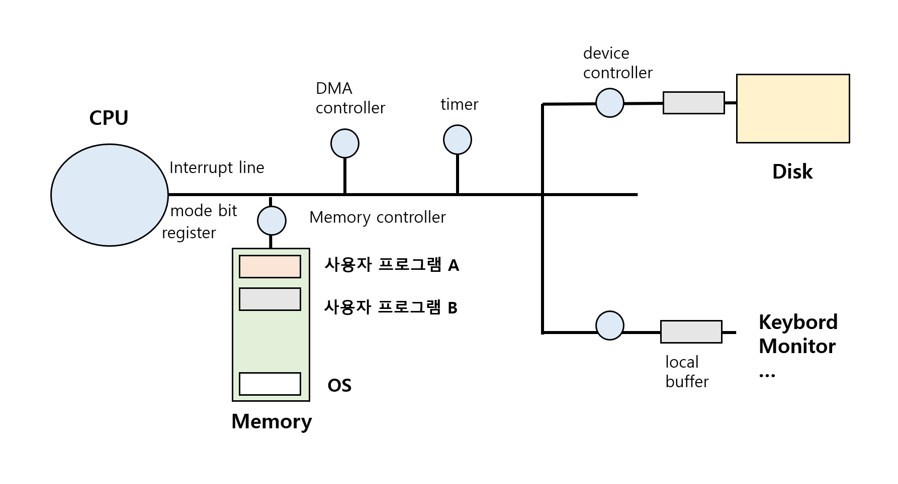
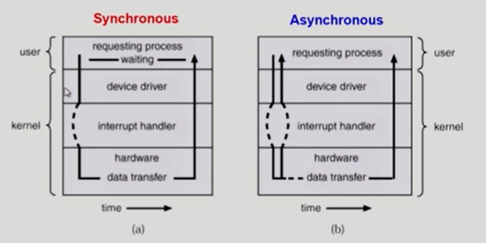
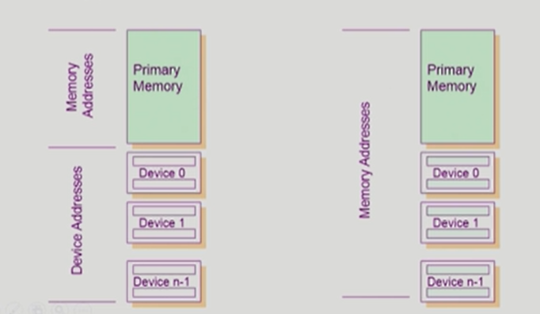
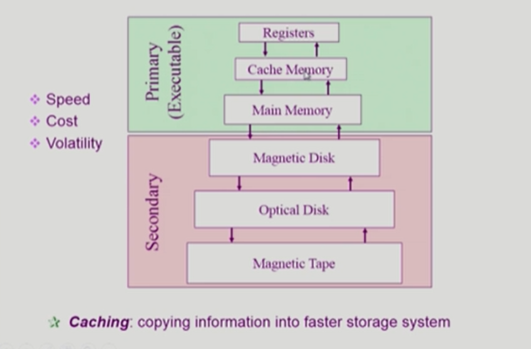
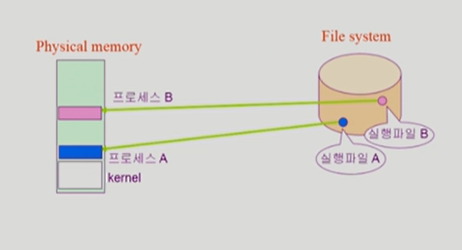
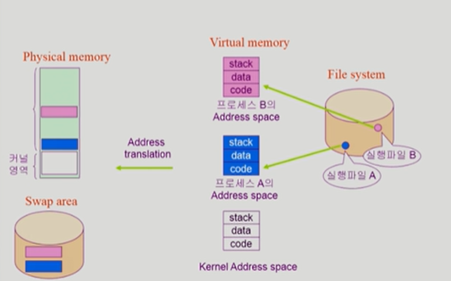
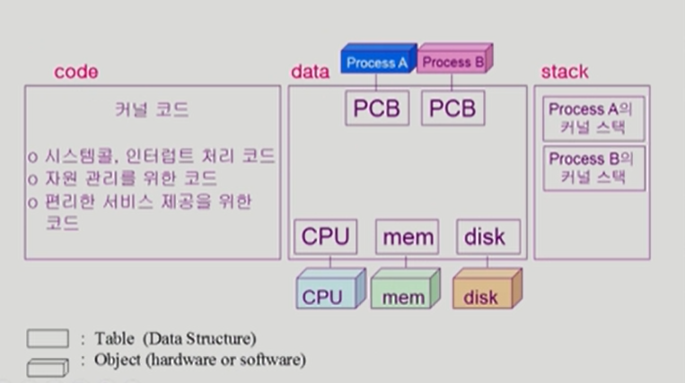
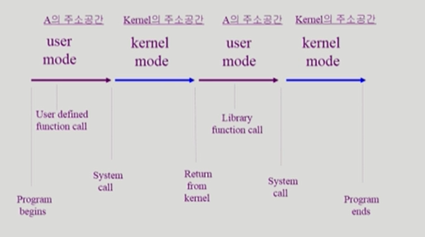

### 시스템 구조 및 프로그램 실행

운영체제 공부에 앞서 컴퓨터 하드웨어적인 부분에 대한 사전학습

#### 컴퓨터 시스템 구조

##### 메모리

CPU의 작업공간, CPU는 매 순간 Memory에서 기계어를 읽어서 실행함

##### register 

메모리보다 빠른 정보를 저장할 수 있는 저장 공간

##### mode bit 

CPU에서 실행되는 것이 운영체제인지 사용자 프로그램인지 구분

사용자 프로그램의 잘못된 수행으로 다른 프로그램 및 운영체제에 피해가 가지 않도록 하기 위한 보호 장치

*  0 : 모니터 모드 = 커널 모드, 시스템 모드 (OS 코드 실행)
   *  메모리 접근, I/O device 접근 등 모든 instruction 가능
   
*  1: 사용자모드 (사용자 프로그램 실행)
   *  제한된 instruction만 가능
   
      

##### interrupt line 

interrupt 발생을 CPU 에 전달하기 위해 존재

CPU는 하나의 명령어를 실행할 때마다  interrupt line을 확인해 interrupt가 발생했는지 확인

##### timer 

특정 프로그램이 CPU를 독점하는 것을 막기 위해 정해진 시간이 흐르 뒤 운영체제에게 제어권이 넘어가도록 interrupt를 발생시킴

timer 값이 0이 되면 interrupt 발생

time sharing을 구현하기 위해 널리 이용됨

##### I/O device controller 

해당 I/O 장치유형을 관리하는 일종의 작은 CPU

제어 정보를 위해 control register, status register를 가짐

data를 저장하는 local buffer를 가짐

cpu가 일을 시킬 때 register로 명령

##### DMA controller 

Direct Memorry Access의 줄임말로 직접 메모리에 접근할 수 있는 controller

I/O 장치가 interrupt를 너무 자주 걸면 CPU가 방해를 받기 때문에 DMA가 메모리를 복사하는 일까지 해서 CPU가 interrupt 당하는 횟수를 줄여줌

##### I/O의 수행

*  모든 입출력 명령은 특권 명령

*  사용자 프로그램은 운영체제를 통해서 접근(시스템 콜)

   사용자 프로그램은 mode bit이 1이기 때문에 운영체제로 접근 불가

   프로그램이 직접 interrupt line을 세팅하는 instruction 실행
   
   

##### interrupt

현대의 운영체제는 인터럽트에 의해 구동됨

*  Interrupt(하드웨어 인터럽트) : 하드웨어가 발생시킨 인터럽트

*  Trap(소프트웨어 인터럽트)
   *  Exception : 프로그램이 오류를 범한 경우
   *  System call : 사용자 프로그램이 운영체제의 서비스를 받기 위해 커널 함수를 호출하는 경우
   
*  관련 용어

   *  인터럽트 벡터 : 해당 인터럽트의 처리 루틴 주소를 가지고 있음
   
   *  인터럽트 처리 루틴 : 해당 인터럽트를 처리하는 커널 함수
   
      

#### 동기식 입출력과 비동기식 입출력

##### 동기식 입출력(sysnchronous I/O)

I/O 요청 후 입출력 작업이 완료된 후에 제어가 사용자 프로그램으로 넘어감

*  구현방법 1
   *  I/O가 끝날 때까지 CPU를 낭비시킴
   *  매시점 하나의 I/O만 일어날 수 있음
*  구현방법 2
   *  I/O가 완료될 때까지 해당 프로그램에게서 CPU를 빼앗음
   *  I/O 처리를 기다리는 줄에 그 프로그램을 줄 세움
   *  다른 프로그램에게 CPU를 줌

##### 비동기식 입출력(asynchronous I/O)

I/O가 시작된 후 입출력 작업이 끝나기를 기다리지 않고 제어가 사용자 프로그램에 즉시 넘어감

##### DMA

빠른 입출력 장치를 메모리에 가까운 속도로 처리하기 위해 사용

CPU의 중재 없이 device controller가 device의 buffer storage의 내용을 메모리에 block 단위로 직접 전송

바이트 단위가 아니라 block 단위로 interrupt를 발생시킴

##### 서로 다른 입출력 명령어

*  I/O를 수행하는 special instructin에 의해
*  Memory Mapped I/O에 의해

메모리 접근 instruction과 io 접근 instruction이 다름

##### Memory Mapped I/O

메모리와 I/O가 하나의 연속된 address영역에 할당

특정 주소에 대해 I/O 접근 instruction이 있는 것이 일반적인데 I/O device에 메모리 주소를 매겨서 메모리 접근하는 instruction을 통해 접근할 수도 있다

##### 저장장치 계층구조

위로 올라갈수록 속도가 빠르고 비싸고 용량이 적음

|        primary         |     secondary      |
| :--------------------: | :----------------: |
|         휘발성         |                    |
| CPU에서 직접 접근 가능 |    직접 처리 x     |
|  byte단위로 접근 가능  | sector 단위로 접근 |

#### 프로그램의 실행(메모리 load)

*  프로그램은 실행파일 형태로 file system(하드 디스크)에 저장됨

*  프로그램을 실행하면 메모리로 올라가서 프로세스가 됨 = 실행

*  가상메모리(virtual memory)

   *  프로그램이 메모리에 올라가기 전에 거치는 단계

      

##### 메모리 adrress space

프로그램을 실행시키면 생기는 그 프로그램만의 독자적인 주소공간

이런 주소공간은 code, data ,stack 영역으로 나눠짐

*  code : cpu에서 실행할 기계어 코드를 담고 있음

*  data : 변수 등 프로그램이 사용하는 자료구조

*  stack : 코드가 함수구조로 되어있기 때문에 함수를 호출하거나 리턴할때 데이터를 사용하는 데에 사용됨

   

##### swap area

사용자 프로그램의 주소공간을 물리적인 메모리에 통째로 다 올리는 것이 아니라 당장 필요한 부분만 올려놓고 아닌 부분은 disk의 swap area에 올려놓음

##### address translation

실제 메모리에 접근하기 위해 가상 메모리를 물리적 메모리로 변환하는 과정

##### 커널 주소 공간

*  code : 자원을 효율적으로 관리하는 코드와 interrupt가 들어오면 각 interrup마다 무슨 일을 처리해야하는지에 관한 코드가 함수 형태로 커널에 정리되어 있음

*  data : 운영체제가 사용하는 여러 자료구조 정리

   각 프로그램들을 관리해야하는 자료구조들이 정리되어있음

*  stack : 운영체제는 프로그램들이 시스템콜을 통해 운영체제를 불러서 사용할 수 있어서 사용자 프로그램마다 커널스택 따로 두고 있음

##### 사용자 프로그램이 사용하는 함수

*  함수
   *  사용자 정의 함수
      *  자신의 프로그램에서 정의한 함수
      
   *  라이브러리 함수
      *  자신의 프로그램에서 정의하지 않고 갖다 쓴 함수
      *  자신의 프로그램의 실행 파일에 포함되어 있음
      
   *  커널 함수
      *  운영체제 프로그램의 함수
      
      *  커널 함수의 호출 = 시스템 호출
      
         

##### 프로그램의 실행

프로그램은 종료될 때까지 유저모드, 커널모드를 계속해서 반복하며 실행됨
