## 프로세스의 개념

### 프로세스

실행중인 프로그램

#### 프로세스의 문맥(context)

CPU 수행 상태를 나타내는 하드웨어 문맥

*  Program Counter

   *  프로세스 내부에 있는 레지스터 중의 하나로 다음에 수행할 명령어의 주소를 가지고 있어 실행할 기계어 코드의 위치 지정
*  각종 register
*  프로세스의 주소 공간

   *  code, data, stack
*  프로세스 관련 커널 자료 구조

   *  PCB(Process Control Block)
   *  Kernel stack

*  현대 운영체제는 time sharing 이기 때문에 프로세스가 cpu를 다른 프로세스에게 뺏겼다가 다시 받았을 때 어느 시점부터 다시 실행해야하는지를 알아야 하기 때문에 프로세스 문맥을 알아야 함

#### 프로세스 상태(Process State)

프로세스는 상태가 변경되며 수행됨

*  Running
   *  CPU를 잡고 instruction을 수행중인 상태
*  Ready
   *  CPU를 기다리는 상태(메모리 등 다른 조건을 모두 만족하고, 당장 필요한 부분이 모두 물리적인 메모리에 올라가 있는 상태)
*  Blocked(wait, sleep)
   *  CPU를 주어도 당장 instuction을 수행할 수 없는 상태
   *  Process 자신이 요청한 event(ex: I/O)가 즉시 만족되지 않아 이를 기다리는 상태
   *  ex) 디스크에서 file을 읽어와야 하는 경우, 코드가 메모리에 올라가있지 않고 disk에 내려가있는 경우

*  New

   *  프로세스가 생성중인 상태

*  Terminated

   *  수행(execution)이 끝난 상태

      

#### 프로세스 상태도

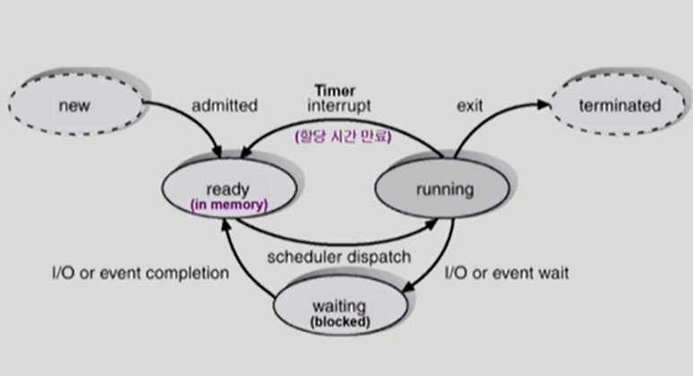

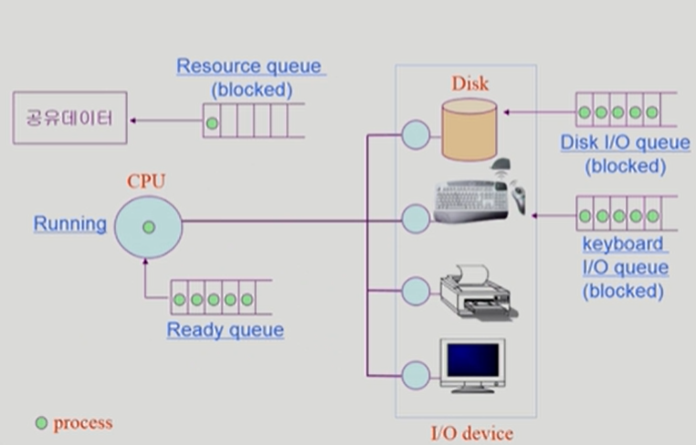

각 프로세스들은 필요한 기능을 수행하기 위해서 해당 작업을 하는 장치의 queue에 들어가서 기다린다.

공유데이터에 여러 프로세스가 동시에 접근하면 일괄성이 깨지는 문제가 생기기 때문에 다른 프로세스가 접근하려고 하면 막아줘야 한다.

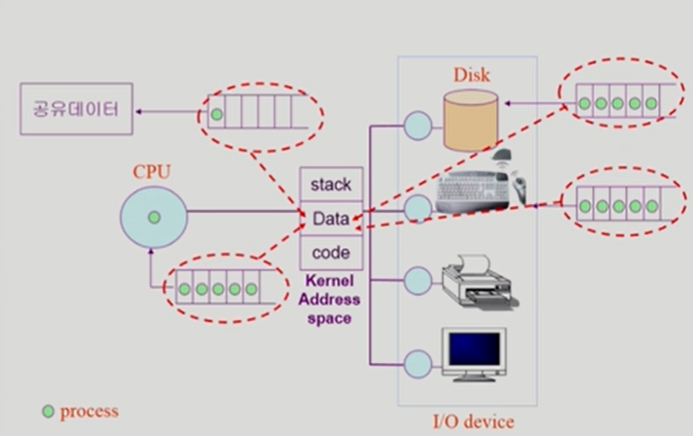

이 queue 들은 모두 운영체제 커널에 data에 자료구조를 만들어놓고 관리함

### PCB(Process Control Block)

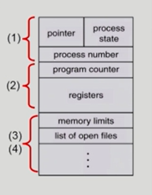

#### PCB

운영체제가 각 프로세스를 관리하기 위해 프로세스당 유지하는 정보

1.  OS가 관리상 사용하는 정보
    *  Process state, Process ID
    *  scheduling information, priority
    
2.  CPU 수행 관련 하드웨어 값
    *  Program counter, registers
    
3.  메모리 관련
    *  Code, data, stack의 위치 정보
    
4.  파일 관련
    *  Open file desciptors ...
    
    

### 문맥 교환(Context Switch)

CPU를 한 프로세스에서 다른 프로세스로 넘겨주는 과정

CPU가 다른 프로세스에세 넘어갈 때 운영체제는 다음을 수행

*  CPU를 내어주는 프로세스의 상태를 그 프로세스의 PCB에 저장
*  CPU를 새롭게 얻는 프로세스의 상태를 PCB에서 읽어옴

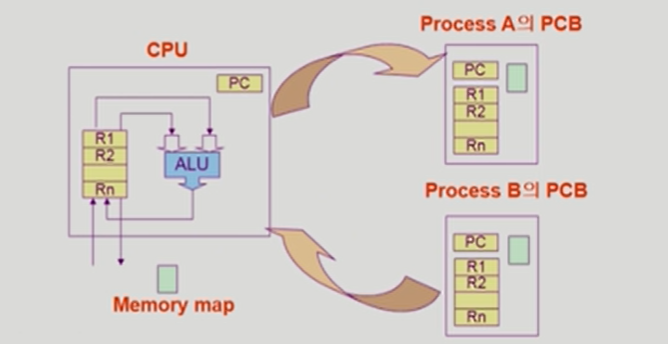

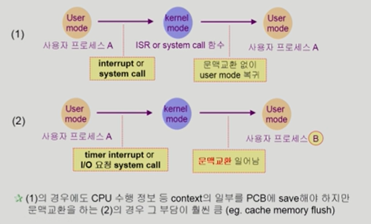

*  System call이나 Interrupt 발생시 반드시 context switch가 일어나는 것은 아님

(1) 프로세스 A가 시스템콜을 했거나 인터럽트가 걸렸을 경우로 보통은 커널로 넘어오기 전 프로세스로 넘어간다.

(2) 타임인터럽트가 걸렸을 경우 다른 프로세스로 cpu를 넘기기 위한 인터럽트이기 때문에 부담이 큰 문맥교환이 필요

### 프로세스를 스케줄링하기 위한 큐

프로세스들은 각 큐들을 오가며 수행됨

각 하드웨어 큐에 프로세스를 관리하는 PCB를 줄세움

##### Job queue

현재 시스템 내에 있는 모든 프로세스의 집합

##### Ready queue

현재 메모리 내에 있으면서 CPU를 잡아서 실행되기를 기다리는 프로세스의 집합 

##### Device queues

I/O device의 처리를 기다리는 프로세스의 집합

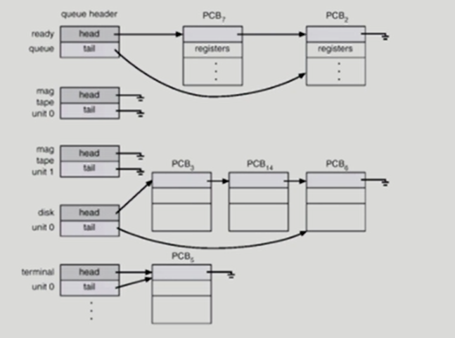

각 하드웨어의 큐에 프로세스를 관리하는 pcb를 줄세움

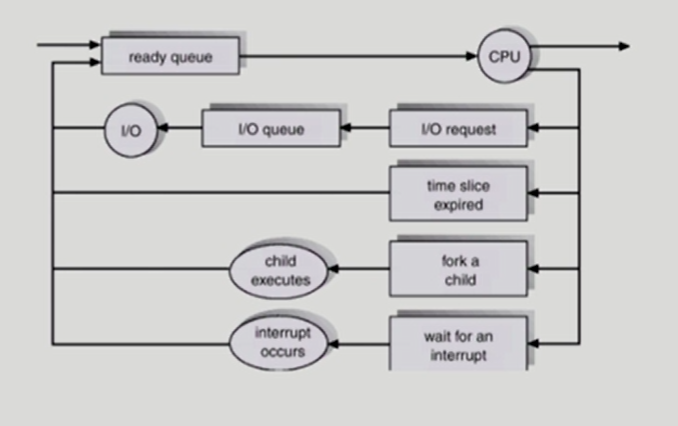

### 스케줄러(Scheduler)

#### Long-term scheduler

장기 스케줄러 or job scheduler

*  시작 프로세스 중 어떤 것들을 ready queue로 보낼지 결정
*  프로세스에 memory(및 각종 자원)을 주는 문제
*  degree of Multiprogramming을 제어
*  time sharing system에는 보통 장기 스케줄러가 없음(무조건 ready)

#### Short-term scheduler

단기 스케줄러 or CPU scheduler

*  어떤 프로세스를 다음번에 running시킬지 결정
*  프로세스에 CPU를 주는 문제
*  충분히 빨라야 함 (millisecond 단위)

#### Medium-Term scheduler

중기 스케줄러 or Swapper

*  여유 공간 마련을 위해 프로세스를 통째로 메모리에서 디스크로 쫓아냄

*  프로세스에게서 memory를 뺏는 문제

*  degree of Multiprograming을 제어

   

#### 프로세스 상태도

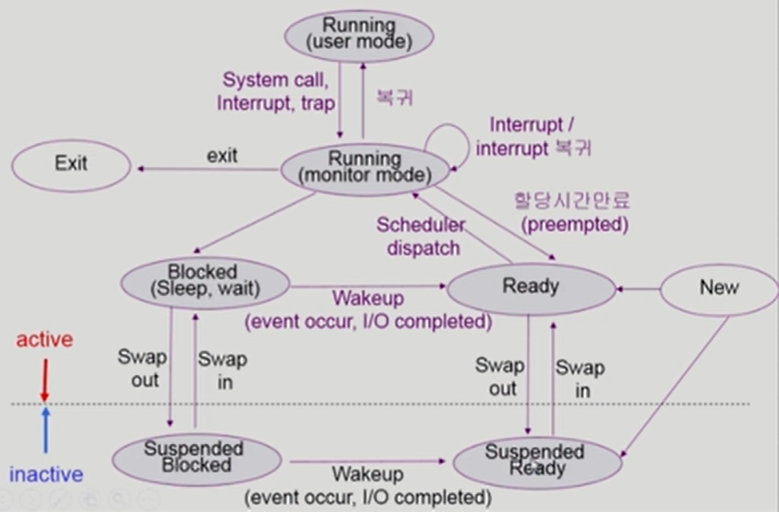

*  모니터 모드 : 운영체제가 running한다는 뜻이 아니라 프로세스가 커널 모드에서 running 중이라는 개념에 유의

   

### Thread

CPU를 수행하는 단위

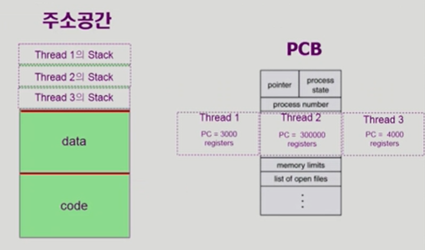

#### Thread의 구성

*  program counter
*  register set
*  stack space

#### Thread가 동료 thread와 공유하는 부분(=task)

*  code section
*  data section
*  OS resources

전통적인 개념의 heavy weight process는 하나의 thread를 가지고 있는 task로 볼 수 있다.

프로세스가 사용하는 자원, 코드 등은 공유하고 CPU 사용과 관련된 정보는 별도로 갖는다.

#### 특징

*  다중 스레드로 구성된 태스크 구조에서는 하나의 서버 스레드가 blocked (waiting) 상태인 동안에도 동일한 태스크 내의 다른 스레드가 실행(running)되어 빠른 처리를 할 수 있다
*  동일한 일을 수행하는 다중 스레드가 협력하여 높은 처리율(throughput)과 성능 향상을 얻을 수 있다
*  병렬성을 높일 수 있다

#### 장점

*  ##### Responsiveness (응답성)

   *  multi-threaded web

*  ##### Resource Sharging

*  ##### Economy

   *  creating & CPU switching thread (rather than a process)
   *  Solaris의 경우 위 두 가지 overhead가 각각 30배, 5배

*  ##### Utilization of MP Architectures

   *  CPU가 여러 개 있는 환경에서 얻을 수 있는 장점
   

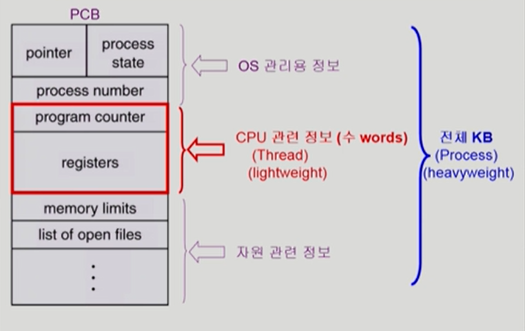

### Implementation of Threads

*  ##### Kernel Threads

supported by kernel

*  ##### User Threds

 supported by library

*  ##### real-time threads

|      | Kernal Threads                                               | User Threads                                                 |
| ---- | ------------------------------------------------------------ | ------------------------------------------------------------ |
| 특징 | 가장 가벼운 커널 스케줄링 단위 하나의 프로세스는 적어도 하나의 커널 스레드 커널 영역에서 스레드 연산 수행 커널이 스레드를 관리, 커널에 종속적 | 사용자 영역에서 스레드 연산 수행 커널에 의존적이지 않은 형태 스레드 기능을 제공하는 라이브러리를 활용 |
| 장점 | 멀티프로세스 환경에서 매우 빠름 다른 스레드의 입출력 작업이 끝날 때까지 다른 스레드 사용 가능 커널이 각 스레드를 개별적으로 관리 안정성과 다양한 기능 | 커널스레드보다 오버헤드가 적음 OS scheduler의 context switch가 없음 모드 간의 전환이 없고 성능 이득 발생 |
| 단점 | 커널을 호출하는데 무겁고 오래걸림 사용자모드 <-> 커널모드 전환이 빈번하게 이뤄져 성능 저하 자원을 많이 소비 | 스케줄링 우선순위를 지원하지 않음 I/O 작업 등에 의해 하나라도 block되면 전체 스레드가 block |

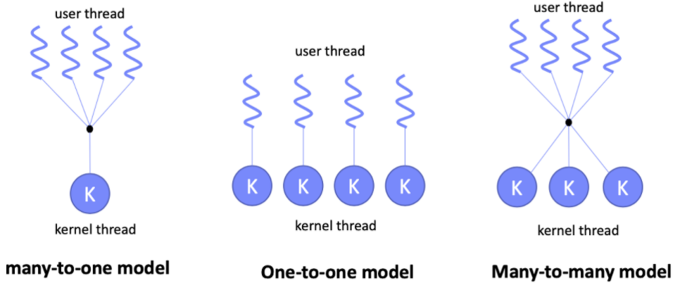

