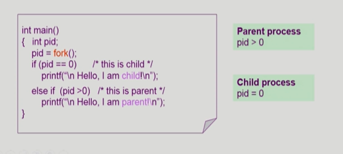
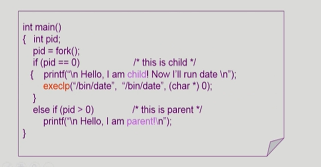
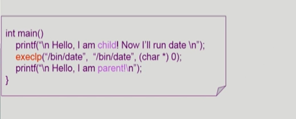
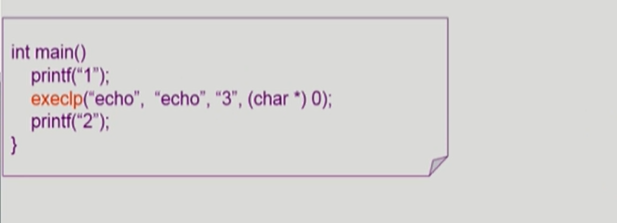
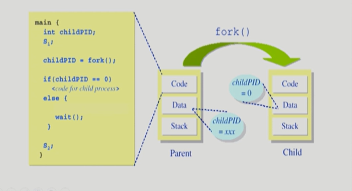
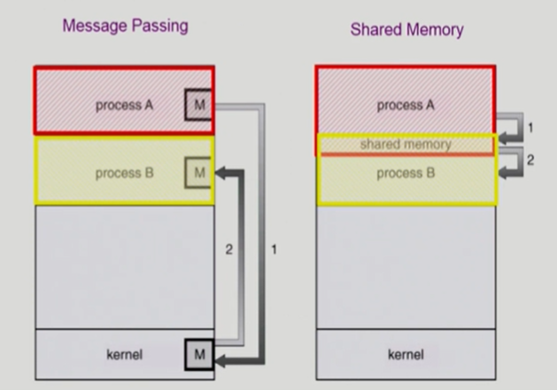
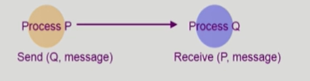
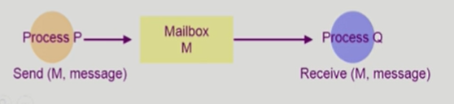

## 프로세스 관리

### 프로세스와 관련한 시스템 콜

|        |                                        |
| ------ | -------------------------------------- |
| fork() | create a child(copy)                   |
| exec() | overlay new image                      |
| wait() | sleep until child is done              |
| exit() | frees all the resources, notify parent |

### 프로세스 생성(Process Creation)

*  부모 프로세스(Parent process)가 자식 프로세스(children process) 생성
*  프로세스의 트리(계층 구조) 형성
*  프로세스는 자원을 필요로 함
   *  운영체제로부터 받음
   *  부모와 공유
*  자원의 공유
   *  부모와 자식이 모든 자원을 공유하는 모델
   *  일부를 공유하는 모델
   *  전혀 공유하지 않는 모델
*  수행(Execution)
   *  부모와 자식은 공존하며 수행되는 모델
   *  자식이 종료(terminate)될 때까지 부모가 기다리는(wait) 모델
*  주소 공간(Address space)
   *  자식은 부모의 공간을 복사함(binary and OS data)
   *  자식은 그 공간에 새로운 프로그램을 올림
*  유닉스의 예
   *  `fork ()` 시스템 콜이 새로운 프로세스를 생성
      *  부모를 그대로 복사(OS data except PID + binary)
      *  주소 공간할당
   *  fork 다음에 이어지는` exec () `시스템 콜을 통해 새로운 프로그램을 메모리에 올림
*  Copy-on-write(COW)
   *  리눅스나 일부 모델은 모드 것을 copy하는 게 아닐 공유 할 수 있는 것은 공유 한 후 copy함
   *  부모와 자식은 결국 별개의 프로세스이기 때문에 필요한 부분만 복사해서 갖게 됨
   *  부모의 자원을 공유하다가 내용이 수정되면 부모의 code, data, stack을 copy

### 프로세스 종료(Process Termination)

*  프로세스가 마지막 명령을 수행한 후 운영체제에게 이를 알려줌(`exit`)
   *  자식이 부모에게 output data를 보냄(via wait)
   *  프로세스의 각종 자원들이 운영체제에게 반납됨
   
*  부모 프로세스가 자식의 수행을 종료시킴(`abort`)
   *  자식이 할당 자원의 한계치를 넘어섰을 경우
   
   *  자식에게 할당된 태스크가 더 이상 필요하지 않을 경우
   
   *  부모가 종료(exit)하는 경우
      *  운영체제는 부모 프로세스가 종료하는 경우 자식이 더 이상 수행되도록 두지 않는다
      
      *  단계적인 종료
      
         

### fork() 시스템콜

*  fort() : 운영체제에게 프로세스 생성을 요청하는 시스템 콜
*  부모의 context를 그대로 복사했기 때문에 프로그램 카운터는 같은 코드부분을 가리키고 있음
*  운영체제가 fork를 할 때 return value로 부모와 자식을 구분해줌( 부모는 양수, 자식은 0)

### exec() 시스템 콜

*  execlp : exec 시스템 콜을 하는 부분
*  새로운 프로그램을 덮어쓰면 다시 돌아올 수 없음

*  execlp 할 때는 프로그램 이름을 2 번 적어주고 arg 적은 후 char * 라고 쓰는 것이 규칙

### wait () 시스템 콜

*  프로세스 A가 wait() 시스템 콜을 호출하면
   *  커널은 child가 종료될 때까지 프로세스 A를 sleep시킨다 (block 상태)
   *  Child proccess가 종료되면 커널은 프로세스 A를 깨운다 (ready 상태)

### exit() 시스템 콜

*  프로세스의 종료
   *  자발적 종료
      *  마지막 statement 수행 후 exit() 시스템 코을 통해 프로그램에 명시적으로 ㅈ거어주지 않아도 main 함수가 리턴되는 위치에 컴파일러가 넣어줌
   *  비자발적 종료
      *  부모 프로세스가 자식 프로세스를 강제 종료시킴
         *  자식 프로세스가 한계치를 넘어서는 자원 요청
         *  자식에게 할당된 태스크가 더 이상 필요하지 않음
      *  키보드로 kill, break 등을 친 경우
      *  부모가 종료하는 경우
         *  부모 프로세스가 종료하기 전에 자식들이 먼저 종료됨

### 프로세스 간 협력

*  독립적 프로세스(Independent process)
   *  프로세스는 각자의 주소 공간을 가지로 수행되므로 원칙적으로 하나의 프로세스는 다르 프로세스의 수행에 영향을 미치지 못함
*  협력 프로세스(Cooperatin process)
   *  프로세스 협력 메커니즘을 통해 하나의 프로세스가 다른 프로세스의 수행에  영향을 미칠 수 있음
*  프로세스 간 협력 메커니즘(IPC: Interprocess Communication)
   *  메시지를 전달하는 방법
      *  message passing : 커널을 통해 메시지 전달
   *  주소 공간을 공유하는 방법
      *  shared memory : 서로 다른 프로세스 간에도 일부 주소 공간을 공유하게 하는 shared memory 메커니즘이 있음
      *  thread: thread는 사실상 하나의 프로세스이므로 프로세스 간 협력으로 보기는 어렵지만 동일한 process를 구성하는 thread들 간에는 주소 공간을 공유하므로 협력이 가능

### Message Passing

#### Message system

프로세스 사이에 공유 변수(shared variable)를 일체 사용하지 않고 통신하는 시스템

*  ##### Direct Communication

통신하려는 프로세스의 이름을 명시적으로 표시

*  ##### Indirect Communication

mailbox(또는 port)를 통해 메시지를 간접 전달

