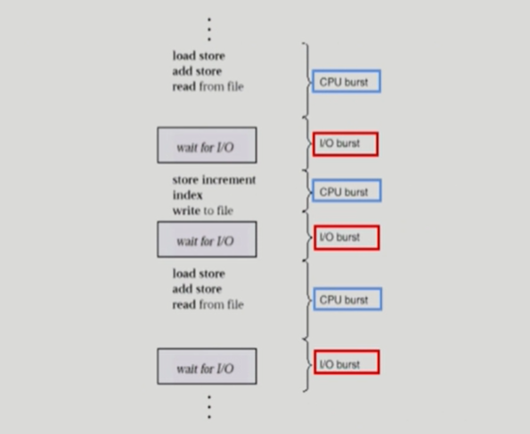
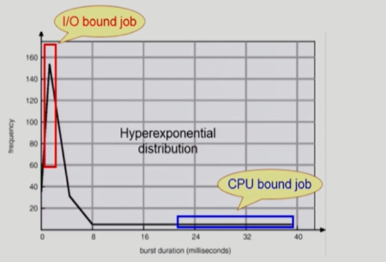
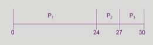
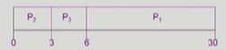
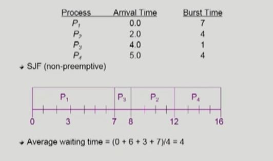
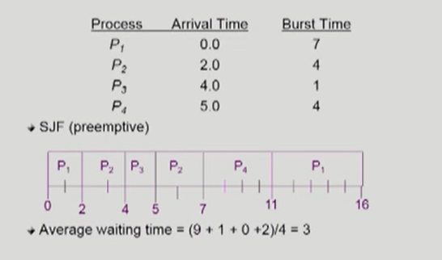
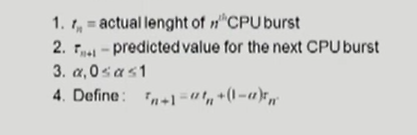
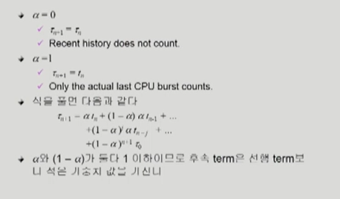
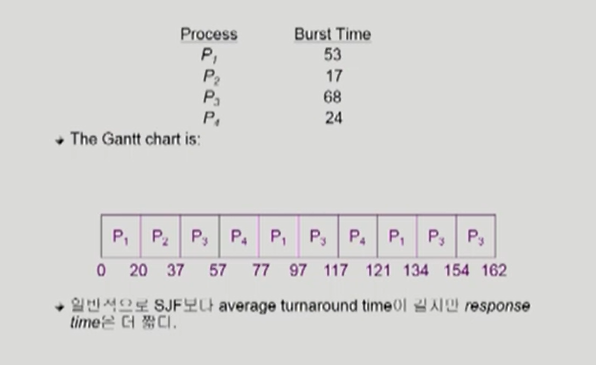
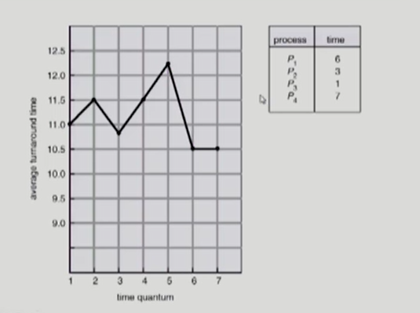

## CPU Scheduling

### CPU and I/O Bursts in Program Execution

*  cpu burst : cpu를 연속적으로 쓰는 단계

*  io burst : io를 실행하고 있는 단계

*  프로그램은 cpu burst와 io burst가 계속해서 반복된다

   

### CPU-burst Time

 

여러 종류의 job(=process)이 섞여 있기 때문에 CPU 스케줄링이 필요하다

*  interactive job에게 적절한 response 제공 요망
*  CPU와 I/O 장치 등 시스템 자원을 골고루 효율적으로 사용

프로세스는 그 특성에 따라 다음 두 가지로 나눔

*  I/O-bound process
   *  CPU를 잡고 계산하는 시간보다 I/O에 많은 시간이 필요한 job
   *  many short CPU bursts
   
*  CPU-bound process
   *  계산 위주의 job
   
   *  few very long CPU bursts
   
      

### CPU Scheduler & Dispatcher

#### CPU Scheduler

Ready 상태의 프로세스 중에서 이번에 CPU를 줄 프로세스를 고름

#### Dispatcher

CPU 의 제어권을 CPU scheduler에 의해 선택된 프로세스에게 넘김

이 과정을 context switch(문맥 교환)라고 함

*  CPU 스케줄링이 필요한 경우
   1.  Running > Blocked (ex. I/O 요청하는 시스템 콜)
   2.  Running > Ready (ex. 할당시간만료로 timer interrupt)
   3.  Blocked > Ready (ex. I/O 완료 후 인터럽트)
   4.  Terminate
*  `선점형` 1, 4에서의 스케줄링은 **nonpreemptive** ( = 강제로 빼앗지 않고 자진 반납)  
*   `비선점형` 나머지는 **preemptive** (=강제로 빼앗음)

### Scheduling Criteria

##### performance index( = performance measure, 성능 척도)

< 시스템 입장에서 >

*  #### CPU utilization (이용률)

   *  CPU as busy as possible

*  #### Throughput (처리량)

< 프로그램 입장에서 >

*  #### Turnaround time (소요시간, 반환시간)

   *  amount of time to execute a particular process
   *  cpu를 쓰려고 기다렸다가 cpu를 쓰고 난 후 i/o 작업을 하러 빠져나올 때까지의 시간

*  #### Waiting time (대기 시간)

   *  amount of time a process has been waiting in the ready queue
   *  ready queue 에서 기다린 순수 시간

*  #### Response time (응답 시간)

   *  amount of time it takes from when a request was submitted until the first response is produced. not output
   *  for time-sharing environment
   *  ready queue에 들어와서 처음으로 cpu를 얻기까지 걸리는 시간

### Scheduling Algorithms

*  #### FCFS (First-Come First Served)

*  #### SJF (Shortest-Job-First)

*  #### SRTF (Shortest Remaining Time First)

*  #### Priority Scheduling

*  #### RR

*  #### M Queue

*  #### M Feedback Queue

#### * FCFS (First-Come First Served)

| Process | burst time |
| ------- | ---------- |
| P1      | 24         |
| P2      | 3          |
| P3      | 3          |

|                      | case 1                                                       | case 2                                                       |
| -------------------- | ------------------------------------------------------------ | ------------------------------------------------------------ |
|                      | p1 > p2 > p3                                                 | p2 > p3 > p1                                                 |
| Gantt chart          |  |  |
| waiting time         | p1 = 0 ; p2 = 24 ; p3 = 27                                   | p1 = 6 ; p2 = 0 ; p3 = 3                                     |
| Average waiting time | (0 + 24 + 27) / 3 = 17                                       | (6 + 0 + 3) / 3 = 3                                          |

**Convoy effect** : short process behind long process

#### * SJF (Shortest-Job-First)

*  각 프로세스와 다음번 CPU burst time을 가지고 스케줄링에 활용
*  CPU burst time이 가장 짧은 프로세스를 제일 먼저 스케줄
*  Two schema
   *  Nonpreemptive
      *  일단 CPU를 잡으면 이번 CPU burst가 완료될 때까지 CPU를 선점당하지 않음
   *  Preemptive
      *  현재 수행중인 프로세스의 남음 burst time보다 더 짧은 CPU burst time을 가지는 새로운 프로세스가 도착하면 CPU를 빼앗김
      *  이 방법을 Shortest-Remaining-Time-First(SRTF) 라고도 부른다
*  SJF is optimal
   *  주어진 프로세스들에 대해 `minimum average waiting time` 을 보장

#####  example of nonpreemptive SJF

#####  example of preemptive SJF

*  nonpreemptive는 cpu를 다 쓰고 나가는 시점에, preemptive은 새로운 process가 도착하면 cpu 스케줄링이 일어난다

   

#### * Priority Scheduling

*  A priority number (Integer) is associated with each process
*  highest priority를 가진 프로세스에게 CPU 할당 ( smallest integer = highest priority)
   *  Preemptive
   *  nonpreemptive
*  SJF는 일종의 priority scheduling
*  Problem
   *  Starvation : low priority processes may never execute
   *  sjf는 극단적으로 짧은 job을 선호하기 때문에 cpu사용기간이 길면 영원히 cpu를 못 받을 수 있음
*  Solution
   *  Aging : as time progresses increase the priority of the process
   *  아무리 우선순위가 낮아도 오래 기다리면 우선순위를 높여줌

#### 다음 CPU Burst Time 의 예측

*  다음번 CPU burst time을 어떻게 알 수 있는가? (input data, branch, user ...)
*  추정(estimate)만 가능
*  과거의 CPU burst time을 이용해서 추정 (exponential averaging)

#### * Round Robin (RR)

*  각 프로세스는 동일 한 크기의 할당 시간(time quantum)을 가짐 (일반적으로 10-100ms)
*  할당 시간이 지나면 프로세스는 선점(preemted)당하고 ready queue의 제일 뒤에 가서 다시 줄을 선다
*  n 개의 프로세스가 ready queue에 있고 할당 시간이 q time unit인 경우 각 프로세스는 최대 q time unit 단위로 CPU 시간의 1/n을 얻음
   *  어떤 프로세스도 (n-1)q time unit 이상 기다리지 않음
*  Performance
   *  q large > FCFS
   *  q small > context switch 오버헤드가 커짐
*  일반적으로 SJF보다 average turnaround time이 길지만 response time은 더 짧음

##### example : RR with Time Quantum = 20

