## Process Syncronization

### 데이터의 접근

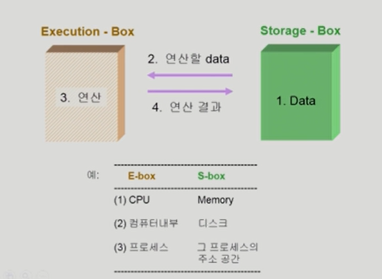

*  storage box: 데이터가 저장된 곳

*  execution box : 연산을 하는 곳

*  데이터를 읽어오고 연산한 후 저장하는 과정에서 누가 데이터를 먼저 읽어갔냐에 따라 값이 달라지게 되고 그 과정에서 `syncronization` 문제가 생김

   

### Race Condition

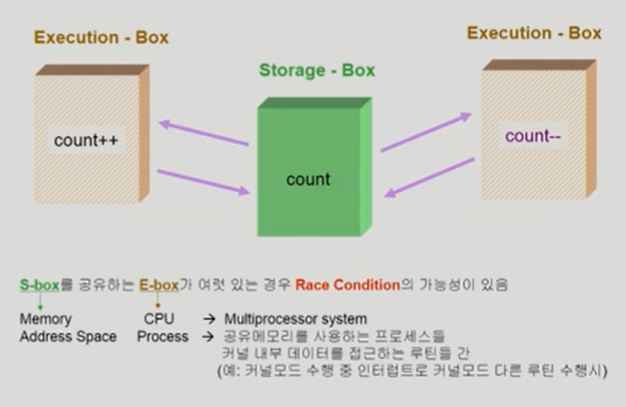

*  Race condition (경쟁 상태) : 여러 주체가 하나의 데이터에 동시에 접근하려는 상황

#### OS에서 race condition은 언제 발생하는가?

1.  kernel 수행 시 인터럽트 발생 시

2.  Process가 system call을 하여 kernal mode로 수행 중인데 context switch가 일어나는 경우

3.  Multiprocessor에서 shared memory 내의 kernel data

    

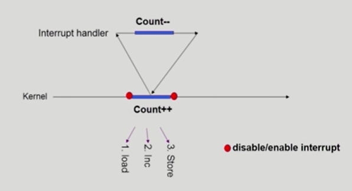

*  커널모드 running 중 interrupt가 발생하여 인터럽트 처리 루틴이 수행 > 양쪽 다 커널 코드이므로 kernel address space 공유

*  해결책 : interrupt가 들어와도 interrupt 처리 루틴으로 넘기는 것이 아니라 작업이 끝날 때까지 interrupt 처리를 안함

   *  순서를 정해두고 데이터를 처리하는 중엔 다른 연산을 막으면 되는데 무작정 막다보면 비효율적일 수 있음

      

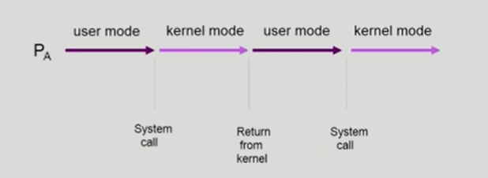

*  두 프로세스의 address space 간에는 data sharing이 없음

*  그러나 system call을 하는 동안에는 kernel address space의 data를 access 하게 됨(share)

*  이 작업 중간에 CPU를 preempt해가면 race condition 발생

   

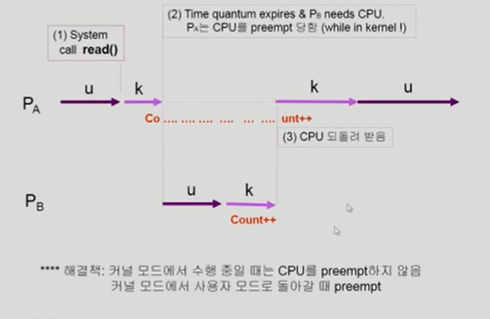

*  해결책 : 커널 모드에서 수행 중일 때는 CPU 를 preempt하지 않음

   ​			커널 모드에서 사용자 모드로 돌아갈 때 preempt

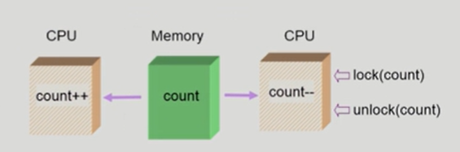

*  어떤 CPU가 마지막으로 count를 store 했는 가? > race condition
*  multiprocessor의 경우 interrupt enable/disable로 해결되지 않음

*  해결책
   *  한 번에 하나의 CPU만이 커널에 들어갈 수 있게 하는 방법
   *  커널 내부에 있는 각 공유 데이터에 접근할 때마다 그 데이터에 대한 lock/ unlock을 하는 방법

### Process Synchronization 문제

*  공유 데이터(shared data)의 동시 접근(concurrent access)은 데이터의 불일치 문제(inconsistency)를 발생시킬 수 있다
*  일관성(consistency) 유지를 위해서는 협력 프로세스(cooperatin  process) 간의 실행 순서(orderly execution)를 정해주는 메커니즘 필요

##### Race condition

*   여러 프로세스들이 동시에 공유 데이터를 접근하는 상황
*  데이터의 최종 연산 결과는 마지막에 그 데이터를 다룬 프로세스에 따라 달라짐
*  race contidion을 막기 위해서는 concurrent process는 동기화(synchronize)되어야 한다

##### Example of a race condition

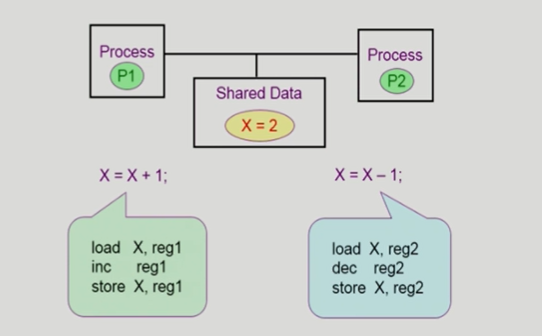

*  P1 수행 중 timer interrupt가 발생해서 context switch가 일어나서 P2가 CPU를 잡으면?
   *  process들은 자신만의 독자적인 주소 공간을 갖고 있기 때문에 보통은 문제가 안생김
   *  특별히 두 프로세스 간에 shared memeory를 쓰고 있다거나 커널에 있는 데이터를 건드리는 동안에 cpu가 넘어가면 생기는 문제

#### The Critical-Section Problem

*  n개의 프로세스가 공유 데이터를 동시에 사용하기를 원하는 경우
*  각 프로세스의 code segment에는 공유 데이터를 접근하는 코드인 `critical section` 이 존재

##### Problem

*  하나의 프로세스가 critical section에 있을 때 다른 모든 프로세스는 critical section에 들어갈 수 없어야 한다

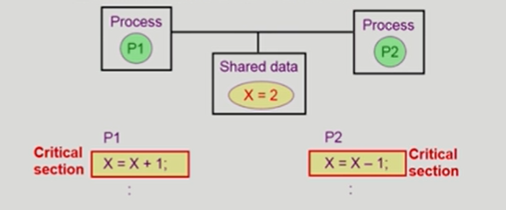

#### Initial Attempts to Solve Problem

*  두 개의 프로세스가 있다고 가정 P0, P1

*  프로세스들의 일반적인 구조

   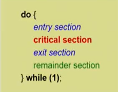

*  프로세스들은 수행의 동기화(synchronize)를 위해 몇몇 변수를 공유할 수 있다 -> synchronization variable

*  프로세스는 공유 데이터를 접근하거나 or 아니거나 하는 코드가 반복됨

*  entry section으로 lock을 걸어주고 critical section 사용이 끝나면 lock을 풀어줌

   

#### 프로그램적 해결법의 충족 조건

*  Mutual Exclusion(상호 배제)
   *  프로세스 Pi가 critical section 부분을 수행 중이면 다른 모든 프로세스들은 그들의 critical section에 들어가면 안 된다
*  Progress
   *  아무도 critical section에 있지 않은 상태에서 critical section에 들어가고자 하는 프로세스가 있으면 critical section에 들어가게 해주어야 한다.
*  Bounded Waiting (유한 대기)
   *  프로세스가 critical section에 들어가려고 요청한 후부터 그 요청이 허용될 때까지 다른 프로세스들이 critical section에 들어가는 횟수에 한계가 있어야 한다

*  가정
   *  모든 프로세스의 수행 속도는 0보다 크다
   *  프로세스들 간의 상대적인 수행 속도는 가정하지 않는다

#### Algorithm 1

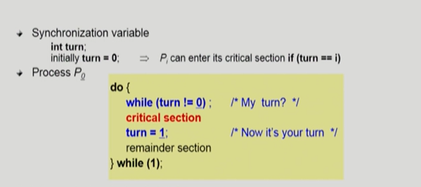

*  turn : 어떤 프로세스인지 차례를 알려주는 변수
*  내 차례가 아닐 경우 while 문을 돌면서 기다리고 차례가 돌아오면 critical section을 들어감

*  문제 : critical section에 반드시 교대로 들어가게 되어 있기 때문에 누가 차례를 넘겨주어야만 들어갈 수 있음
   *  ex ) P0 은 critical section에 더 자주 접근해야하는데 만약 P1은 1번만 접근한다면 그 후로 P0에게 차례를 넘겨주지 않아서 영원히 못 들어가게 됨
   *  Progress 조건 만족 X

#### Algorithm 2

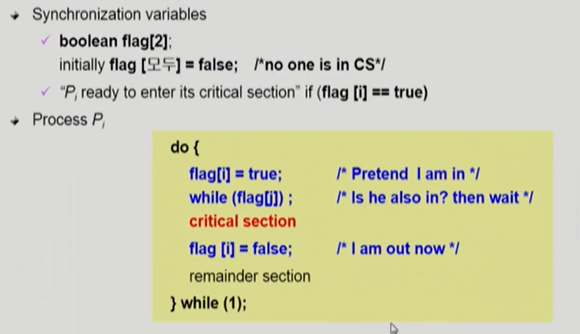

*  flag 는 프로세스가 critical section에 들어가고자 하는 의지 표시
*  문제점 : 둘 다 2행까지 수행 후 끊임 없이 양보하는 상황 발생 가능
   *  Satisfies mutual exclusion, but not progress requirement

#### Algorithm 3 (Peterson's Algorithm)

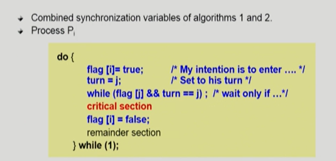

*  turn 변수, flag 변수 모두 사용
*  Meets all three requirements; solve the critical section problem for two progresses
*  문제점 : Busy Waiting(=spin lock) (계속 CPU와 memory를 쓰면서 wait)
   *  만약 어떤 프로세스가 critical section 들어가 있는 상황에서 다르 프로세스가 cpu를 잡으면 상대방이 바꿔주기 전까지 while문을 계속 돔
   *  비효율적

#### Synchronization Hardware

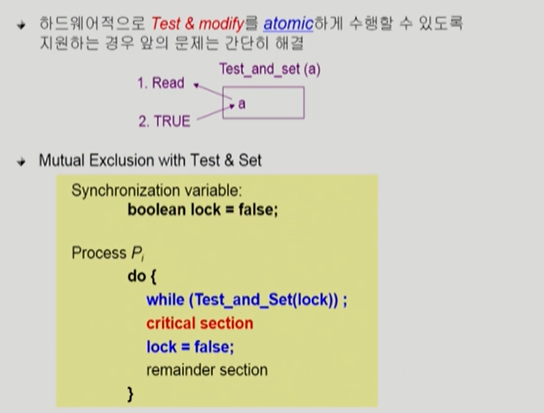

*  test ans set이라는 instruction
   *  data를 읽고 쓰는 것이 하나의 instruction으로 이루어져 있다면 이 과정에서 cpu를 뺏기지 않을 테니까 문제가 발생하지 않음
