## 가상 메모리

### 가상 메모리

*  프로세스 전체가 메모리 내에 적재되지 않더라도 실행이 가능하도록 하는 기법

*  장점

   *  많은 프로그램을 동시에 수행할 수 있음

   *  CPU 이용률과 처리율이 높아짐

      

### Demand Paging (요구 페이징)

*  실제로 필요할 때 page를 메모리를 올리는 것
   *  I/O 양의 감소
   *  Memory 사용량 감소
   *  빠른 응답 시간
   *  더 많은 사용자 수용
*  Valid/ Invalid bit의 사용
   *  Invalid의 의미
      *  사용되지 않은 주소 영역인 경우
      *  페이지가 물리적 메모리에 없는 경우
   *  처음에는 모든 page entry가 invalid로 초기화
   *  address translation 시에 invalid bit이 set되어 있으면 `page fault`

### Memory에 없는 Page의 Page Table

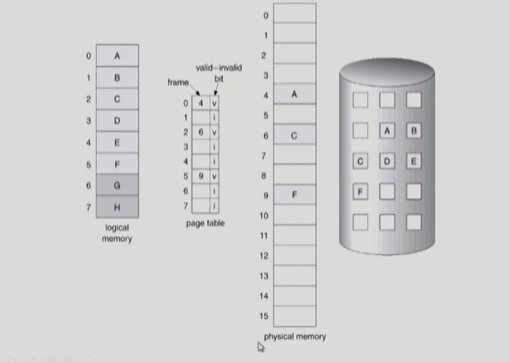

맨 오른쪽 원기둥 : backing store

### Page Fault

*  invalid page를 접근하면 MMU가 trap을 발생시킴 (page fault trap)
*  Kernel mode로 들어가서 page fault handler가 invoke됨
*  다음과 같은 순서로 page fault를 처리한다
   *  Invalid reference? (eg. bad address, protection violation) > abort process
   *  Get and empty page frame (없으면 뺏어온다 : replace)
   *  해당 페이지를 disk에서 memory로 읽어온다
      *  disk I/O가 끝나기까지 이 프로세스는 CPU를 preempt 당함(block)
      *  Disk read가 끝나면 page tables entry기록, valid, invalid bit = "valid"
      *  ready queue에 process를 insert > dispatch later
   *  이 프로세스가 CPU를 잡고 다시 running
   *  아까 중단되었던 instruction을 재개

### Steps in Handling a Page Fault

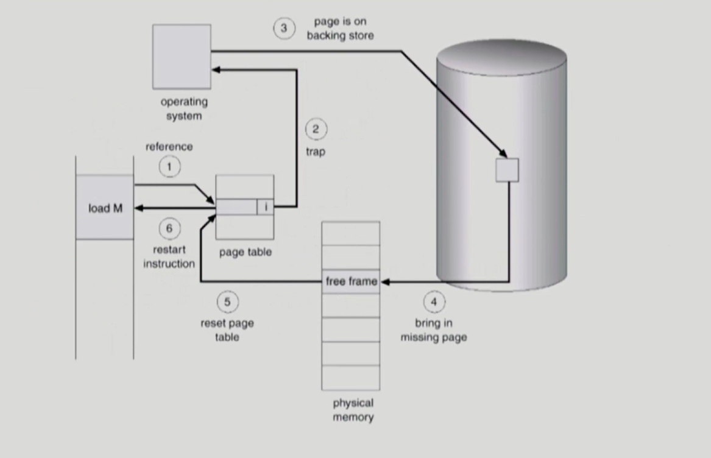

### Performance of Demand Paging

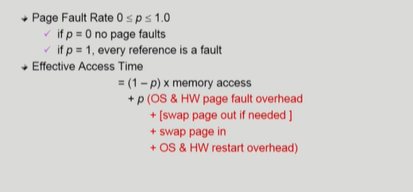

### Free frame이 없는 경우

*  Page replacement
   *  어떤 frame을 빼앗아올지 결정해야함
   *  곧바로 사용되지 않을 page를 쫓아내는 것이 좋음
   *  동일한 페이지가 여러 번 메모리에서 쫓겨났다가 다시 들어올 수 있음
*  Replacement Algorithm
   *  page-fault rate을 최소화하는 것이 목표
   *  알고리즘의 평가
      *  주어진 page reference string에 대해 page fault를 얼마나 내는지 조사
   *  reference string의 예
      *  1, 2, 3, 4, 1, 2, 5, 1, 2, 3, 4, 5

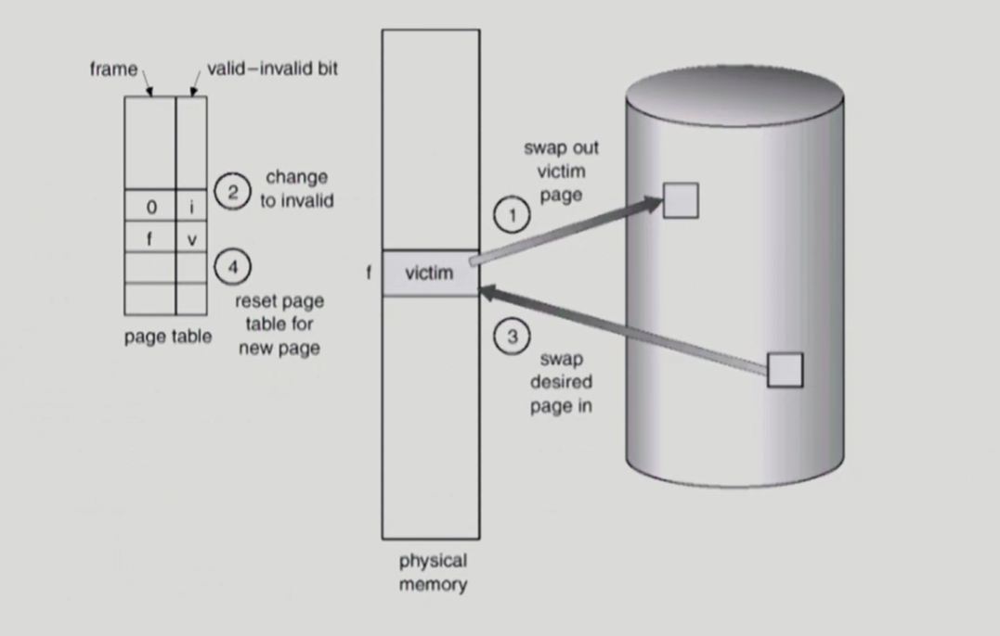

### Optimal Algorithm

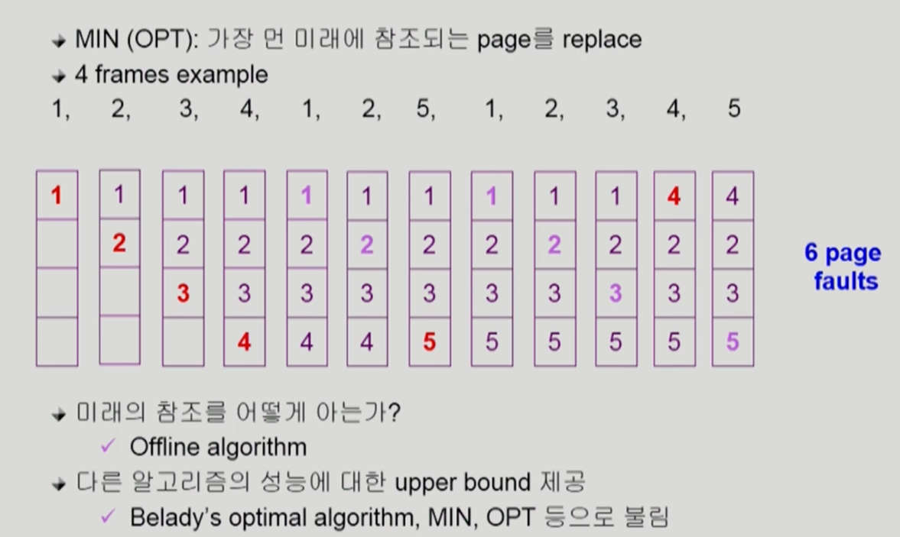

### FIFO (First In First Out) Algorithm

*  FIFO: 먼저 들어온 것을 먼저 내쫓음

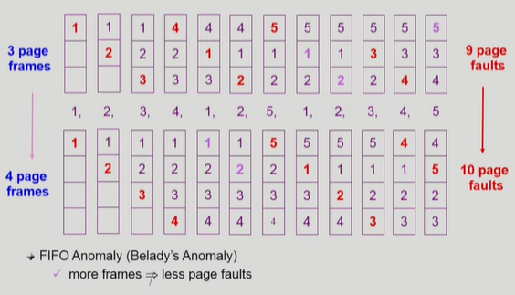

*  FIFO Anomaly : 메모리 크기가 늘어나면 page fault가 늘어나는 기이한 현상

### LRU (Least Recently Used) Algorithm

*  LRU : 가장 오래 전에 참조된 것을 지움

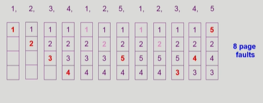

### LFU (Least Frequently Used) Algorithm

*  LFU : 참조 횟수(reference count)가 가장 적은 페이지를 지움
   *  최저 참조 횟수인 page가 여럿 있는 경우
      *  LFU 알고리즘 자체에서는 여러 page 중 임의로 선정한다
      *  성능 향상을 위해 가장 오래 전에 참조된 page를 지우게 구현할 수도 있다
   *  장단점
      *  LRU처럼 직전 참조 시점만 보는 것이 아니라 장기적인 시간 규모를 보기 때문에 page의 인기도를 좀 더 정확히 반영할 수 있음
      *  참조 시점의 최근성을 반영하지 못함
      *  LRU보다 구현이 복잡함

### LRU와 LFU 알고리즘 예제

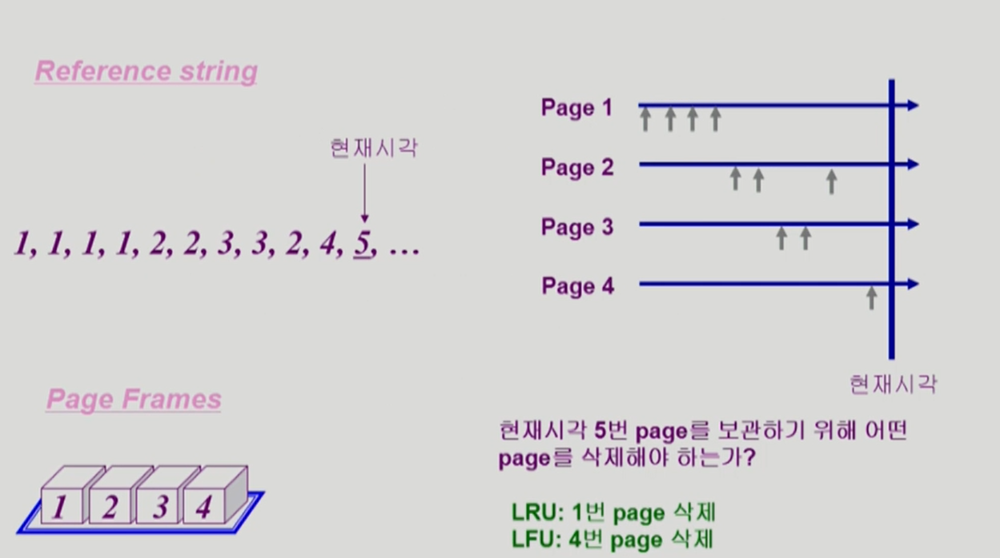

### LRU와 LFU 알고리즘의 구현

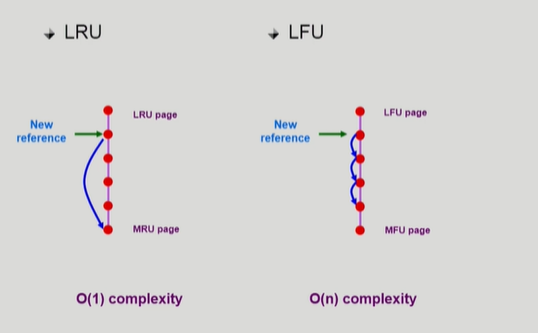

*  LRU
   *  페이지들을 한줄로 줄세움
   *  linked list 형태
   *  다음에 참조되는 page는 가장 아래로 보내고, 쫓아낼 때는 가장 위에 있는 것을 쫓아내면 됨
   *  시간복잡도 O(1)

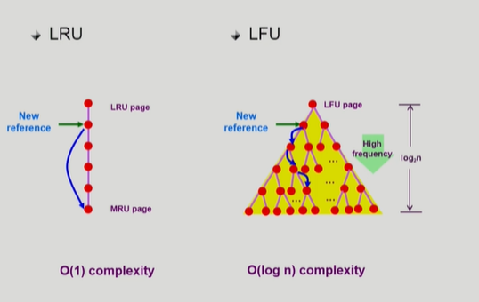

*  LFU
   *  밑으로 내려갈수록 참조횟수가 많은 경우
   *  한줄로 줄세우기가 어려움. 참조횟수가 늘어날 때마다 비교하면 시간이 많이 걸림 시간복잡도 O(n)
   *  그래서 heap을 이용

### 다양한 Caching 환경

*  캐슁 기법
   *  한정된 빠른 공간(=캐쉬)에 요청된 데이터를 저장해 두었다가 후속 요청시 캐쉬로부터 직접 서비스하는 방식
   *  paging system 외에도 cache memory, buffer caching, Web caching 등 다양한 분야에서 사용
*  캐쉬 운영의 시간 제약
   *  교체 알고리즘에서 삭제할 항목을 결정하는 일에 지나치게 많은 시간이 걸리는 경우 실제 시스템에서 사용할 수 없음
   *  Buffer caching이나 Web caching의 경우
      *  O(1) 에서 O(log n) 정도까지 허용
   *  Paging system인 경우
      *  page fault인 경우에만 OS에 관여함
      *  페이지가 이미 메모리에 존재하는 경우 참조시각 등의 정보를 OS가 알 수 없음
      *  O(1)인 LRU의 list 조작조차 불가능

### Paging System에서 LRU, LFU 가능한가?

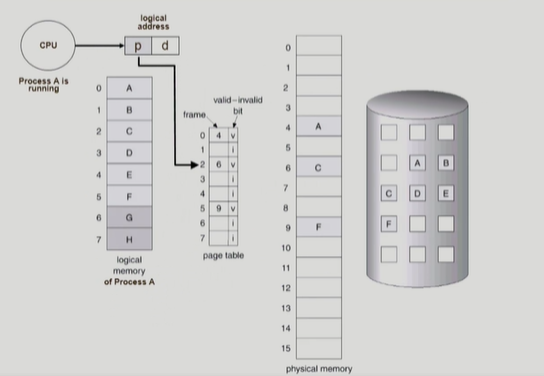

*  운영체제는 disk에 접근하는 I/O 작업이 일어났을 때에 관여하기 때문에 이미 물리적인 메모리에 올라와있는 page에 접근하는 것에 대한 정보를 얻기 어려움 > LRU, LFU 사용 불가
*  LRU, LFU는 buffer caching, web caching 에서 사용 가능

### Clock Algorithm

*  Clock algorithm
   *  LRU의 근사(approximation) 알고리즘
   *  여러 명칭으로 불림
      *  Second chance algorithm
      *  NUR (Not Used Recently) 또는 NRU (Not Recently Used)
   *  Reference bit을 사용해서 교체 대상 페이지 선정(circular list)
   *  reference bit가 0인 것을 찾을 때까지 포인터를 하나씩 앞으로 이동
   *  포인터 이동하는 중에 reference bit 은 모두 0으로 바꿈
   *  Reference bit이 0인 것을 찾으면 그 페이지를 교체
   *  한 바퀴 되돌아와서도(=second chance) 0이면 그때에는 replace 당함
   *  자주 사용되는 페이지라면 second chance가 올 때 1
*  Clock algorithm의 개선
   *  reference bit과 modified bit (dirty bit)을 함께 사용
   *  referenct bit = 1 : 최근에 참조된 페이지
   *  modified bit = 1 : 최근에 변경된 페이지 (I/O를 동반하는 페이지)

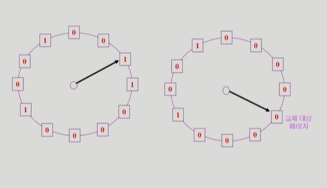

### Page Frame의 Allocation

*  Allocation problem : 각 proeess에 얼마만큼의 page frame을 할당할 것인가?
*  Allocation의 필요성
   *  메모리 참조 명령어 수행시 명령어, 데이터 등 여러 페이지 동시 참조
      *  명령어 수행을 위해 최소한 할당되어야 하는 frame의 수가 있음
   *  Loop를 구성하는 page들은 한꺼번에 allocate되는 것이 유리함
      *  최소한의 allocation이 없으면 매 loop마다 page fault
*  Allocation Scheme
   *  Equal allocation : 모든 프로세스에 똑같은 갯수 할당
   *  Proportional allocation : 프로세스 크기에 비례하여 할당
   *  Priority allocation : 프로세스의 priority에 따라 다르게 할당

### Global vs Local Replacement

*  Global replacement
   *  Replace 시 다른 process에 할당된 frame을 빼앗아 올 수 있다
   *  Process별 할당량을 조절하는 또 다른 방법임
   *  FIFO, LRU, LFU 등의 알고리즘을 global replacement로 사용시에 해당
   *  Working set, PFF 알고리즘 사용
*  Local replacement
   *  자신에게 할당된 frame 내에서만 replacement
   *  FIFO, LRU, LFU 등의 알고리즘을 process 별로 운영시

### Thrashing

*  Thrashing
   *  프로세스의 원활한 수행에 필요한 최소한의 page frame 수를 할당 받지 못한 경우 발생
   *  Page fault rate이 매우 높아짐
   *  CPU utilization이 낮아짐
   *  OS는 MPD(Multiprogramming degree)를 높여야 한다고 판단
   *  또 다른 프로세스가 시스템에 추가됨(higher MPD)
   *  프로세스 당 할당된 frame의 수가 더욱 감소
   *  프로세스는 page의 swap in / swap out 으로 매우 바쁨
   *  대부분의 시간에 CPU는 한가함
   *  low throughput

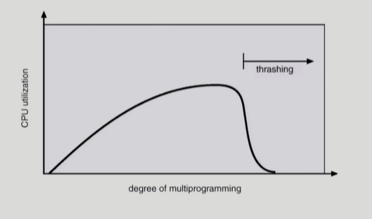

*  x축 : 메모리에 올라가 있는 프로그램의 개수
*  y축 : cpu 이용률

### Working-Set Model

*  Locality of reference
   *  프로세스는 특정 시간 동안 일정 장소만을 집중적으로 참조한다
   *  집중적으로 참조되는 해당 page들의 집합을 locality set이라 함
*  Working-set Mpdel
   *  Locality에 기반하여 프로세스가 일정 시간 동안 원활하게 수행되게 위해 한꺼번에 메모리에 올라와 있어야 하는 page들의 집합을 `Working Set`이라 정의함
   *  Working Set 모델에서는 process의 working set 전첵다 메모리에 올라와 있어야 수행되고 그렇지 않을 경우 모든 frame을 반납한 후 swap out(suspend)
   *  Thrashing을 방지함
   *  Multiprogramming degree를 결정함

### Working-Set Algorithm

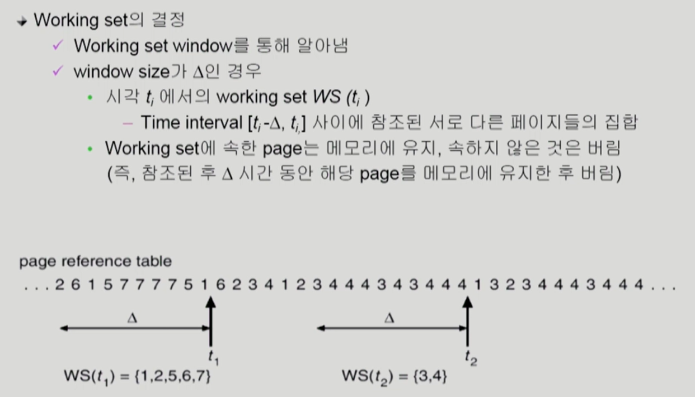

### PFF (Page-Fault Frequency) Scheme

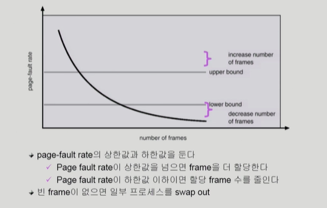

### Page Size의 결정

*  Page를 감소시키면
   *  페이지 수 증가
   *  페이지 테이블 크기 증가
   *  Internal framentation 감소
   *  Disk transfer의 효율성 감소
      *  Seek/rotation vs transfer
   *  필요한 정보만 메모리에 올라와 메모리 이용이 효율적
      *  Locality의 활용 측면에서는 좋지 않음
*  Trend
   *  Larger page size

